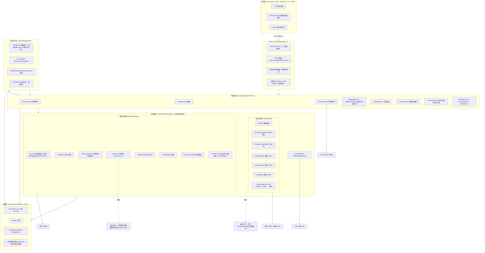
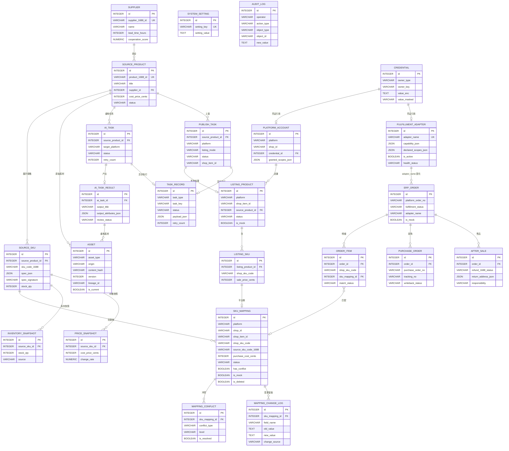
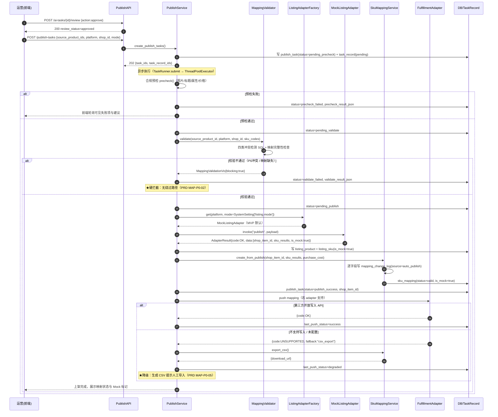
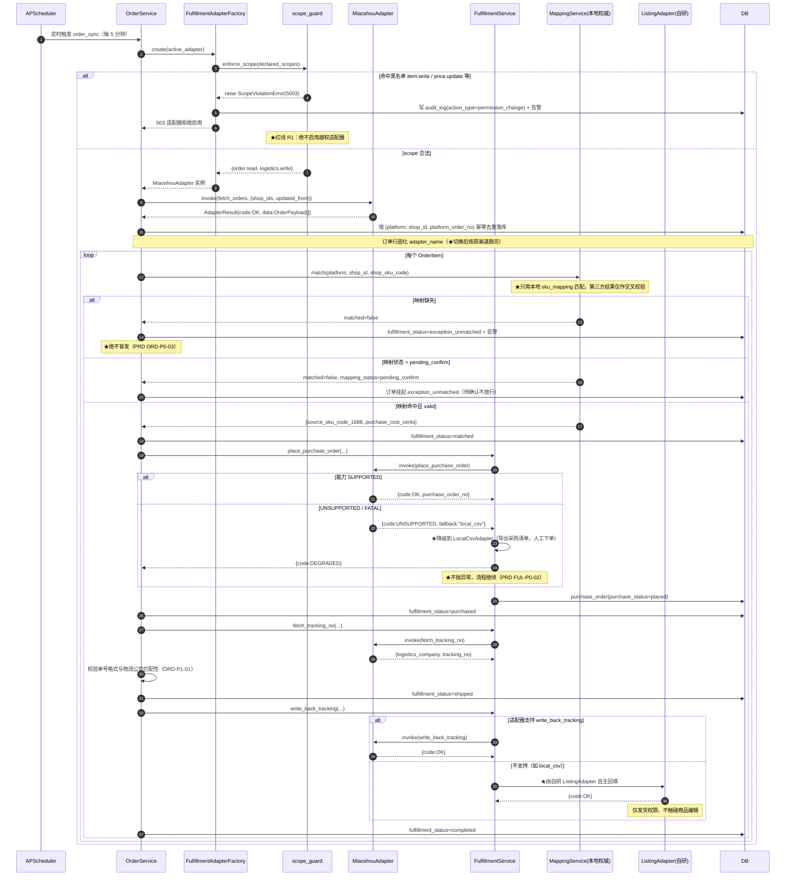
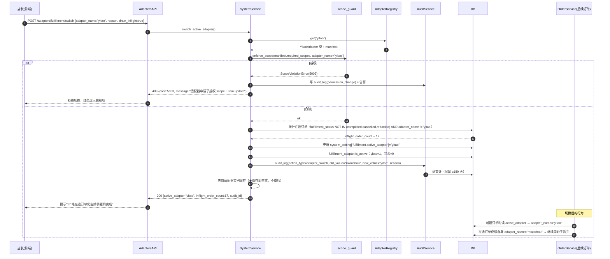
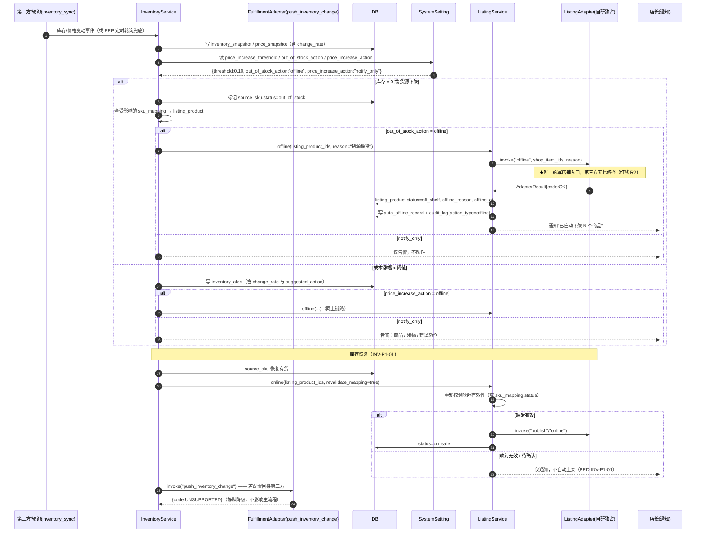
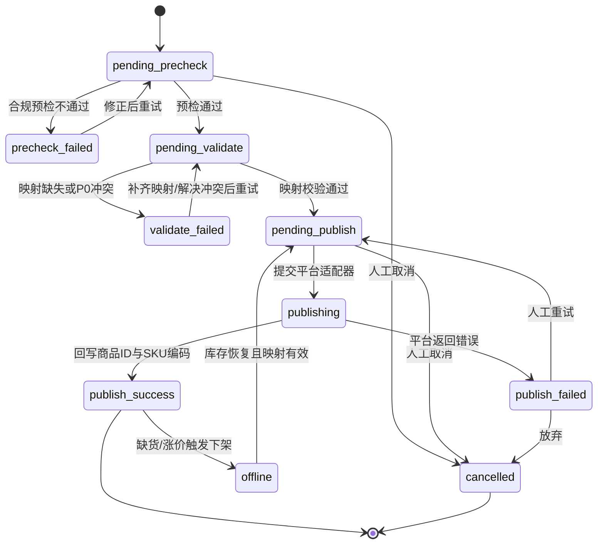
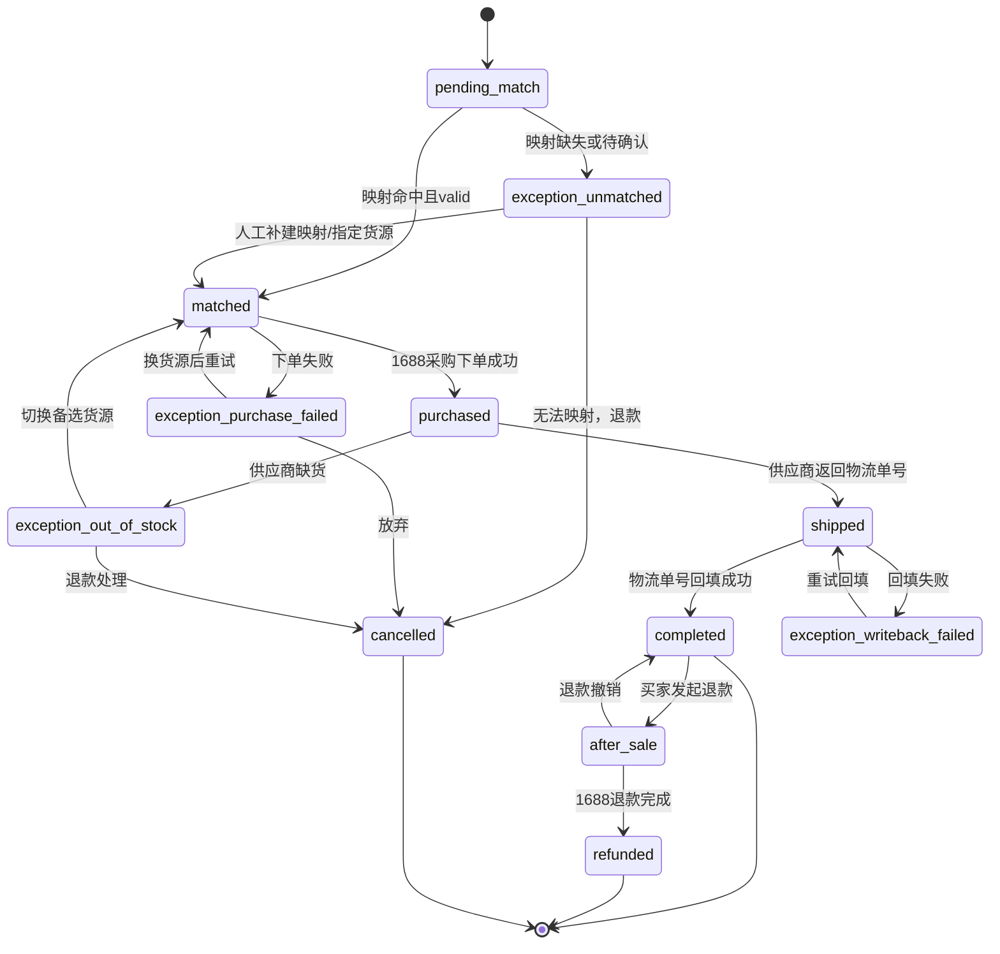
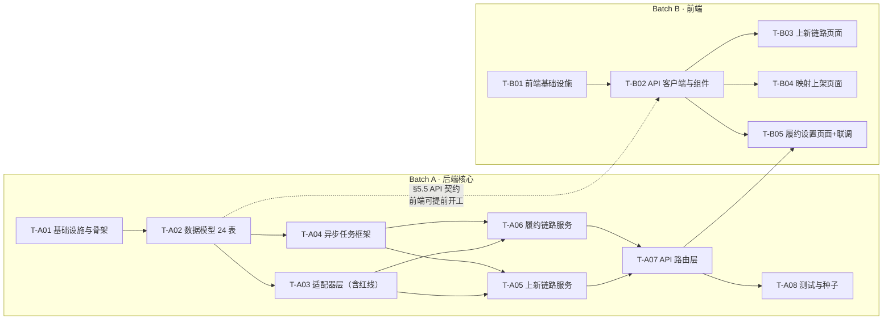

# 自用电商 ERP 系统 · 系统架构设计文档

| 项目信息 | 内容 |
| --- | --- |
| 文档语言 | 简体中文 |
| 项目名称 | `selfuse_ecommerce_erp` |
| 文档版本 | **v1.15**（对齐 PRD v1.15 定稿版） |
| 撰写人 | 高见远（架构师） |
| 上游输入 | `docs/PRD.md` **v1.15 定稿**（许清楚） |

> **v1.1 修订摘要**（与 PRD v1.1 对齐，共 5 处）
> ① §3 / §3.1：前端页面 **18 → 14 页**（采纳 PM 决策：合并 P3/P5/P9/P13，**保留 P17 权限页独立**），文件数估算与裁剪建议同步重算
> ② §3.1 补充**前端实现约束 3 条**（P5 Drawer 须宽屏/全屏、P9 Tab 常驻、P13 保留「售后中」看板列跳转）
> ③ §4.3.1 / §4.4.4 / §5.5.6：冲突类型枚举**对齐 PRD v1.1 的 5 类命名**并修正一处 DDL 层面的逻辑缺陷（见 §4.3.1 注）
> ④ §8.2 Batch B：页面文件清单与实现约束同步
> ⑤ §11.2：待明确事项与 PRD **Q13–Q16** 建立映射；**N3 已由 PRD 第十节确认**，标记为已解决
>
> **v1.2 修订摘要**（与 PRD v1.2 对齐，共 4 处，**新增 PRD 需求 SYS-P0-05 的配套设计**）
> ⑥ §5.5.1 新增 **`GET /system/status-bar`**：全局顶栏三项（越权告警 / 上架模式·履约渠道 / 系统健康）**合并为一次轻量轮询**，避免顶栏每 60s 打三个接口
> ⑦ §5.5.12 新增 **`POST /adapters/violations/{id}/handle`**；`GET /adapters/violations` 增加 `is_unhandled?` 过滤（SYS-P0-05 要求"全部处理后熄灭"，必须有处置态）
> ⑧ §4.4.6 `audit_log` 增加 `is_handled` / `handled_by` / `handled_at` 三字段（仅 `permission_change` 类型使用），承载越权告警的处置状态
> ⑨ §8.2 T-B01、`附录 A` 第 14 条：顶栏三项落地与验收口径；API 总数 **86 → 88**
>
> **v1.3 修订摘要**（与 PRD v1.3 对齐，共 3 处）
> ⑩ §5.5.12：`POST /adapters/violations/{id}/handle` 对应 PRD 新增需求 **SYS-P0-06**；`GET /adapters/violations` 明确"**不得拆成 4 个接口轮询**"为禁止性约束
> ⑪ §10.11 新增 **数据建模原则：单一真相源优先于表结构整洁**（PRD v1.3 确立为产品设计原则）
> ⑫ `附录 A` 新增第 16 条：越权处置闭环审计（"被拒"与"被处置"成对存在）；需求编号已按 PRD v1.3 重排（SYS-P0-01…06，P1/P2 顺延）
>
> **v1.4 修订摘要**（与 PRD v1.4 对齐，共 6 处 · 成本三层语义落地）
> ⑬ **§4.3 `sku_mapping` DDL 新增 `cost_source` 字段**（`auto`/`manual`，PRD v1.4 成本覆盖不静默约束）
> ⑭ **§4.3.1 冲突检测 5 类 → 6 类**：新增 **`cost_underwater` 成本倒挂（P1，提示不拦截）** + 检测 SQL + 级别可通过配置项升 P0
> ⑮ **§4.4.5 `order_item.purchase_cost_cents` 语义变更为不可变快照**（下单时点固化，永不可变）
> ⑯ **§10.5 新增「成本三层语义」表**（真源 / 镜像 / 快照）与三条硬约束（历史利润禁止 join 回取 / 人工覆盖不静默 / 审计噪音控制）
> ⑰ §5.5.6 / §5.5.13：映射变更日志与审计日志增加 `include_system` 过滤（默认排除系统同步记录）
> ⑱ §8.1 T-A08 新增 `tests/test_order_profit.py`；`附录 A` 新增第 18 条（历史订单利润不可回溯改写）。文件数 157 → **158**
>
> **v1.5 修订摘要**（与 PRD v1.5 对齐，共 5 处 · 售价必填落地，PRD 新增 LST-P0-07）
> ⑲ **§4.3.1 ⑥ `cost_underwater` 检测 SQL 增加 `AND m.is_mock = 0`**（Mock 商品售价是模拟值，倒挂检测对它们无意义且污染冲突面板）；并明确**"过滤 ≠ 解决"**——过滤只是存量兜底，主手段是 LST-P0-07 售价必填
> ⑳ **§5.5.7 `POST /publish-tasks/manual/{id}/fill-back` 售价改为必填**，缺失时**拒绝提交**（422），从源头消灭空值
> ㉑ **§5.5.8 新增 `POST /listing-products/{id}/fill-price`**（存量补填入口，补填后**自动触发 `cost_underwater` 重算**）+ `GET /listing-products` 增加 `missing_price?` 过滤。API 总数 **88 → 90**
> ㉒ **§8.2 T-B04 / T-B05 增加前端要求**：回填表单售价必填校验；P10 页提供"售价为空的在售商品"补填入口
> ㉓ `附录 A` 新增第 21 条：售价必填校验 + 存量补填触发重算
>
> **v1.6 修订摘要**（对齐 PRD v1.6 定稿版，共 2 处）
> ㉔ **本版无实质设计变更**。PRD v1.6 的 1 处修订（LST-P0-07 验收标准补充"服务端 422 兜底"与"补填响应体返回新冲突列表"）**已在架构 v1.5 落地**，无需重新设计。仅更新对齐声明与版本号
> ㉕ **§10.12 新增「方案必附边界」协作约定**（架构师 × 产品经理共同确立，见下）
>
> **v1.7 修订摘要**（对齐 PRD v1.7，共 2 处 · 规范双向镜像补齐）
> ㉖ **本版无实质设计变更**。PRD v1.7 将 §10.12 的「方案必附边界」规范**镜像到 PRD §4 需求池**（面向测试 / 验收读者），架构侧同步标注双向镜像关系
> ㉗ **§10.12 新增「本架构文档中的边界声明范例」E1–E5**：PM 在 PRD 侧配了 3 条需求条目样板，架构侧配 5 条设计样板，两边读者都有可抄的示例
>
> **v1.8 修订摘要**（对齐 PRD v1.8，共 2 处 · 回路闭合的对称声明）
> ㉘ **本版无实质设计变更**。PM 在 PRD §4 加了指向本文件附录 A 的**反向指引**，并声明"PRD 不重复维护断言，避免两处口径漂移"。架构侧做**对称声明**（见附录 A 开头）：附录 A 是 21 条断言的**唯一真相源**，PRD 只做指引不复制
> ㉙ **§10.11 案例表新增第 4 例**：「验收断言」——单一真相源原则从数据建模扩展到**文档与验收资产**
>
> **v1.9 修订摘要**（对齐 PRD v1.9 + 后端实现侧反馈，共 5 处 · **采集侧兜底 + 任务注册单点化**）
> ㉚ **§0 新增铁律 R4「兜底通道与主通道下游完全等价」**（PRD v1.9 SRC-P0-04）：`source_platform` 只做来源标记，**不得出现在任何能力分支判断**中
> ㉛ **§4.4.1 `source_product` DDL 变更**：新增 `source_platform`（`1688`/`manual`/`csv`）；`product_1688_id` 由 `NOT NULL` 放宽为 `NULL` + **部分唯一索引**；手工/CSV 的 `source_sku.sku_code_1688` 填 `'manual:'+spec_signature`，**靠"字段语义对齐"实现等价，而不是靠下游到处加 `if`**
> ㉜ **§5.5.3 新增 3 个端点**（手工录入 / CSV 导入 / 导入模板），API 总数 **90 → 93**；新增 `source_import.py` 服务 + `SourceImportDialog.tsx` + `test_source_import.py`，文件数 **158 → 161**
> ㉝ **§5.6 新增「任务注册单点化契约」**（回应实现侧"新增任务类型要同步三处"的静默失效事故）：`@task_handler` 只接受 `TaskType` 枚举、handler 包自动发现、定时任务清单由注册表派生 + **启动自检**；§10.12 新增事故案例 3 / 4 与范例 E6；`附录 A` 新增第 22 / 23 条（**21 → 23**），第 3 条补"严禁把 422 保护当 bug 修掉"
>
> **v1.10 修订摘要**（对齐 PRD v1.10 · **Q13 关闭，AI 接入由"待定"变为"已决"**，共 4 处）
> ㉞ **§5.7 新增「AI 客户端抽象与双通道热切换」**：`AiClient` 接口 + `file_bridge`（默认）/ `http` / `mock` 三实现 + `AiClientFactory`；**未知客户端名必须报错 1099，绝不静默回退到 `mock`**（否则占位图文会被一路送上架）
> ㉟ **§4.4 `ai_task` 新增 `ai_client` 字段**（任务级固化所用客户端）：PRD v1.10 要求"切换时在途任务按原客户端跑完"，但 `ai_task` 原无此列 → 该要求**在数据结构上无法实现**；补列后与 `Order.adapter_name`（在途订单按原履约渠道）**同一模式**
> ㊱ **§3 目录树补入 `app/adapters/ai/` 6 个文件**（`base` / `factory` / `file_bridge` / `http_client` / `mock_client` / `__init__`）——**实现已落地但目录树此前未收录**（文档滞后于实现），如实补记；文件数 **161 → 167**
> ㊲ **§11.2 Q13 由「⚠️ 阻塞」降级为「✅ 已决 + 部署配置事项」**；`附录 A` 新增第 24 条（AI 双通道切换与在途任务不中途换客户端），**23 → 24 条**
>
> **v1.11 修订摘要**（对齐 PRD v1.11 · **PM 质询一处措辞矛盾并成立**，共 4 处）
> ㊳ **§4.4.1 措辞订正（采纳方案 A）**：v1.9 写的"填充 `sku_code_1688` **满足唯一约束**"与同节"重复导入**不硬拦截**"自相矛盾——**质询成立**。订正为：填充该字段的**唯一目的是保证非空**（使下游零 `if` 分支）；现有唯一约束是**复合** `(source_product_id, sku_code_1688)`（**作用域在商品内**，PM 查 `uq_` 清单未见它，此处一并更正事实），**管不住跨商品重复**。并新增**禁止项**：禁止给 `sku_code_1688` 加单列唯一索引（否则"只提示"会静默变成"中途硬失败"）
> ㊴ **§5.5.3 CSV 导入事务语义订正**（PM 约束 1 **批评成立**，原设计确实制造孤儿数据）：由"单行失败不回滚整批、逐行回执"改为 **`dry_run` 整批预校验 + 单事务写入，任一行失败整批 rollback**；重复提示**必须在提交前整批给出**
> ㊵ **§5.7 A3 收紧**：「在途」明确包含 **`queued` + `running`**（排队任务换新客户端同样永远等不到旧通道产物）；补"运营想换客户端 = **取消后重建**，不由系统切换"的简单语义
> ㊶ **§3.1 / §8.2 新增前端约束 F9**（E8 边界升格为产品要求）：AI 任务页须显示等待时长 / 剩余超时 / 可能原因 + 取消入口；`附录 A` 新增第 25 条（**24 → 25 条**），第 24 条补 `queued` 断言
> ㊷ **§4.4.1 实现反哺**：后端落地时把 R4 用得更彻底——`product_1688_id` 也**补齐**为 `MANUAL-<商品编码>`（幂等 upsert），因此 v1.9 的"放宽为可空 + 部分唯一索引"**降级为防御性兜底，不执行**。**没有就造一个，而不是把约束拆了**
>
> **v1.13 修订摘要**（对齐 PRD v1.12 + v1.13，共 4 处 · **R1 精确口径 + upsert 语义**）
> ㊸ **§5.4 新增 R1 三条精确口径 S1–S3**（对齐 PRD v1.12）：① **校验对象必须是库内已生效的 `declared_scopes`，不是请求体**（实验发现"请求体不带 scope 就跳过校验"是真实绕过通道）；② 越权处置 = 拒绝启用 + 403 + 审计 + `rejected`，**不得自动停用适配器**（否则在途订单中断，违反 FUL-P0-05）；③ `is_enabled=true` + `rejected` 危险组合必须可见 → 前端约束 **F10**
> ㊹ **§5.5.3 新增三条硬约束**：正式导入**内建预校验**（安全不依赖运营记得先点预览）；**upsert 必须是部分更新语义**（CSV 未提供的字段不覆盖，否则成本抹 0 → `cost_invalid` 禁上架、库存抹 0 → 误判缺货下架）；**不得静默覆盖 `cost_source='manual'` 的人工成本**（沿用 MAP-P0-04 成本待确认）
> ㊺ **§5.5.3 重复提示二分口径定稿**（有编码 → 幂等 upsert + **字段级 diff**；无编码 → 按标题+规格指纹提示），`dry_run` 响应体带 `duplicates[].changes[]`；前端约束 **F8 增强**
> ㊻ `附录 A` 新增第 **26 / 27 条**（**25 → 27**），第 1 条指向第 27 条的精确口径
>
> **v1.14 修订摘要**（对齐 PRD v1.14 · **破坏性动作的触发门槛必须与数据源可信度匹配**，共 4 处）
> ㊼ **§5.8 新增「破坏性动作的数据源门槛」**：手工/CSV 库存永不自动更新 → 同时产生**风险 A（超卖，静默）**与**风险 B（误下架，破坏性）**；裁定 **自动下架（INV-P0-03）仅适用于"最近库存快照来源 = 自动同步"的 SKU**，手工维护的只告警 + 一键下架入口
> ㊽ **★ 关键设计决定：判定键用 `inventory_snapshot.source`，不用 `source_platform`** —— 给出与铁律 R4 的相容性论证（分支影响的是"破坏性动作门槛"而非"能力可用性"）与用 `source_platform` 实现的三个具体错误；并写清**状态迁移**与"无快照 = unknown 不自动下架"
> ㊾ **§4.4 `inventory_snapshot.source` 扩值**（`manual_import` / `manual_edit`）+ 新增配置项 `inventory.manual_stock_max_age_days`（默认 7）；导入改库存/成本**必须写快照并触发重算**（与 INV-P0-05 同口径）
> ㊿ 新增前端约束 **F11**（库存页显示数据源 + 最后更新时间 + 新鲜度标记）；**两种陈旧提示不得混用**（自动同步中断 ≠ 库存过期，混用会误导运营手工改库存、把可信数据源污染成不可信数据源）；`附录 A` 新增第 **28 / 29 条**（**27 → 29**），新增范例 **E9**
>
> **v1.15 修订摘要**（对齐 PRD v1.15，共 2 处 · **无新增需求，两条判据与警示定稿**）
> 五十一 **§5.8 新增「什么时候该等价、什么时候该区分」的通用判据**（PM 已采纳进 PRD）：R4 禁止的是**「能力可用性」分支**（**前者必须等价**，否则兜底形同虚设）；本条允许的是**「破坏性动作门槛」分支**（**后者必须区分**，否则自动化放大错误）。**这条给出的是判断方法，而不只是"这条该区分"**
> 五十二 **§5.8 边界补「污染是单向的」**：被误导改成 `manual_edit` 后，**除非下次同步主动拉回，否则永远回不来**，且**整个过程无任何告警**；§10.12 同步新增反面规范——**"写了检测不等于检测生效"的反面同样成立：告警若引导用户做错动作，告警本身就是污染源**；附录 A 第 29 条补"未因提示被污染"的断言
| 目标用户 | 个人 / 小团队卖家（无货源 / 一件代发） |
| 部署形态 | Windows / 单机优先，SQLite 零配置起步，可切 PostgreSQL |

---

## 0. 架构一句话定位

> **自研只管上新，第三方只管履约，第三方永远不持有商品编辑权。**

架构上把这条业务红线翻译成四条技术铁律：

| # | 业务红线 | 技术铁律 | 落地手段 |
| --- | --- | --- | --- |
| R1 | 第三方不得持有商品编辑 / 上新 / 下架 / 改价权限 | **`scope` 白名单硬校验，放在适配器初始化的公共路径上** | `FulfillmentAdapterFactory.create()` 内强制调用 `scope_guard.enforce_scope()`，任何适配器都无法绕过；越权直接抛 `ScopeViolationError` 并落审计 + 告警 |
| R2 | 第三方不得直接写店铺商品 | **系统中不存在"第三方直写店铺商品"的代码路径** | 库存/价格变动只能走 `InventoryService` → `ListingAdapter.update_stock_price / offline`，该链路的输入是 ERP 内部事件，不接受外部写入 |
| R3 | 第三方能力不可靠时业务不中断 | **能力声明（capability manifest）+ 降级，绝不抛裸异常** | 8 项能力逐项声明 `SUPPORTED / UNSUPPORTED / DEGRADED`；`UNSUPPORTED` 返回 `AdapterResult(code="UNSUPPORTED")` 而非抛异常，调度层按 `fallback` 降级到 `local_csv` 或人工 |
| **R4**（v1.9） | **兜底通道必须与主通道下游完全等价**，否则兜底形同虚设 | **`source_platform` 只做来源标记，不得出现在任何能力分支判断中** | 手工录入 / CSV 导入的商品落库时**补齐下游依赖字段**（如 `sku_code_1688 = 'manual:'+spec_signature`）而非留空，使素材库 / AI 重构 / 上架 / 映射 / 订单匹配五条下游链路**零 `if` 分支**即可复用；全仓搜索 `source_platform` 只允许出现在展示与筛选中（见附录 A 第 22 条） |

---

## 1. 架构总览

### 1.1 分层架构图



### 1.2 关键架构决策（ADR 摘要）

| ADR | 决策 | 理由 | 代价 / 缓解 |
| --- | --- | --- | --- |
| ADR-1 | **FastAPI + SQLAlchemy 2.0 异步 + Alembic + Pydantic v2** | 自带 OpenAPI 契约，前端可据契约并行开发；Pydantic v2 性能与校验能力满足 24 表规模 | 异步 ORM 学习曲线；用 `async_sessionmaker` + 统一 `deps.get_db` 收敛 |
| ADR-2 | **SQLite 默认，DATABASE_URL 可切 PostgreSQL** | 个人卖家零配置开箱即用，Windows 无运维负担 | SQLite 不支持并发写 → 用 WAL 模式 + 单一写线程池 + 任务串行化缓解；数据量过万后一键切 PG |
| ADR-3 | **不用 Celery + Redis，改用 APScheduler + ThreadPoolExecutor + 任务表** | 用户环境是 Windows，Redis 部署成本高；本项目任务为 IO 密集型（HTTP 调用），线程池足够 | 无跨进程分布式能力 → 抽象 `TaskRunner` 接口，未来换 Celery 只需替换实现，业务代码零改动；`TaskRecord` 表持久化保证重启恢复 |
| ADR-4 | **上架适配器 Mock 优先** | 三平台发布类 API 均需企业资质（PRD Q1 未决），MVP 必须能跑通全链路 | Mock 数据带 `is_mock=True` 且**不参与真实履约**（`OrderService` 匹配映射时硬过滤 `is_mock`） |
| ADR-5 | **履约适配层用能力声明 + 降级而非接口全实现** | 妙手/逸淘开放能力未知（PRD Q2 未决），强制全实现会导致假实现 | 基类默认返回 `UNSUPPORTED`，调度层按 manifest 降级；新增适配器零改动核心流程 |
| ADR-6 | **适配器工厂 + 注册表，配置驱动热切换** | 店长要"哪家便宜用哪家、出问题立刻换"（US-6） | 切换时落审计；**在途订单按原渠道跑完**：`Order.adapter_name` 在订单创建时固化，切换只影响新订单 |
| ADR-7 | **SKU 映射为最高等级资产，软删除 + 全量变更日志** | 映射错误 = 发错货纠纷（G3） | 软删除保留 ≥180 天可回滚；`MappingChangeLog` 逐字段记录前后值；订单匹配命中 `pending_confirm` 状态即挂起 |
| ADR-8 | **前端 Ant Design 5（非 MUI）** | 后台管理场景重度依赖 Table / Form / Modal / Steps / Descriptions，antd 可减少 40%+ 代码量 | 不引入 Tailwind，避免两套样式体系打架；布局用 antd 的 `Layout/Grid/Space` |

---

## 2. 技术选型表

### 2.1 后端

| 类别 | 选型 | 版本 | 选型理由 | 被否决方案及原因 |
| --- | --- | --- | --- | --- |
| 运行时 | Python | 3.11.x | 生态最全，1688/平台 SDK 与 AI SDK 齐全；3.11 性能提升 25% | Python 3.12（部分 C 扩展 wheel 不全，Windows 上有风险） |
| Web 框架 | **FastAPI** | 0.115.x | 原生异步、自动生成 OpenAPI 3.1（前端契约并行基础）、Pydantic 深度集成 | Flask（无异步无类型契约）；Django（太重，自带 ORM/Admin 与本项目分层冲突） |
| ORM | **SQLAlchemy** | 2.0.36 | 2.0 风格 `Mapped[]` 类型注解友好；同时支持 SQLite/PG 一套代码 | Django ORM（绑 Django）；Tortoise（生态弱）；裸 SQL（24 表维护成本高） |
| 迁移 | **Alembic** | 1.14.x | SQLAlchemy 官方迁移工具，多库兼容 | 手写 SQL 迁移（易漂移） |
| 数据校验 | **Pydantic** | 2.10.x | v2 性能提升 5-50x；`model_validator` 适合写复杂业务校验 | marshmallow（与 FastAPI 集成弱） |
| 数据库 | **SQLite（默认）/ PostgreSQL 16** | — | SQLite 零配置、`data/erp.db` 单文件、备份就是拷贝文件；PG 通过 `DATABASE_URL` 切换 | MySQL（Windows 部署成本高）；MongoDB（本项目强关系、强事务需求） |
| SQLite 驱动 | **aiosqlite** | 0.20.x | SQLAlchemy 异步必需 | sqlite3 同步驱动（阻塞事件循环） |
| PG 驱动 | **asyncpg** | 0.30.x | 异步 PG 性能最佳 | psycopg2（同步） |
| 任务调度 | **APScheduler** | 3.10.x（BackgroundScheduler） | 进程内调度、无外部依赖、支持 cron/interval、可持久化到 DB | **Celery + Redis（否决：Windows 装 Redis 成本高，用户环境不允许）**；Dramatiq（同样需要 broker） |
| 线程池 | **ThreadPoolExecutor**（标准库） | — | 任务均为 IO 密集（HTTP/AI/文件），线程池足够；与 asyncio 通过 `run_in_threadpool` 桥接 | ProcessPool（Windows spawn 开销大，且无法共享 DB session） |
| HTTP 客户端 | **httpx** | 0.28.x | 同步/异步统一 API，支持连接池与超时精细控制 | requests（同步，阻塞）；aiohttp（API 不如 httpx 友好） |
| 加密 | **cryptography（Fernet / AES-256-GCM）** | 44.x | 标准库级别成熟度；密钥由环境变量注入 | 自研 XOR/Base64（不安全）；keyring（跨平台不一致） |
| 对象存储 | **本地文件系统 `data/assets/`** | — | 单机部署，按内容哈希去重即可满足 AST-P0-01 | **MinIO / S3（否决：需额外起服务，Windows 单机场景过度设计）** |
| 日志 | **structlog + 标准 logging** | 24.x | 结构化 JSON 日志，`trace_id` 全链路贯穿（PRD 8.2） | loguru（结构化能力弱，且接管 logging 有侵入） |
| 配置 | **pydantic-settings** | 2.7.x | `.env` + 环境变量 + 类型校验 | python-dotenv 裸用（无类型） |
| 测试 | **pytest + pytest-asyncio + httpx(ASGITransport)** | 8.x / 0.24.x / 0.28.x | 无 Mock 服务器即可测 API | unittest（样板代码多） |
| 代码质量 | **ruff + mypy** | 0.8.x / 1.13.x | 极快，统一风格与类型检查 | black+flake8+isort 三件套（配置繁琐） |
| CSV | 标准库 `csv` + **pandas（可选）** | 2.2.x | 映射导入导出；pandas 仅在需要复杂对账时引入 | openpyxl（本项目 CSV 优先，第三方工具导入以 CSV 为主） |
| YAML（适配器 profile） | **PyYAML** | 6.0.2 | 端点与字段映射外置为 YAML，改配置不改代码 | JSON（不支持注释，TODO 标注可读性差） |

### 2.2 前端

| 类别 | 选型 | 版本 | 选型理由 | 被否决方案及原因 |
| --- | --- | --- | --- | --- |
| 构建 | **Vite** | 5.4.x | 冷启动秒级，HMR 快；Windows 兼容良好 | Webpack（配置重、慢）；Turbopack（不成熟） |
| 框架 | **React** | 18.3.x | 生态最大，antd 官方支持 | Vue 3（团队已定 React）；Solid（生态不足） |
| 语言 | **TypeScript** | 5.6.x | 与后端 OpenAPI 契约对齐，防止字段名漂移 | JavaScript（24 表字段多，易错） |
| UI 组件库 | **Ant Design** | 5.22.x | 后台场景 Table/Form/Modal/Steps/Descriptions/Upload 齐全，减少 40%+ 代码量 | **MUI（否决：后台表格/表单能力弱于 antd）**；Element Plus（Vue 生态） |
| 路由 | **React Router** | 6.28.x | v6 声明式路由，与 antd Menu 联动简单 | Next.js（本项目纯 SPA，无需 SSR） |
| 服务端状态 | **TanStack Query** | 5.62.x | 缓存/重试/失效/轮询开箱即用，订单看板轮询场景刚需 | SWR（功能略少）；**Redux Toolkit（否决：服务端状态已有 TQ，再引入是重复）** |
| HTTP 客户端 | **axios** | 1.7.x | 拦截器统一处理 `{code,message,data,trace_id}` 与错误提示 | fetch 裸用（需自己封装拦截器） |
| 图表 | **@ant-design/charts** | 2.2.x | 与 antd 视觉一致，Dashboard 指标卡 + 价格曲线够用 | echarts-for-react（体积大，需手动适配主题） |
| 日期 | **dayjs**（antd 内置） | 1.11.x | antd 5 默认依赖，体积小 | moment（体积大，已停止新特性） |
| 样式 | **antd Token 主题 + 少量 CSS Module** | — | 单一体系，避免样式冲突 | **Tailwind（否决：与 antd 的 class 体系混用会打架，仅允许在 `global.css` 做极少量布局补充）** |
| 表单 | **antd Form + zod（可选校验）** | zod 3.23.x | 复杂预填表单（半自动上架页） | react-hook-form（与 antd Form 受控组件需适配层） |

### 2.3 已否决的 PRD 原技术栈说明

| PRD 原文 | 架构决策 | 原因 |
| --- | --- | --- |
| Celery + Redis | **改为 APScheduler + ThreadPoolExecutor** | 用户环境 Windows，装 Redis 成本高；抽象 `TaskRunner` 保留未来切回 Celery 的能力 |
| PostgreSQL | **默认 SQLite，可切 PG** | 零配置开箱即用；`DATABASE_URL` 一切即换 |
| MinIO / 对象存储 | **改为本地文件系统 `data/assets/`** | 单机部署，内容哈希去重已满足需求 |
| React + TS + Vite（未指定 UI 库） | **锁定 Ant Design 5** | 后台管理场景，antd 组件覆盖率最高 |

---

## 3. 目录结构

```
selfuse_ecommerce_erp/
├── README.md                                  # 项目说明、启动步骤、环境变量清单
├── .gitignore                                 # 忽略 data/、.env、__pycache__、node_modules、dist
├── docker-compose.yml                         # 可选：仅用于一键起 PostgreSQL（SQLite 模式不需要）
│
├── docs/
│   ├── PRD.md                                 # 产品需求文档（上游输入）
│   ├── ARCHITECTURE.md                        # 本文档：架构设计 + 任务分解
│   └── API_CONTRACT.md                        # （建议）由 OpenAPI 自动导出的契约快照，供前端锁定
│
├── backend/
│   ├── requirements.txt                       # 生产依赖（含版本锁定）
│   ├── requirements-dev.txt                   # 开发/测试依赖（pytest/ruff/mypy）
│   ├── alembic.ini                            # Alembic 配置（script_location=alembic）
│   ├── pytest.ini                             # pytest 异步模式与覆盖率配置
│   ├── .env.example                           # 环境变量样例：DATABASE_URL/SECRET_KEY/AI_API_KEY...
│   │
│   ├── app/
│   │   ├── __init__.py
│   │   ├── main.py                            # FastAPI 应用工厂：注册中间件/异常处理器/路由/启动时初始化调度器与任务恢复
│   │   │
│   │   ├── core/
│   │   │   ├── __init__.py
│   │   │   ├── config.py                      # pydantic-settings Settings：database_url/secret_key/storage_dir/任务并发/阈值默认值
│   │   │   ├── database.py                    # 异步 engine + async_sessionmaker + Base；SQLite 启用 WAL 与 busy_timeout
│   │   │   ├── response.py                    # 统一响应体 ApiResponse{code,message,data,trace_id} 与分页封装
│   │   │   ├── errors.py                      # 错误码枚举 ErrorCode + BusinessError 异常基类 + 全局异常处理器
│   │   │   ├── logging.py                     # structlog 配置、trace_id 上下文变量、买家手机号/地址脱敏过滤器
│   │   │   ├── security.py                    # AES-256 加解密、凭证掩码、当前用户/角色依赖（管理员 vs 运营）
│   │   │   ├── deps.py                        # 依赖注入：get_db / get_current_user / require_admin / get_trace_id
│   │   │   └── pagination.py                  # 分页参数 PageParams 与 PageResult 构造工具
│   │   │
│   │   ├── models/
│   │   │   ├── __init__.py                    # 统一导出所有模型，供 Alembic 自动发现
│   │   │   ├── base.py                        # DeclarativeBase + 通用 Mixin（id/created_at/updated_at/软删除字段）
│   │   │   ├── enums.py                       # 全部枚举：Platform/ListingMode/MappingStatus/OrderStatus/PublishStatus/AdapterName...
│   │   │   ├── source.py                      # Supplier / SourceProduct / SourceSku
│   │   │   ├── asset.py                       # Asset / AiTask / AiTaskResult
│   │   │   ├── listing.py                     # PlatformAccount / ListingProduct / ListingSku
│   │   │   ├── mapping.py                     # SkuMapping / MappingConflict / MappingChangeLog（核心资产）
│   │   │   ├── publish.py                     # PublishTask
│   │   │   ├── order.py                       # Order / OrderItem / PurchaseOrder / AfterSale
│   │   │   ├── inventory.py                   # InventorySnapshot / PriceSnapshot
│   │   │   ├── system.py                      # SystemSetting / AuditLog / Credential（统一密钥保险箱）
│   │   │   └── task.py                        # TaskRecord（异步任务持久化，重启恢复依据）
│   │   │
│   │   ├── schemas/
│   │   │   ├── __init__.py
│   │   │   ├── common.py                      # PageResult / MoneyStr / IdReq / OkResp / 通用枚举 DTO
│   │   │   ├── source.py                      # 货源采集相关请求/响应 DTO
│   │   │   ├── asset.py                       # 素材 + AI 任务/审核 DTO
│   │   │   ├── mapping.py                     # 映射 CRUD / 校验结果 / 冲突 / 变更日志 DTO
│   │   │   ├── listing.py                     # 平台商品 / 上架任务 / 半自动素材包 DTO
│   │   │   ├── order.py                       # 订单 / 采购单 / 履约动作 DTO
│   │   │   ├── inventory.py                   # 库存快照 / 价格快照 / 阈值配置 DTO
│   │   │   └── system.py                      # 系统设置 / 凭证 / 适配器 / 审计日志 / Dashboard DTO
│   │   │
│   │   ├── adapters/
│   │   │   ├── __init__.py
│   │   │   ├── listing/
│   │   │   │   ├── __init__.py
│   │   │   │   ├── base.py                    # ListingAdapter 抽象基类（publish/query_status/offline/update_stock_price/health_check）
│   │   │   │   ├── factory.py                 # 按 (platform, mode) 从注册表取类并实例化；mode 读 SystemSetting['listing.mode']
│   │   │   │   ├── mock.py                    # MockListingAdapter ★MVP 默认：返回模拟商品ID/SKU编码，is_mock=True
│   │   │   │   ├── manual.py                  # ManualListingAdapter 半自动：生成素材包 ZIP + 预填表单数据，回填 ID 后补建映射
│   │   │   │   ├── taobao.py                  # TaobaoAdapter 空骨架 + TODO（待资质，见 PRD Q1）
│   │   │   │   ├── douyin.py                  # DouyinAdapter 空骨架 + TODO
│   │   │   │   └── pdd.py                     # PddAdapter 空骨架 + TODO
│   │   │   ├── fulfillment/
│   │   │   │   ├── __init__.py
│   │   │   │   ├── base.py                    # FulfillmentAdapter 抽象基类：8 项能力默认返回 UNSUPPORTED + invoke() 异常兜底
│   │   │   │   ├── manifest.py                # Capability / CapabilityLevel / CapabilitySpec / AdapterManifest 数据结构
│   │   │   │   ├── scope_guard.py             # ★红线 R1：ALLOWED_SCOPES 白名单 + FORBIDDEN_SCOPES 黑名单 + enforce_scope()
│   │   │   │   ├── registry.py                # 适配器注册表（装饰器 @register("miaoshou")）
│   │   │   │   ├── factory.py                 # FulfillmentAdapterFactory：读 SystemSetting['fulfillment.active_adapter'] 热切换 + scope 校验
│   │   │   │   ├── http_client.py             # 可配置 HTTP 客户端：签名、超时、重试、响应映射、trace_id 透传
│   │   │   │   ├── miaoshou.py                # MiaoshouAdapter（妙手）：能力声明 + profile 驱动调用 + CSV 降级
│   │   │   │   ├── yitao.py                   # YitaoAdapter（逸淘）：同上
│   │   │   │   ├── local_csv.py               # LocalCsvAdapter：不依赖第三方，CSV 导入导出 + ERP 自主记录采购单/物流单号
│   │   │   │   └── profiles/
│   │   │   │       ├── miaoshou.yaml          # 妙手端点路径/请求模板/响应字段映射（不确定处标 TODO）
│   │   │   │       └── yitao.yaml             # 逸淘同上
│   │   │   ├── ai/                            # ★v1.10 补入（实现已落地，原目录树漏收）
│   │   │   │   ├── __init__.py
│   │   │   │   ├── base.py                    # AiClient 抽象基类：rework_images / rewrite_title / suggest_attributes / health_check
│   │   │   │   ├── factory.py                 # AiClientFactory：默认客户端单一真相源 = Settings.ai_client（当前 file_bridge）；未知名 → 1099 报错
│   │   │   │   ├── file_bridge.py             # ★默认：写 data/ai_queue/<task_id>/{task.json, prompt.md}，轮询 data/ai_output/<task_id>/result.json
│   │   │   │   ├── http_client.py             # OpenAI 兼容 HTTP API（部署期填 base_url / model / api_key）
│   │   │   │   └── mock_client.py             # 占位产出（过渡与首次体验）；配置改为此值后必须真实生效
│   │   │   └── source/
│   │   │       ├── __init__.py
│   │   │       └── alibaba1688.py             # 1688 商品详情采集 + SKU 规格树笛卡尔展开 + 规格指纹计算
│   │   │
│   │   ├── services/
│   │   │   ├── __init__.py
│   │   │   ├── source_service.py              # 采集入库存、原图下载归档（内容哈希去重）、供应商管理
│   │   │   ├── source_import.py               # ★v1.9 SRC-P0-04：手工录入 + CSV 批量导入（采集侧兜底），落库即补齐下游依赖字段保证等价
│   │   │   ├── asset_service.py               # 素材版本管理、回滚、原始/重构分类、批量下载
│   │   │   ├── ai_task_service.py             # 重构任务创建/入队/重试/取消；审核通过才允许被上架引用（硬约束）
│   │   │   ├── mapping_service.py             # 映射 CRUD（软删除）、状态流转、导出 CSV、推送（不支持则降级）、变更日志
│   │   │   ├── mapping_validator.py           # ★四类冲突检测 + 上架前强制校验（返回缺失/冲突清单）
│   │   │   ├── publish_service.py             # 上架编排：合规预检 → 映射校验 → 调适配器 → 回写 ID → 建映射 → 推送
│   │   │   ├── listing_service.py             # 平台商品管理、上下架执行、下架原因记录
│   │   │   ├── order_service.py               # 订单拉取去重、SKU 匹配（含挂起）、履约状态机推进、动作处置
│   │   │   ├── fulfillment_service.py         # 适配器能力路由与降级编排（UNSUPPORTED → fallback）
│   │   │   ├── inventory_service.py           # 快照入库、涨幅计算、缺货/涨价处置决策、调用 ListingAdapter 下架
│   │   │   ├── after_sale_service.py          # 退款联动、退货地址获取与回传、责任归属标记
│   │   │   ├── system_service.py              # SystemSetting 读写与缓存失效、凭证管理、适配器配置与切换（含审计）
│   │   │   └── audit_service.py               # 审计日志埋点与查询（映射/上架/下架/切换/凭证/权限）
│   │   │
│   │   ├── tasks/
│   │   │   ├── __init__.py
│   │   │   ├── runner.py                      # ★TaskRunner 抽象接口（submit/schedule/cancel/get_status）+ LocalTaskRunner 实现
│   │   │   ├── registry.py                    # 任务处理器注册表 @task_handler("publish")
│   │   │   ├── scheduler.py                   # APScheduler 装配、cron 配置、启动时注册定时任务
│   │   │   ├── recovery.py                    # 启动时扫描 TaskRecord 未完成任务并恢复（PRD 8.4 可靠性）
│   │   │   └── handlers/
│   │   │       ├── __init__.py
│   │   │       ├── source_collect.py          # 1688 采集任务（含限流）
│   │   │       ├── ai_rework.py               # AI 重构任务（调用 AI，产出素材新版本）
│   │   │       ├── publish.py                 # 上架任务执行器
│   │   │       ├── order_sync.py              # 定时增量拉取订单（当前生效适配器）
│   │   │       ├── inventory_sync.py          # 库存/价格轮询兜底 + 自动下架决策
│   │   │       └── mapping_check.py           # 货源端变更检测 → 生成"映射待确认"工单
│   │   │
│   │   ├── api/
│   │   │   ├── __init__.py
│   │   │   ├── router.py                      # /api/v1 总路由聚合
│   │   │   └── v1/
│   │   │       ├── __init__.py
│   │   │       ├── dashboard.py               # 工作台指标卡
│   │   │       ├── source.py                  # 供应商 + 货源商品 + 采集
│   │   │       ├── assets.py                  # 素材库
│   │   │       ├── ai_tasks.py                # AI 重构任务与审核
│   │   │       ├── mappings.py                # SKU 映射 CRUD/校验/冲突/导出/待确认/变更日志
│   │   │       ├── publish.py                 # 上架任务 + 半自动素材包 + 回填
│   │   │       ├── listings.py                # 平台商品上下架
│   │   │       ├── orders.py                  # 订单看板 + 匹配 + 异常处置
│   │   │       ├── after_sales.py             # 售后退款与退货地址
│   │   │       ├── inventory.py               # 库存/价格监控与阈值配置
│   │   │       ├── adapters.py                # 适配器列表/能力矩阵/切换/连通性自检
│   │   │       ├── settings.py                # 系统设置 + 平台凭证
│   │   │       ├── audit.py                   # 审计日志
│   │   │       └── tasks.py                   # 异步任务记录查询/取消/重试
│   │   │
│   │   └── utils/
│   │       ├── __init__.py
│   │       ├── crypto.py                      # AES-256 加解密封装（密钥来自环境变量）
│   │       ├── csvio.py                       # CSV 导入导出（BOM 处理，兼容妙手/逸淘导入）
│   │       ├── hashkit.py                     # 图片内容哈希、规格指纹生成
│   │       ├── dt.py                          # UTC 时间工具、ISO8601 序列化
│   │       └── zipkit.py                      # 半自动素材包 ZIP 打包
│   │
│   ├── alembic/
│   │   ├── env.py                             # 异步迁移环境
│   │   ├── script.py.mako
│   │   └── versions/
│   │       └── 0001_initial_schema.py         # 初始 24 张表 + 索引 + 唯一约束 + 种子系统配置
│   │
│   ├── tests/
│   │   ├── conftest.py                        # 内存 SQLite fixture、测试客户端、Mock 适配器装配
│   │   ├── test_mapping_validator.py          # 四类冲突检测 + 上架前强制校验（G3 红线）
│   │   ├── test_scope_guard.py                # 越权 scope 必须拒绝并落审计（R1 红线）
│   │   ├── test_fulfillment_adapters.py       # 能力降级：UNSUPPORTED 不抛异常，走 fallback
│   │   ├── test_order_profit.py               # v1.4：历史订单利润不可回溯改写（成本快照语义）
│   │   ├── test_source_import.py              # ★v1.9：手工/CSV 录入商品与 API 采集商品下游等价（R4）+ CSV 行级错误回执
│   │   └── test_publish_flow.py               # 上架全链路（Mock 模式）+ 未审核素材禁止上架
│   │
│   └── scripts/
│       ├── seed.py                            # 种子数据：示例供应商/货源商品/映射，便于演示
│       └── smoke.py                           # 冒烟脚本：启动后跑通"采集→重构→上架→映射→订单"全链路
│
├── web/
│   ├── package.json
│   ├── vite.config.ts                         # 代理 /api → http://localhost:8000
│   ├── tsconfig.json
│   ├── tsconfig.node.json
│   ├── index.html
│   ├── .env.development                       # VITE_API_BASE=/api/v1
│   └── src/
│       ├── main.tsx                           # 入口：QueryClientProvider + ConfigProvider(antd) + Router
│       ├── App.tsx                            # 应用根组件
│       ├── router.tsx                         # 14 个页面路由表 + 侧边栏菜单配置（同一份配置驱动；P3/P5/P9/P13 以 ?tab=/?drawer= 参数区分）
│       ├── theme.ts                           # antd Token 主题定制
│       ├── constants/enums.ts                 # 与后端 enums.py 对齐的枚举常量与中文标签映射
│       │
│       ├── api/
│       │   ├── client.ts                      # axios 实例：baseURL、拦截器（拆 {code,message,data}、非0 抛错 + message 提示）
│       │   ├── types.ts                       # 全局 DTO 类型（PageResult、统一响应体）
│       │   ├── dashboard.ts
│       │   ├── source.ts
│       │   ├── assets.ts
│       │   ├── aiTasks.ts
│       │   ├── mappings.ts
│       │   ├── publish.ts
│       │   ├── listings.ts
│       │   ├── orders.ts
│       │   ├── afterSales.ts
│       │   ├── inventory.ts
│       │   ├── adapters.ts
│       │   ├── settings.ts
│       │   └── audit.ts
│       │
│       ├── hooks/
│       │   ├── usePagination.ts               # 分页 + 筛选参数与 URL query 同步
│       │   └── useEnumOptions.ts              # 枚举 → antd Select options
│       │
│       ├── components/
│       │   ├── PageContainer.tsx              # 页面骨架（标题 + 操作区 + 内容）
│       │   ├── StatusTag.tsx                  # 状态徽标（按枚举映射颜色）
│       │   ├── ConflictBadge.tsx              # 映射冲突红标
│       │   ├── MoneyText.tsx                  # 金额渲染（分 → 元）
│       │   ├── MockBadge.tsx                  # Mock 数据显著标记
│       │   ├── SourceImportDialog.tsx         # ★v1.9 SRC-P0-04：手工录入表单 + CSV 导入（模板下载 / 预校验 / 行级错误回执）
│       │   └── AuditTimeline.tsx              # 审计/处理记录时间线
│       │
│       ├── layouts/
│       │   └── MainLayout.tsx                 # antd Layout：侧边栏 + 顶栏（Mock 模式提示 + 当前履约渠道指示）
│       │
│       ├── pages/                              # ★ v1.1：18 页 → 14 页（PRD v1.1 第六节决策）
│       │   ├── Dashboard.tsx                  # P1  工作台
│       │   ├── SourceProducts.tsx             # P2  货源商品库 ＋【P3 素材库 Tab】?tab=assets（保留跨商品全局视图）
│       │   ├── AiTasks.tsx                    # P4  AI 重构任务队列 ＋【P5 审核 Drawer】?drawer=:id（★须支持宽屏/全屏）
│       │   ├── SkuMappings.tsx                # P6  SKU 映射管理（5 类冲突按 P0/P1 分级，P1 仅黄标）
│       │   ├── MappingPending.tsx             # P7  映射变更待确认
│       │   ├── PublishTasks.tsx               # P8  上架任务管理 ＋【P9 半自动素材包 Tab】?tab=manual（★常驻不可折叠）
│       │   ├── ListingProducts.tsx            # P10 平台商品管理
│       │   ├── Orders.tsx                     # P11 订单履约看板（12 态）＋【P13 售后 Tab】?tab=after-sale
│       │   ├── OrderExceptions.tsx            # P12 异常订单处理台
│       │   ├── Inventory.tsx                  # P14 库存与价格监控
│       │   ├── SettingsCredentials.tsx        # P15 平台凭证
│       │   ├── SettingsAdapters.tsx           # P16 适配器配置与切换
│       │   ├── SettingsPermissions.tsx        # P17 权限与越权告警（★保留独立页，承载越权告警面）
│       │   └── AuditLogs.tsx                  # P18 审计日志
│       │
│       └── styles/
│           └── global.css                     # 极少量全局布局补充（不引入 Tailwind）
│
└── data/                                      # 运行时数据（.gitignore 忽略）
    ├── erp.db                                 # SQLite 数据库文件
    ├── assets/                                # 素材原图与重构图（按内容哈希命名去重）
    ├── exports/                               # CSV 导出（映射 CSV、对账报告）
    ├── packages/                              # 半自动上架素材包 ZIP
    └── logs/                                  # 结构化日志
```

### 3.1 文件数估算与裁剪建议

| 分部 | 完整结构 | 裁剪后 | 说明 |
| --- | --- | --- | --- |
| 后端 `backend/` | **约 127** | **约 122** | 含 `app/` + `alembic/` 3 + `tests/` 7 + `scripts/` 2；裁剪 C4(-3) + C5(-3)；**v1.9 +2**（`source_import.py` / `test_source_import.py`）、**v1.10 +6**（`adapters/ai/` 补记） |
| 前端 `web/` | **约 53** | **约 41** | 完整为 18 页面 + 14 api 模块 + 6 组件 + 配置 7；裁剪 C1(-4) + C2(-8)；**v1.9 +1**（`SourceImportDialog.tsx`） |
| 根目录 + `docs/` | **约 5** | **约 4** | README / .gitignore / 2 docs；裁剪 C7 去掉 `docker-compose.yml` |
| **合计** | **约 185** | **约 167** | 其中 `__init__.py` 空文件约 21 个、三平台适配器骨架 3 个近乎空 → **实际需实质编码约 144 个** |

> **如实说明（v1.10 更新）**：参考值是 50–70 文件，实际即使采纳全部裁剪项也是 **167 个文件（实质编码约 144）**，仍高出约 2 倍。
> **这是本项目体量的客观结果，不是设计冗余**：9 大需求模块 + 24 张表 + 14 个页面 + 93 个 API + **三套**可扩展适配层（上架 6 个实现 / 履约 3 个实现 / **AI 客户端 3 个实现**）。
> **v1.10 的 +6 个是"补记"不是"新增"**：`app/adapters/ai/` 这 6 个文件此前已实现但目录树未收录（文档滞后于实现），本版如实补入，**不是新增加的工作量**。
> **167 是可裁剪的极限**——再往下砍就必须删 P0 需求（映射校验、冲突检测、适配器降级、审计留痕、采集侧兜底），这五条都是用户"控风险"诉求的落地，不能删。**建议主理人按 167 文件立项，不要按 50–70 立项。**

**裁剪决策（v1.1 已与 PM 达成一致，全部采纳）**

| # | 裁剪项 | 减少文件 | 状态 |
| --- | --- | --- | --- |
| C1 | **前端 18 页 → 14 页**（PRD v1.1 第六节最终决策） | -4 | ✅ **已定稿**。合并 P3/P5/P9/P13；**P17 权限页保留独立**（PM 否决合并，架构侧接受，理由见下） |
| C2 | **前端 api 层 14 模块 → 6 模块**（按域合并：catalog / mapping / publish / order / inventory / system） | -8 | ✅ 采纳 |
| C3 | **`taobao.py / douyin.py / pdd.py` 只留接口骨架 + TODO，不实现**（约 40 行/文件） | 0（工作量 -80%） | ✅ 采纳。PRD Q1 资质未决，本来也只能 Mock |
| C4 | **`utils/` 6 → 3**：`hashkit` 并入 `crypto`，`dt` 并入 `common`，`zipkit` 并入 `publish_service` | -3 | ✅ 采纳 |
| C5 | `schemas/` 9 → 6（合并 common/inventory/asset） | -3 | ✅ 采纳（PM 指定用此项抵扣 P17 保留多出的 2 个文件） |
| C7 | `docker-compose.yml` 延后到切 PostgreSQL 时再加 | -1 | ✅ 采纳 |
| C6 | P2 报表页延后 | 0 | ✅ 本就未计入 18 页内 |

#### ★ 关于 P17 权限页保留独立的架构侧确认

架构师原提议把 P17 并入适配器设置页 Tab，**PM 否决，架构侧接受**。理由成立且不只是一句"体验"：

| 维度 | 说明 |
| --- | --- |
| 告警面 ≠ 配置项 | P17 承载**越权告警记录**（`GET /adapters/violations`）。第三方哪天申请了 `item.write` scope，这是**唯一能被看见的地方**。降级为 Tab 等于把安全告警藏起来 |
| 对应 P0 需求 | FUL-P0-06 权限最小化配置 + SYS-P0-02 越权拦截，都是 P0，不是"设置子项" |
| 架构侧补强 | 既然 P17 独立保留，`MainLayout` 顶栏应增加**越权告警红点**（轮询 `GET /adapters/violations?is_unhandled=true`），即使不在设置页也能被发现——这条已写入 T-B01 |

#### ★ 前端实现约束 8 条（PM 附加条件 + PRD v1.9 新增，写入 Batch B 任务）

| # | 约束 | 来自 | 违反后果 |
| --- | --- | --- | --- |
| F1 | **P5 审核 Drawer 必须支持宽屏 / 全屏**（antd `Drawer width="90%"` 或 `fullscreen` 切换） | PRD v1.1 P5 附加条件 | 左右对比在窄 Drawer 里无法并排，单商品审核耗时拉长，**直接违反 G2（人工 ≤ 5 分钟）** |
| F2 | **P3 素材库合并目标为「货源商品库」页的独立 Tab，不是 Drawer** | PRD v1.1 P3 附加条件 | 塞进 Drawer 会失去"跨商品浏览全部素材"的全局入口，AST-P0-03 的版本回退也失去操作场所 |
| F3 | **P9 半自动素材包 Tab 常驻不可折叠；且若 Q1 结论为"拿不到发布 API 资质"，P9 必须提升为独立页面** | PRD v1.1 P9 附加条件 | 无资质时半自动是上新主路径而非兜底路径，塞在 Tab 里不可接受。**T-B04 需预留拆分成本**（页面内聚，Tab 内容抽成独立子组件，提升为页面时只改路由） |
| **F8**（v1.9 / **v1.13 增强**） | **P2 货源商品页顶部常驻「+ 手工录入」「CSV 导入」两个入口**（`SourceImportDialog.tsx`）；且列表 / 筛选 / 下游操作**不得因 `source_platform != '1688'` 有任何区别对待**（只允许新增"来源"列与筛选器）。**v1.13 追加**：预览必须展示**字段级 diff**（成本价 10.00→12.00、SKU 数 3→4），并明示"**未提供字段不会被覆盖**" | **PRD v1.9 SRC-P0-04 / v1.13 二分口径** | ① 无入口 = 采集兜底在 UI 层不存在；② 一旦加区别对待，"录入的商品不能上架"这类限制会让兜底**形同虚设**（铁律 R4，附录 A 第 22 条）；③ 只说"将更新"而不列 diff，运营无法判断这次导入会不会改坏成本 → **违反"宁可少覆盖也不能打残在售商品"** |
| **F10**（v1.13） | **P16 适配器设置页：「启用状态」与「scope 校验状态」分列展示**，`is_enabled=true` + `scope_check_status=rejected` 的组合**红色高亮**并给出处置入口 | **PRD SYS-P1-03 / v1.12** | 若两者合并成一个状态展示，这个危险组合会被**隐藏**——适配器在跑但权限声明是被拒的，没人看得见 |
| **F11**（v1.14） | **库存监控页每行显示「库存数据源」（自动同步 / 手工维护 / 暂无数据）+「最后更新时间」**；手工维护且超 `inventory.manual_stock_max_age_days`（默认 7）未更新 → 标记"**库存可能已过期**"；**自动同步中断**时必须提示"**自动同步已中断 X 小时**"而**不是**"库存可能已过期" | **PRD v1.14 §4.8** | ① 风险 A（超卖）是**静默**的——不显示数据源与更新时间，库存页一片正常，看不出异常；② 两种陈旧提示混用会误导运营去手工改库存，**把可信数据源污染成不可信数据源**，反而让 SKU 退出自动下架（§5.8 边界） |
| **F9**（v1.11） | **P4 AI 任务页：`running` 且等待外部产出的任务必须显示「已等待时长 + 剩余超时时间 + 可能原因：外部 AI 代理未返回结果」**；并配套「取消任务」入口（配合"排队任务换客户端 = 取消后重建"） | **PRD v1.11**（由架构 E8 边界升格） | 运营只看到"一直在转圈"，**无法区分"正在正常生成"与"外部链路已断"**——前者应继续等，后者应立刻人工介入。缺这条会让 E8 的超时兜底形同虚设 |

---

## 4. 数据模型

### 4.1 实体总览（24 张表）

> PRD 第七节列出 22 个业务实体；本设计**新增 2 张基础设施表**：
> - `Credential`：统一密钥保险箱（PRD SYS-P0-01 要求"明文永不落库"，集中一处加密存储便于审计与轮换）
> - `TaskRecord`：异步任务持久化（PRD 8.4 要求"服务重启后未完成任务自动恢复"，APScheduler 方案必须自建）

| # | 实体 | 表名 | 归属模块 | 说明 |
| --- | --- | --- | --- | --- |
| 1 | Supplier | `supplier` | 货源 | 1688 供应商 |
| 2 | SourceProduct | `source_product` | 货源 | 1688 货源商品 |
| 3 | SourceSku | `source_sku` | 货源 | 1688 货源 SKU（含规格指纹） |
| 4 | Asset | `asset` | 素材 | 原始 / AI 重构素材，版本管理 |
| 5 | AiTask | `ai_task` | AI 重构 | 重构任务 |
| 6 | AiTaskResult | `ai_task_result` | AI 重构 | 重构产出与审核 |
| 7 | PlatformAccount | `platform_account` | 平台 | 店铺账号与授权 scope |
| 8 | ListingProduct | `listing_product` | 上架 | 平台商品 |
| 9 | ListingSku | `listing_sku` | 上架 | 平台 SKU |
| 10 | **SkuMapping** | `sku_mapping` | 映射 | **核心资产，4.3 给完整 DDL** |
| 11 | MappingConflict | `mapping_conflict` | 映射 | 冲突记录 |
| 12 | MappingChangeLog | `mapping_change_log` | 映射 | 逐字段变更日志 |
| 13 | PublishTask | `publish_task` | 上架 | 上架任务状态机 |
| 14 | FulfillmentAdapter | `fulfillment_adapter` | 履约 | 适配器配置与能力声明 |
| 15 | Order | `erp_order` | 订单 | 店铺订单（表名避保留字 `order`） |
| 16 | OrderItem | `order_item` | 订单 | 订单明细与匹配状态 |
| 17 | PurchaseOrder | `purchase_order` | 订单 | 1688 采购单 |
| 18 | AfterSale | `after_sale` | 售后 | 售后退款单 |
| 19 | InventorySnapshot | `inventory_snapshot` | 库存 | 库存快照 |
| 20 | PriceSnapshot | `price_snapshot` | 库存 | 价格快照 |
| 21 | AuditLog | `audit_log` | 系统 | 审计日志 |
| 22 | SystemSetting | `system_setting` | 系统 | 系统配置 KV |
| 23 | **Credential**（新增） | `credential` | 系统 | 加密密钥保险箱 |
| 24 | **TaskRecord**（新增） | `task_record` | 系统 | 异步任务持久化 |

### 4.2 通用字段约定（Base Mixin）

所有表均含以下字段（`models/base.py`）：

| 字段 | 类型 | 说明 |
| --- | --- | --- |
| `id` | `INTEGER PK`（PG: `BIGSERIAL`） | 自增主键 |
| `created_at` | `TIMESTAMP NOT NULL DEFAULT CURRENT_TIMESTAMP` | UTC 存储 |
| `updated_at` | `TIMESTAMP NOT NULL DEFAULT CURRENT_TIMESTAMP` | UTC，更新时自动刷新 |

软删除表额外含：`is_deleted BOOLEAN DEFAULT 0`、`deleted_at TIMESTAMP NULL`、`deleted_by VARCHAR(64) NULL`、`delete_reason VARCHAR(255) NULL`。

**软删除适用范围（PRD 8.4）**：`sku_mapping`（强制，≥180 天）、`source_product`、`source_sku`、`asset`、`listing_product`、`listing_sku`、`supplier`。其余表（快照、日志、任务）不做软删除，按时间归档清理。

### 4.3 ★ SkuMapping 完整 DDL（第一份交付物）

> 说明：DDL 以**可移植形式**给出，SQLite 与 PostgreSQL 均可直接执行。
> SQLite 差异点：`BOOLEAN` → `INTEGER(0/1)`；`JSON` → `TEXT`；`NUMERIC(12,2)` → `DECIMAL`；`BIGSERIAL` → `INTEGER PRIMARY KEY AUTOINCREMENT`。
> 实际项目中以 SQLAlchemy 模型为唯一真源，Alembic 自动生成迁移。

```sql
-- ============================================================================
--  SKU 映射表（核心资产 / 最高等级保护）
--  业务含义：店铺平台 SKU  ←→  1688 货源 SKU 的唯一对应关系
--  保护要求：软删除保留 ≥180 天可回滚；任何变更写 mapping_change_log
--  校验要求：上架前必须通过 4 类冲突检测，否则禁止上架（PRD MAP-P0-02/03）
-- ============================================================================

CREATE TABLE sku_mapping (
    -- ---------- 主键 ----------
    id                      INTEGER         NOT NULL PRIMARY KEY,   -- PG: BIGSERIAL

    -- ---------- 平台侧（店铺）----------
    platform                VARCHAR(32)     NOT NULL,               -- taobao | douyin | pdd
    shop_id                 VARCHAR(64)     NOT NULL,               -- 店铺 ID（平台账号维度）
    shop_item_id            VARCHAR(64)     NOT NULL,               -- 店铺商品 ID（平台返回）
    shop_sku_code           VARCHAR(128)    NOT NULL,               -- 店铺 SKU 编码（平台侧外层 SKU 编码）
    shop_sku_name           VARCHAR(255)    NULL,                   -- 店铺 SKU 规格描述（冗余展示，如 "红色-XL"）
    listing_product_id      INTEGER         NULL,                   -- FK → listing_product.id
    listing_sku_id          INTEGER         NULL,                   -- FK → listing_sku.id

    -- ---------- 货源侧（1688）----------
    source_product_id       INTEGER         NULL,                   -- FK → source_product.id
    source_sku_id           INTEGER         NULL,                   -- FK → source_sku.id
    source_product_1688_id  VARCHAR(64)    NULL,                    -- 1688 商品 ID（冗余，便于无 JOIN 查询）
    source_sku_code_1688    VARCHAR(128)    NULL,                   -- 1688 SKU 编码
    source_sku_name         VARCHAR(255)    NULL,                   -- 1688 SKU 规格描述（冗余展示）
    spec_signature          VARCHAR(128)    NULL,                   -- 规格指纹：规格名值对排序后 md5，用于货源端变更检测（MAP-P0-04）

    -- ---------- 成本（★ v1.4 三层语义：本表为「镜像层」）----------
    purchase_cost_cents     INTEGER         NOT NULL DEFAULT 0,     -- 采购成本【单位：分】。★镜像层：随货源真源自动同步，人工可覆盖
    cost_currency           VARCHAR(8)      NOT NULL DEFAULT 'CNY',
    cost_source             VARCHAR(16)     NOT NULL DEFAULT 'auto',  -- ★v1.4 新增：auto 自动同步 | manual 人工覆盖
                            -- 语义：auto 时货源变动会自动刷新；manual 时货源再变动**不得静默覆盖**，
                            --       改为生成「成本待确认」工单（复用 MAP-P0-04 待确认机制）
    cost_overridden_at      TIMESTAMP       NULL,                   -- 最近一次人工覆盖时间
    cost_overridden_by      VARCHAR(64)     NULL,                   -- 最近一次人工覆盖人
    last_cost_check_at      TIMESTAMP       NULL,                   -- 最近一次成本核对时间（INV-P0-05 同步节拍）

    -- ---------- 状态 ----------
    status                  VARCHAR(16)     NOT NULL DEFAULT 'pending_confirm',
                            -- valid           有效（唯一允许参与上架与订单匹配）
                            -- pending_confirm 待确认（货源端变更未确认 → 订单挂起，ORD-P0-03）
                            -- invalid         失效（人工确认无法映射 / 货源下架）
                            -- archived        归档（历史版本，软删除前的快照态）
    has_conflict            BOOLEAN         NOT NULL DEFAULT 0,     -- 冗余标记：存在未解决冲突时置 1，列表页红标避免每次 JOIN
    conflict_types          VARCHAR(128)    NULL,                   -- 逗号分隔：one_to_many | many_to_one | duplicate | cost_invalid | spec_mismatch
    conflict_level          VARCHAR(8)      NULL,                   -- P0（禁止上架）| P1（提示）
    is_mock                 BOOLEAN         NOT NULL DEFAULT 0,     -- Mock 模式产生的数据；★ 不参与真实履约，订单匹配时硬过滤

    -- ---------- 来源与生效 ----------
    source                  VARCHAR(16)     NOT NULL DEFAULT 'system',
                            -- manual 人工 | system 系统（上架回写自动建立）| third_party 第三方导入 | auto_publish 上架自动
    effective_at            TIMESTAMP       NULL,                   -- 生效时间（PRD 字段要求）
    expire_at               TIMESTAMP       NULL,                   -- 失效时间
    last_pushed_at          TIMESTAMP       NULL,                   -- 最近一次推送给第三方的时间
    last_push_status        VARCHAR(16)     NULL,                   -- success | failed | degraded(降级CSV)
    last_push_adapter       VARCHAR(32)     NULL,                   -- 最近推送使用的适配器名

    -- ---------- 软删除（保留 ≥180 天可回滚）----------
    is_deleted              BOOLEAN         NOT NULL DEFAULT 0,
    deleted_at              TIMESTAMP       NULL,
    deleted_by              VARCHAR(64)     NULL,
    delete_reason           VARCHAR(255)    NULL,

    -- ---------- 审计 ----------
    created_by              VARCHAR(64)     NULL,
    updated_by              VARCHAR(64)     NULL,
    created_at              TIMESTAMP       NOT NULL DEFAULT CURRENT_TIMESTAMP,
    updated_at              TIMESTAMP       NOT NULL DEFAULT CURRENT_TIMESTAMP,
    version                 INTEGER         NOT NULL DEFAULT 1,     -- 乐观锁，每次变更 +1
    remark                  VARCHAR(512)    NULL,

    -- ---------- 约束 ----------
    CONSTRAINT ck_sku_mapping_platform CHECK (platform IN ('taobao','douyin','pdd')),
    CONSTRAINT ck_sku_mapping_status   CHECK (status   IN ('valid','pending_confirm','invalid','archived')),
    CONSTRAINT ck_sku_mapping_source   CHECK (source   IN ('manual','system','third_party','auto_publish')),
    CONSTRAINT ck_sku_mapping_cost_src CHECK (cost_source IN ('auto','manual')),        -- ★v1.4
    CONSTRAINT ck_sku_mapping_level    CHECK (conflict_level IS NULL OR conflict_level IN ('P0','P1')),

    CONSTRAINT fk_sku_mapping_listing_product FOREIGN KEY (listing_product_id) REFERENCES listing_product(id),
    CONSTRAINT fk_sku_mapping_listing_sku     FOREIGN KEY (listing_sku_id)     REFERENCES listing_sku(id),
    CONSTRAINT fk_sku_mapping_source_product  FOREIGN KEY (source_product_id)  REFERENCES source_product(id),
    CONSTRAINT fk_sku_mapping_source_sku      FOREIGN KEY (source_sku_id)      REFERENCES source_sku(id)
);

-- ============================================================================
--  索引与唯一约束
-- ============================================================================

-- 【唯一约束 · 核心】同一平台+店铺下，一个店铺 SKU 编码只能有一条有效映射
-- 采用部分唯一索引：软删除记录不占用唯一键，删除后可重新创建同键映射
CREATE UNIQUE INDEX uq_sku_mapping_shop_sku
    ON sku_mapping (platform, shop_id, shop_sku_code)
    WHERE is_deleted = 0;

-- 订单匹配主查询路径：platform + shop_sku_code → 货源 SKU（★ 最高频，ORD-P0-01/P0-03）
CREATE INDEX idx_sku_mapping_match
    ON sku_mapping (platform, shop_id, shop_sku_code, status, is_deleted);

-- 按店铺商品维度查看该商品全部映射
CREATE INDEX idx_sku_mapping_shop_item
    ON sku_mapping (platform, shop_id, shop_item_id, is_deleted);

-- 货源 SKU 反向查：一个货源 SKU 被多少平台 SKU 映射（冲突检测 2 的加速索引）
CREATE INDEX idx_sku_mapping_source_sku
    ON sku_mapping (source_sku_id, is_deleted, status);

-- 按 1688 商品 ID 查（采集变更检测批量定位）
CREATE INDEX idx_sku_mapping_1688_item
    ON sku_mapping (source_product_1688_id, is_deleted);

-- 冲突面板查询
CREATE INDEX idx_sku_mapping_conflict
    ON sku_mapping (has_conflict, conflict_level, is_deleted);

-- 状态筛选（待确认工单列表）
CREATE INDEX idx_sku_mapping_status
    ON sku_mapping (status, is_deleted, updated_at);

-- 增量推送给第三方（MAP-P1-01）
CREATE INDEX idx_sku_mapping_push
    ON sku_mapping (updated_at, is_deleted)
    WHERE status = 'valid' AND is_mock = 0;

-- 软删除清理任务（保留 180 天，定期扫描）
CREATE INDEX idx_sku_mapping_deleted
    ON sku_mapping (is_deleted, deleted_at);
```

#### 4.3.1 六类冲突检测 SQL（PRD v1.4 MAP-P0-03）

> **【v1.1 修订】** 冲突类型枚举对齐 PRD v1.1 变更记录 ③，由 4 类调整为 **5 类命名**，并修正 v1.0 的一处逻辑缺陷（见下方 ⚠️ 注）。
> **【v1.4 修订】** 新增第 6 类 **`cost_underwater` 成本倒挂（P1）**，由 PM 在推导成本三层语义时发现（PRD v1.4）。

**冲突类型枚举（唯一真源，`models/enums.py :: ConflictType`）**

| code | 中文名 | 级别 | 是否禁止上架 |
| --- | --- | --- | --- |
| `one_to_many` | 一个平台 SKU 映射多个货源 SKU | **P0** | ✅ 禁止 |
| `duplicate` | 重复映射（同店铺内一个货源 SKU 被多个店铺 SKU 引用 / 同一 SKU 编码挂在不同商品下） | **P0** | ✅ 禁止 |
| `many_to_one` | 跨平台铺货：一个货源 SKU 映射到多个平台店铺 SKU | **P1** | ❌ **仅黄标提示，不拦截** |
| `cost_invalid` | 采购成本为空 / 为 0 / 为负 | **P0** | ✅ 禁止 |
| **`cost_underwater`**（v1.4 新增） | **成本倒挂：镜像成本 ≥ 平台售价（扣除最低利润率缓冲后）** | **P1**（可配升 P0） | ❌ **仅黄标提示，不拦截** |
| `spec_mismatch` | 规格指纹与货源侧当前指纹不一致 | **P0** | ✅ 禁止（映射自动转 `pending_confirm`） |

> ⚠️ **v1.0 逻辑缺陷修正**：v1.0 的"冲突类型 3 重复映射"按 `(platform, shop_id, shop_item_id, shop_sku_code, source_product_1688_id, source_sku_code_1688)` 全字段分组查重，**这个查询永远不会返回结果**——因为部分唯一索引 `uq_sku_mapping_shop_sku (platform, shop_id, shop_sku_code) WHERE is_deleted = 0` 已经从 DB 层阻断了同键多行。
> v1.1 把 `duplicate` 重新定义为**唯一索引覆盖不到的两种真实重复**：
> ① 同一店铺内一个货源 SKU 被多个店铺 SKU 引用（索引只约束"一店铺SKU→一映射"，不约束反向）；
> ② 同一 `shop_sku_code` 挂在不同的 `shop_item_id` 下（索引不含 `shop_item_id`）。

```sql
-- ============================================================
-- ① one_to_many：一个平台 SKU 映射多个货源 SKU      ★ P0，禁止上架
-- 说明：订单无法确定向哪个供应商下单，是发错货的直接根因
-- ============================================================
SELECT m.platform, m.shop_id, m.shop_item_id, m.shop_sku_code,
       COUNT(DISTINCT m.source_sku_id)               AS source_sku_cnt,
       GROUP_CONCAT(DISTINCT m.source_sku_code_1688) AS source_sku_codes,  -- PG: STRING_AGG(DISTINCT ..., ',')
       GROUP_CONCAT(DISTINCT m.id)                   AS mapping_ids        -- PG: ARRAY_AGG(m.id)
FROM sku_mapping m
WHERE m.is_deleted = 0
GROUP BY m.platform, m.shop_id, m.shop_item_id, m.shop_sku_code
HAVING COUNT(DISTINCT m.source_sku_id) > 1;

-- ============================================================
-- ②a duplicate：同店铺内，一个货源 SKU 被多个店铺 SKU 引用   ★ P0，禁止上架
-- 说明：唯一索引约束的是「一店铺SKU → 一映射」，不约束反向，此情形可真实发生
-- ============================================================
SELECT m.platform, m.shop_id, m.source_sku_id, m.source_sku_code_1688,
       COUNT(DISTINCT m.shop_sku_code)        AS shop_sku_cnt,
       GROUP_CONCAT(DISTINCT m.shop_sku_code) AS shop_sku_codes,
       GROUP_CONCAT(DISTINCT m.id)            AS mapping_ids
FROM sku_mapping m
WHERE m.is_deleted = 0 AND m.source_sku_id IS NOT NULL
GROUP BY m.platform, m.shop_id, m.source_sku_id, m.source_sku_code_1688
HAVING COUNT(DISTINCT m.shop_sku_code) > 1;

-- ============================================================
-- ②b duplicate：同一 shop_sku_code 挂在不同的 shop_item_id 下  ★ P0，禁止上架
-- 说明：唯一索引 uq_sku_mapping_shop_sku 不含 shop_item_id，此情形可真实发生
-- ============================================================
SELECT m.platform, m.shop_id, m.shop_sku_code,
       COUNT(DISTINCT m.shop_item_id)        AS item_cnt,
       GROUP_CONCAT(DISTINCT m.shop_item_id) AS shop_item_ids,
       GROUP_CONCAT(DISTINCT m.id)           AS mapping_ids
FROM sku_mapping m
WHERE m.is_deleted = 0
GROUP BY m.platform, m.shop_id, m.shop_sku_code
HAVING COUNT(DISTINCT m.shop_item_id) > 1;

-- ============================================================
-- ③ many_to_one：跨平台铺货（同一货源铺到淘宝/抖店/拼多多）  ★ P1，仅提示，不拦截
-- 说明：这是正常业务！PRD v1.1 验收口径明确：
--      "运营在三个平台铺同一个货源商品时，不得出现『为什么我三平台铺货被拦了』的拦截"
-- ============================================================
SELECT m.source_sku_id,
       m.source_sku_code_1688,
       COUNT(DISTINCT m.platform || ':' || m.shop_id || ':' || m.shop_sku_code) AS shop_sku_cnt,
       COUNT(DISTINCT m.platform) AS platform_cnt,
       GROUP_CONCAT(DISTINCT m.platform) AS platforms
FROM sku_mapping m
WHERE m.is_deleted = 0 AND m.source_sku_id IS NOT NULL
GROUP BY m.source_sku_id, m.source_sku_code_1688
HAVING COUNT(DISTINCT m.platform || ':' || m.shop_id || ':' || m.shop_sku_code) > 1;

-- ============================================================
-- ④ cost_invalid：采购成本为空 / 为 0 / 为负        ★ P0，禁止上架
-- 说明：成本缺失导致利润无法核算，也可能导致按错误价格下单
-- ============================================================
SELECT m.id, m.platform, m.shop_id, m.shop_item_id, m.shop_sku_code,
       m.source_sku_code_1688, m.purchase_cost_cents, m.status
FROM sku_mapping m
WHERE m.is_deleted = 0
  AND (m.purchase_cost_cents IS NULL OR m.purchase_cost_cents <= 0);

-- ============================================================
-- ⑤ spec_mismatch：规格指纹与货源侧当前指纹不一致    ★ P0，禁止上架
-- 说明：货源端改名/改规格后指纹变化，映射已失效（MAP-P0-04 变更检测的技术实现）
--      命中后映射自动转 pending_confirm，关联订单挂起
-- ============================================================
SELECT m.id, m.platform, m.shop_sku_code, m.source_sku_code_1688,
       m.spec_signature  AS mapping_signature,
       s.spec_signature  AS current_signature,
       s.spec_json       AS current_spec_json
FROM sku_mapping m
JOIN source_sku s ON s.id = m.source_sku_id
WHERE m.is_deleted = 0
  AND m.status <> 'invalid'
  AND (m.spec_signature IS NULL OR m.spec_signature <> s.spec_signature);

-- ============================================================
-- ⑥ cost_underwater：成本倒挂（镜像成本 ≥ 平台售价）  ★ P1，仅黄标，不拦截
-- 【v1.4 新增】由 PM 在推导成本三层语义时发现 PRD INV-P0-04 的盲区：
--   INV-P0-04 判的是「涨幅」（相对变化）。某商品成本涨 8%（未达 10% 阈值）但**早已倒挂**，
--   涨幅告警不触发 → 运营卖一单亏一单且毫无察觉。这是最直接烧钱的场景。
-- 说明：判定取镜像层 sku_mapping.purchase_cost_cents（与 INV-P0-04 取数口径一致）。
--       min_profit_margin 为可配最低利润率缓冲（默认 0，见 system_setting）。
-- ============================================================
SELECT m.id, m.platform, m.shop_id, m.shop_item_id, m.shop_sku_code,
       m.source_sku_code_1688,
       m.purchase_cost_cents              AS cost_cents,
       ls.sale_price_cents                AS price_cents,
       (ls.sale_price_cents - m.purchase_cost_cents) AS margin_cents,
       m.cost_source, m.status
FROM sku_mapping m
JOIN listing_sku ls ON ls.id = m.listing_sku_id
WHERE m.is_deleted = 0
  AND m.status = 'valid'
  AND m.is_mock = 0                  -- ★v1.5：Mock 商品售价是模拟值，倒挂检测对它们无意义，且会污染冲突面板
  AND ls.sale_price_cents > 0
  AND m.purchase_cost_cents >= CAST(ls.sale_price_cents * (1 - :min_profit_margin) AS INTEGER);
```

> **★ P1 vs P0 可配置**：`cost_underwater` 的级别由 `system_setting['mapping.conflict_cost_underwater_level']` 决定（默认 `"P1"`）。运营可在后台升为 `"P0"` 开启硬拦截，**不改代码**。
>
> **★ 关于 `sale_price_cents > 0` 这个过滤条件 —— 过滤不等于解决（PRD v1.5）**
>
> 半自动模式下人工回填 ID 时若不填售价，`sale_price_cents = 0` 会被判定成"成本 ≥ 售价" → **大面积误报倒挂**。该过滤能防误报，但**防不了真正的危害**：被过滤掉的商品**永久失去倒挂检测能力**——冲突面板上干干净净，实际是这些商品根本没被检测。**这与 `duplicate` 是同一类缺陷：不报错、只静默失效。**
>
> 因此**主次不能颠倒**：
> | 主次 | 手段 | 作用 |
> | --- | --- | --- |
> | **主** | **LST-P0-07 售价必填**（§5.5.7 回填表单拒绝空售价） | **从源头消灭空值** |
> | 辅 | 本 SQL 的 `sale_price_cents > 0` 过滤 | 仅兜底存量历史残留 |
> | 辅 | **§5.5.8 存量补填入口** | 救回历史空值数据，补填后自动重算 |
>
> ⚠️ **后续维护者注意**：不要因为"SQL 已经过滤了"就认为问题处理完了。空值商品的检测盲区仍然存在，必须靠必填 + 补填解决。

> **★ 检测执行的强制排序**：`MappingValidator.validate()` 必须**先跑 ③ `many_to_one` 并剔除**，再对剩余项跑 ①②④⑤。
> 否则跨平台铺货会被 ②a 误判为 P0 拦截。**`test_mapping_validator.py` 必须有"三平台铺同一货源 → passed=true"的用例**，这是 PRD v1.1 写死的验收标准。

### 4.4 其余实体字段定义

#### 4.4.1 货源模块

**`supplier` 供应商**

| 字段 | 类型 | 说明 |
| --- | --- | --- |
| id / created_at / updated_at / 软删除 | — | 通用 |
| supplier_1688_id | VARCHAR(64) UNIQUE NOT NULL | 1688 供应商 ID |
| name | VARCHAR(255) NOT NULL | 供应商名称 |
| location | VARCHAR(128) | 所在地 |
| lead_time_hours | INTEGER | 发货时效（小时） |
| moq | INTEGER | 起订量 |
| cooperation_score | NUMERIC(3,2) | 合作评分 0–5 |
| status | VARCHAR(16) | active / inactive / blacklist |
| contact_enc | TEXT | 联系方式（加密） |

**`source_product` 货源商品（★ v1.9：来源由「仅 1688」扩展为「1688 / 手工 / CSV」）**

| 字段 | 类型 | 说明 |
| --- | --- | --- |
| id / 时间戳 / 软删除 | — | 通用 |
| **source_platform** | **VARCHAR(16) NOT NULL DEFAULT '1688'** | **v1.9 新增**：`1688` / `manual` / `csv`。**仅作来源标记，禁止参与任何能力分支判断（铁律 R4）** |
| product_1688_id | **VARCHAR(64) NULL**（原 `UNIQUE NOT NULL`） | 1688 商品 ID。**手工/CSV 录入无此值 → 置 NULL** |
| title | VARCHAR(512) NOT NULL | 标题 |
| category_path | VARCHAR(255) | 类目路径 |
| supplier_id | INTEGER FK→supplier | 供应商 |
| cost_price_cents | INTEGER | 成本价（分） |
| origin_url | VARCHAR(512) | 原始 URL |
| main_image_url | VARCHAR(512) | 主图 URL |
| params_json | JSON | 参数表 |
| collected_at | TIMESTAMP | 采集时间 |
| status | VARCHAR(16) | on_sale / off_shelf / out_of_stock |
| stock_status | VARCHAR(16) | 库存状态快照 |
| raw_payload_json | JSON | 原始 API 响应存档；**手工/CSV 时存录入原文（含 CSV 原始行）** |

> **★ v1.9 DDL 变更（SRC-P0-04 采集侧兜底）**
>
> ```sql
> ALTER TABLE source_product ADD COLUMN source_platform VARCHAR(16) NOT NULL DEFAULT '1688';
> -- SQLite 需重建表加 CHECK；PostgreSQL：
> ALTER TABLE source_product ADD CONSTRAINT ck_source_product_platform
>   CHECK (source_platform IN ('1688','manual','csv'));
>
> -- product_1688_id 放宽为可空后，唯一约束必须降级为「部分唯一索引」，否则手工录入无法插入
> CREATE UNIQUE INDEX uq_source_product_1688
>   ON source_product (product_1688_id) WHERE product_1688_id IS NOT NULL AND is_deleted = 0;
> ```
>
> **★ v1.11 实现反哺：上面这条 DDL 变更是"防御性兜底"，不是首选方案**
>
> 后端实现（任务 #24 / #25）落地手工录入与 CSV 导入时，**选择在商品级 ID 上也做"补齐"**——`product_1688_id = 'MANUAL-<商品编码>'`（未填编码时自动生成并保证库内唯一，见 `source_service._resolve_manual_product_id`）。
> 这与 `sku_code_1688 = 'manual:'+spec_signature` 是**同一套 R4 手法**，而且用得比 v1.9 的设计更彻底：**既然能补齐，就不必放宽约束**。
>
> | 方案 | 约束强度 | 重复导入行为 | 结论 |
> | --- | --- | --- | --- |
> | **补齐（实现已采用）** | `UNIQUE NOT NULL` **保持不变** | 有编码 → **幂等 upsert**（更新，不产生第二条）；无编码 → 自动生成新 ID → 两条 | ✅ **首选**。约束更强，且幂等 upsert 天然解决了"重复计费/重复素材"的一大半 |
> | 放宽为可空 + 部分唯一索引（v1.9 设计） | 削弱为"非空时才唯一" | 无 ID → 无法去重，只能提示 | ⚠ **仅作兜底**：确实出现无法补齐的业务场景时才启用，DDL 已备好 |
>
> **因此**：`product_1688_id` **维持 `UNIQUE NOT NULL`**，不要因为"手工录入没有 1688 ID"就去放宽它——**没有就造一个，而不是把约束拆了**。
> 顺带修正 v1.9 的一处判断：v1.9 认为"不补齐就必须放宽"，实际是"**先想能不能补齐**"，这是 R4 的应有之义。
>
> **等价性的实现手段是「字段语义对齐」，不是「下游加分支」**：手工/CSV 商品落库时把下游依赖的键**补齐**（`source_sku.sku_code_1688 = 'manual:' || spec_signature`；无规格时 `'manual:' || seq`），使素材库、AI 重构、上架、映射、订单匹配五条下游链路**一行 `if` 都不用加**。
>
> **边界（必读）**：
> ① `product_1688_id` 变可空后，**1688 采集去重仍按该字段**；手工/CSV 商品无此键，**不参与 1688 去重**——同一手工商品重复导入会生成两条记录，仅给出「标题 + 规格指纹重复」提示，**不做硬拦截**（避免误伤正常补录）；
> ② `origin_url` / `main_image_url` 对手工录入可以为空 → **素材库对无图商品不生成 `asset` 记录**，AI 重构仍可走「仅标题/属性」模式（AIR 侧已支持按重构项勾选）；
> ③ `source_platform` 允许出现在：列表展示、筛选条件、审计日志。**禁止出现在任何 `if`/`where` 能力分支**（附录 A 第 22 条）。

**`source_sku` 货源 SKU（★ v1.9：兼容手工/CSV 来源）**

| 字段 | 类型 | 说明 |
| --- | --- | --- |
| id / 时间戳 / 软删除 | — | 通用 |
| source_product_id | INTEGER FK NOT NULL | 所属货源商品 |
| sku_code_1688 | VARCHAR(128) NOT NULL | SKU 编码。1688 来源为原编码；**手工/CSV 来源填 `'manual:' + spec_signature`**（**唯一目的是保证非空 → 下游零改动**，见下方「★ v1.11 措辞订正」） |
| spec_json | JSON NOT NULL | 规格名值组合，如 `{"颜色":"红","尺码":"XL"}` |
| spec_signature | VARCHAR(128) NOT NULL | **规格指纹**：spec_json 排序后 md5，变更检测依据 |
| cost_price_cents | INTEGER | 成本价（分） |
| stock_qty | INTEGER | 库存 |
| status | VARCHAR(16) | on_sale / off_shelf / out_of_stock |
| last_checked_at | TIMESTAMP | 最近检测时间 |
| UNIQUE | **(source_product_id, sku_code_1688)** | 唯一约束。**注意是"商品内"复合唯一，不是"全局"唯一** |

> **★ v1.11 措辞订正：`sku_code_1688` 的唯一性声明（PM 质询，采纳方案 A）**
>
> v1.9 原文写的是"填充 `'manual:'+spec_signature`，**保证非空且满足唯一约束**"。PM 指出这与同节声明的边界"重复导入只提示、**不硬拦截**"相互矛盾。**质询成立，措辞订正如下**（并顺带更正一处事实）：
>
> | 层 | 事实 | 说明 |
> | --- | --- | --- |
> | 唯一约束确实存在 | `UNIQUE (source_product_id, sku_code_1688)` | 是**复合**约束（在字段表里），不是 `uq_` 命名的部分索引——**PM 查 `uq_` 清单未看到它，这一点需要更正** |
> | 但它**管不住重复导入** | 重复导入会创建**新的 `source_product_id`** → 复合键不同 → **不会**撞约束 | 所以"满足唯一约束"**不能**作为"为什么可以放心不硬拦截"的理由 |
> | 填充该字段的**真实目的** | **只有一个：保证非空** | 使下游（素材库 / AI 重构 / 上架 / 映射 / 订单匹配）无需 `if` 即可复用，即铁律 R4 的落地手段 |
>
> **因此定稿为方案 A**：保留"不硬拦截"，去掉"满足唯一约束"作为理由，并**额外立一条禁止项**：
>
> - ✅ 保留：`sku_code_1688` **非空**；保留复合唯一 `(source_product_id, sku_code_1688)`（**作用域在商品内**，用于防止同一商品下写重 SKU）。
> - 🚫 **禁止**给 `sku_code_1688` 增加**单列**唯一索引，也禁止把复合约束收窄为单列。
>   理由：一旦加上，重复导入会从"只提示"**静默变成"导入中途硬失败"**，而边界声明仍写着"不硬拦截"——**这正是 §10.12 要防的"声明的边界与实际行为悄悄分岔"**。运营确实可能有两条同名同规格的手工商品（不同供应商），硬失败会误伤。
> - **重复判定改在应用层**：按「标题 + 规格指纹集合」在**导入预处理阶段整批**给出提示（见 §5.5.3 与 PRD v1.11 §4.1 约束 2），**不靠 DB 约束兜底**。
>
> 自检方式见**附录 A 第 25 条**（含"人为加单列唯一索引后本条应 FAIL"的反向断言）。

#### 4.4.2 素材与 AI 模块

**`asset` 素材**

| 字段 | 类型 | 说明 |
| --- | --- | --- |
| id / 时间戳 / 软删除 | — | 通用 |
| source_product_id | INTEGER FK | 关联货源商品 |
| source_sku_id | INTEGER FK | 关联货源 SKU |
| asset_type | VARCHAR(16) | main_image / detail_image / video |
| origin | VARCHAR(16) | **raw（原始） / ai_rework（AI 重构）** |
| storage_path | VARCHAR(512) NOT NULL | 本地存储相对路径 `data/assets/...` |
| origin_url | VARCHAR(512) | 原始 URL（可追溯，AST-P0-01） |
| content_hash | VARCHAR(64) NOT NULL | **内容哈希（去重依据）** |
| version | INTEGER NOT NULL DEFAULT 1 | 版本号（同一 lineage 内递增） |
| lineage_id | VARCHAR(64) | 版本族 ID：同族可回滚切换 |
| is_current | BOOLEAN DEFAULT 1 | 当前生效版本 |
| width / height | INTEGER | 尺寸 |
| size_bytes | INTEGER | 文件大小 |
| tags_json | JSON | 标签（P1） |
| UNIQUE INDEX | (content_hash) | 内容去重 |

**`ai_task` AI 重构任务**

| 字段 | 类型 | 说明 |
| --- | --- | --- |
| id / 时间戳 | — | 通用 |
| source_product_id | INTEGER FK NOT NULL | 货源商品 |
| target_platform | VARCHAR(32) NOT NULL | 目标平台 |
| rework_items_json | JSON NOT NULL | 重构项：`["main_image","detail_image","title","attribute"]` |
| template_version | VARCHAR(32) | Prompt 模板版本 |
| status | VARCHAR(16) NOT NULL | queued / running / pending_review / approved / rejected / failed / cancelled |
| priority | INTEGER DEFAULT 5 | 调度优先级 |
| retry_count | INTEGER DEFAULT 0 | 已重试次数（上限 3） |
| max_retry | INTEGER DEFAULT 3 | 最大重试 |
| duration_ms | INTEGER | 耗时 |
| error_code / error_message | VARCHAR(64) / TEXT | 失败信息 |
| task_record_id | INTEGER FK→task_record | 关联异步任务 |
| created_by | VARCHAR(64) | 创建人 |
| **ai_client**（★v1.10 新增） | **VARCHAR(16) NOT NULL DEFAULT 'file_bridge'** | **任务创建时固化所用 AI 客户端**（`file_bridge` / `http` / `mock`）。切换 `ai.client` 后**在途任务仍按本字段跑完**，不得中途换客户端（PRD v1.10 §4.3 产品侧要求；与 `Order.adapter_name` 同一模式） |

> **★ v1.10 补列说明（数据结构支撑不了需求就是设计缺口）**
> PRD v1.10 要求「切换 `ai.client` 时**在途任务按原客户端跑完**」，但 `ai_task` 原本**没有记录客户端的列**——
> 任务跑到一半时只能读当前配置，切换后必然读到的就是新客户端，**该要求在数据结构上无法实现**。
> 补 `ai_task.ai_client` 后：任务创建时固化 → handler 一律用 `ai_task.ai_client` 取客户端，**配置只影响"之后新建的任务"**。
> 这与 `Order.adapter_name`（在途订单按原履约渠道跑完，FUL-P0-05）是**同一个模式**，不是新发明。

**`ai_task_result` 重构结果**

| 字段 | 类型 | 说明 |
| --- | --- | --- |
| id / 时间戳 | — | 通用 |
| ai_task_id | INTEGER FK NOT NULL | 所属任务 |
| output_asset_ids_json | JSON | 产出素材 ID 列表 |
| output_title | VARCHAR(512) | 产出标题 |
| output_selling_points | TEXT | 产出卖点 |
| output_attributes_json | JSON | 产出属性（平台类目模板填充） |
| banned_words_json | JSON | 违禁词 / 极限词命中（AIR-P0-04） |
| review_status | VARCHAR(16) NOT NULL | **pending / approved / rejected**（默认 pending，未 approved 禁止上架） |
| review_note | TEXT | 审核意见 |
| reviewed_by / reviewed_at | VARCHAR(64) / TIMESTAMP | 审核人与时间 |
| model_name / prompt_snapshot | VARCHAR(64) / TEXT | 用于成本归因与复现 |

#### 4.4.3 平台与上架模块

**`platform_account` 平台账号**

| 字段 | 类型 | 说明 |
| --- | --- | --- |
| id / 时间戳 | — | 通用 |
| platform | VARCHAR(32) NOT NULL | taobao / douyin / pdd / alibaba1688 |
| shop_id | VARCHAR(64) NOT NULL | 店铺 ID |
| shop_name | VARCHAR(255) | 店铺名称 |
| credential_id | INTEGER FK→credential | 加密凭证引用（Token/AppKey/Secret 不放本表） |
| granted_scopes_json | JSON NOT NULL | 授权 scope 列表 |
| token_expires_at | TIMESTAMP | 过期时间 |
| status | VARCHAR(16) | active / expired / revoked |
| UNIQUE | (platform, shop_id) | 唯一约束 |

**`listing_product` 平台商品**

| 字段 | 类型 | 说明 |
| --- | --- | --- |
| id / 时间戳 / 软删除 | — | 通用 |
| platform / shop_id | VARCHAR NOT NULL | 平台与店铺 |
| shop_item_id | VARCHAR(64) NOT NULL | 平台商品 ID |
| source_product_id | INTEGER FK | 关联货源商品 |
| title | VARCHAR(512) | 上架标题 |
| status | VARCHAR(16) | on_sale / off_shelf / publishing / failed |
| **is_mock** | BOOLEAN NOT NULL DEFAULT 0 | **Mock 标记（PRD LST-P0-02）** |
| listing_mode | VARCHAR(16) | real / mock / manual |
| published_at / offline_at | TIMESTAMP | 上架 / 下架时间 |
| offline_reason | VARCHAR(255) | 下架原因（INV-P0-03） |
| UNIQUE | (platform, shop_id, shop_item_id) | 唯一约束 |

**`listing_sku` 平台 SKU**

| 字段 | 类型 | 说明 |
| --- | --- | --- |
| id / 时间戳 / 软删除 | — | 通用 |
| listing_product_id | INTEGER FK NOT NULL | 所属平台商品 |
| shop_sku_code | VARCHAR(128) NOT NULL | 平台 SKU 编码 |
| spec_json | JSON | 规格名值 |
| sale_price_cents | INTEGER | 售价（分） |
| status | VARCHAR(16) | on_sale / off_shelf |
| UNIQUE | (listing_product_id, shop_sku_code) | 唯一约束 |

**`publish_task` 上架任务**

| 字段 | 类型 | 说明 |
| --- | --- | --- |
| id / 时间戳 | — | 通用 |
| source_product_id | INTEGER FK NOT NULL | 货源商品 |
| ai_task_result_id | INTEGER FK | 引用的重构结果（必须 review_status=approved，硬约束） |
| platform / shop_id | VARCHAR NOT NULL | 目标平台与店铺 |
| listing_mode | VARCHAR(16) NOT NULL | real / mock / manual |
| status | VARCHAR(16) NOT NULL | 见 §7.1 状态机 |
| precheck_result_json | JSON | 合规预检结果（失败项与建议） |
| validate_result_json | JSON | 映射校验结果（缺失 / 冲突清单） |
| platform_error_code / platform_error_msg | VARCHAR(64) / TEXT | 平台返回错误 |
| error_advice | TEXT | 平台错误码翻译后的中文建议（LST-P1-02） |
| shop_item_id / shop_sku_codes_json | VARCHAR / JSON | 回写结果 |
| is_mock | BOOLEAN DEFAULT 0 | Mock 标记 |
| package_path | VARCHAR(512) | 半自动素材包路径（manual 模式） |
| task_record_id | INTEGER FK→task_record | 异步任务 |
| created_by | VARCHAR(64) | 创建人 |

#### 4.4.4 映射模块（辅助表）

**`mapping_conflict` 映射冲突**

| 字段 | 类型 | 说明 |
| --- | --- | --- |
| id / 时间戳 | — | 通用 |
| sku_mapping_id | INTEGER FK NOT NULL | 关联映射 |
| conflict_type | VARCHAR(32) NOT NULL | `one_to_many`(P0) / `duplicate`(P0) / `many_to_one`(**P1**) / `cost_invalid`(P0) / **`cost_underwater`(P1，可配升 P0)** / `spec_mismatch`(P0)，定义见 §4.3.1 |
| level | VARCHAR(8) NOT NULL | P0 / P1 |
| description | TEXT NOT NULL | 中文描述（前端直接展示） |
| detail_json | JSON | 冲突明细（涉及的 mapping_id 列表等） |
| is_resolved | BOOLEAN DEFAULT 0 | 是否已解决 |
| resolved_by / resolved_at | VARCHAR(64) / TIMESTAMP | 解决人与时间 |
| resolve_action | VARCHAR(32) | manual_fix / auto_fix / ignored |

**`mapping_change_log` 映射变更日志（PRD MAP-P1-02）**

| 字段 | 类型 | 说明 |
| --- | --- | --- |
| id / created_at | TIMESTAMP NOT NULL | 变更时间（UTC） |
| sku_mapping_id | INTEGER FK NOT NULL | 关联映射 |
| change_action | VARCHAR(16) NOT NULL | create / update / delete / restore / status_change / push |
| field_name | VARCHAR(64) | 变更字段（status_change 时为 `status`） |
| old_value | TEXT | 原值 |
| new_value | TEXT | 新值 |
| change_source | VARCHAR(16) NOT NULL | **manual / system / third_party** |
| operator | VARCHAR(64) | 操作人 |
| reason | VARCHAR(255) | 变更原因 |
| trace_id | VARCHAR(64) | 链路追踪 ID |

#### 4.4.5 订单与履约模块

**`erp_order` 店铺订单**（表名避 SQL 保留字 `order`）

| 字段 | 类型 | 说明 |
| --- | --- | --- |
| id / 时间戳 | — | 通用 |
| platform / shop_id | VARCHAR NOT NULL | 平台与店铺 |
| platform_order_no | VARCHAR(64) NOT NULL | 平台订单号 |
| buyer_info_enc | TEXT | 买家信息密文（加密存储，日志脱敏） |
| receiver_addr_enc | TEXT | 收货地址密文 |
| receiver_name_enc / receiver_phone_enc | TEXT | 收件人脱敏密文 |
| total_amount_cents | INTEGER | 订单金额（分） |
| paid_at | TIMESTAMP | 下单/付款时间 |
| fulfillment_status | VARCHAR(32) NOT NULL | 见 §7.2 状态机，默认 `pending_match` |
| **adapter_name** | VARCHAR(32) NOT NULL | **订单创建时固化的履约适配器（★ 切换后在途订单按原渠道跑完）** |
| match_status | VARCHAR(16) | matched / unmatched / pending_confirm |
| exception_type | VARCHAR(32) | unmatched / address_error / decrypt_failed / purchase_failed / writeback_failed / out_of_stock |
| exception_note | TEXT | 异常说明 |
| handling_action | VARCHAR(16) | retry / switch_source / refund / ignore |
| handled_by / handled_at | VARCHAR(64) / TIMESTAMP | 处置人与时间 |
| is_mock | BOOLEAN DEFAULT 0 | Mock 数据标记 |
| UNIQUE | (platform, shop_id, platform_order_no) | **幂等去重（ORD-P0-01）** |

**`order_item` 订单明细**

| 字段 | 类型 | 说明 |
| --- | --- | --- |
| id / 时间戳 | — | 通用 |
| order_id | INTEGER FK NOT NULL | 所属订单 |
| platform_order_item_no | VARCHAR(64) | 平台子订单号 |
| shop_item_id / shop_sku_code | VARCHAR NOT NULL | 平台商品 / SKU 编码 |
| sku_mapping_id | INTEGER FK | **匹配到的映射（匹配失败时为 NULL）** |
| source_sku_id | INTEGER FK | 匹配到的 1688 货源 SKU |
| quantity | INTEGER NOT NULL | 数量 |
| purchase_cost_cents | INTEGER NOT NULL | **★ v1.4 语义变更：不可变快照层**。下单瞬间从 `sku_mapping.purchase_cost_cents`（镜像层）复制，此后**永不可变**（即使货源涨价/映射成本被覆盖）。历史订单利润一律读此字段，禁止 join 回 `sku_mapping` 或 `source_sku` 取成本（附录 A 第 18 条） |
| sale_price_cents | INTEGER | 售价（分） |
| match_status | VARCHAR(16) NOT NULL | matched / unmatched / pending_confirm |
| purchase_order_id | INTEGER FK | 关联采购单 |

**`purchase_order` 1688 采购单**

| 字段 | 类型 | 说明 |
| --- | --- | --- |
| id / 时间戳 | — | 通用 |
| order_id | INTEGER FK NOT NULL | 关联订单 |
| purchase_order_no | VARCHAR(64) | 1688 采购单号 |
| supplier_id | INTEGER FK | 供应商 |
| amount_cents | INTEGER | 金额（分） |
| **adapter_name** | VARCHAR(32) | 下单使用的适配器 |
| purchase_status | VARCHAR(16) | pending / placed / failed / cancelled |
| logistics_company | VARCHAR(64) | 物流公司 |
| tracking_no | VARCHAR(64) | 物流单号 |
| shipped_at | TIMESTAMP | 发货时间 |
| writeback_status | VARCHAR(16) | pending / success / failed |
| writeback_retry | INTEGER DEFAULT 0 | 回填重试次数 |
| raw_payload_json | JSON | 第三方响应存档 |

**`after_sale` 售后单**

| 字段 | 类型 | 说明 |
| --- | --- | --- |
| id / 时间戳 | — | 通用 |
| order_id | INTEGER FK NOT NULL | 关联订单 |
| platform_refund_no | VARCHAR(64) | 平台退款单号 |
| refund_reason | TEXT | 退款原因 |
| refund_amount_cents | INTEGER | 退款金额（分） |
| refund_1688_status | VARCHAR(16) | pending / submitted / success / failed |
| return_address_json | JSON | 1688 退货地址 |
| return_address_push_status | VARCHAR(16) | pending / success / failed |
| responsibility | VARCHAR(16) | **our_shop / supplier / buyer / platform**（责任归属） |
| handling_status | VARCHAR(16) | processing / done / closed |
| evidence_json | JSON | 举证材料（P2 预留） |

**`fulfillment_adapter` 履约适配器配置（PRD FUL-P0-05）**

| 字段 | 类型 | 说明 |
| --- | --- | --- |
| id / 时间戳 | — | 通用 |
| adapter_name | VARCHAR(32) UNIQUE NOT NULL | **miaoshou / yitao / local_csv** |
| display_name | VARCHAR(64) NOT NULL | 妙手 / 逸淘 / 本地兜底 |
| credential_id | INTEGER FK→credential | 凭证引用（local_csv 为 NULL） |
| capability_json | JSON NOT NULL | **能力声明 manifest 持久化副本（8 项能力 level + fallback）** |
| declared_scopes_json | JSON | 适配器声明的 scope（初始化时送 scope_guard 校验） |
| scope_check_status | VARCHAR(16) | passed / rejected |
| scope_check_message | TEXT | 越权原因 |
| is_enabled | BOOLEAN DEFAULT 0 | 是否启用 |
| is_active | BOOLEAN DEFAULT 0 | **是否当前生效（唯一一行可为 1）** |
| priority | INTEGER DEFAULT 10 | 优先级（灰度分流 P2 预留） |
| health_status | VARCHAR(16) | healthy / degraded / down / unknown |
| last_heartbeat_at / last_heartbeat_msg | TIMESTAMP / TEXT | 心跳（FUL-P1-01） |
| heartbeat_fail_count | INTEGER DEFAULT 0 | 连续失败次数 |
| config_json | JSON | 适配器私有配置（端点覆盖、CSV 路径等） |

#### 4.4.6 库存与系统模块

**`inventory_snapshot` 库存快照**

| 字段 | 类型 | 说明 |
| --- | --- | --- |
| id / 时间戳 | — | 通用 |
| source_sku_id | INTEGER FK NOT NULL | 货源 SKU |
| stock_qty | INTEGER NOT NULL | 库存数 |
| source | VARCHAR(16) | **★ v1.14：库存数据来源，是「能否自动下架」的判定键** —— `erp_poll`（1688 轮询同步）/ `third_party_push`（第三方推送）/ **`manual_import`（CSV 导入）** / **`manual_edit`（人工编辑）** |
| collected_at | TIMESTAMP NOT NULL | 采集时间 |
| INDEX | (source_sku_id, collected_at) | 时间序列查询 |

> **★ v1.14：`inventory_snapshot.source` 承担两个职责**
> ① 快照溯源（原有）；② **自动下架的准入门槛判定**（新增）。
> 判定取**该 SKU 最近一次**快照的 `source`，不是商品来源。理由见 §5.8（为什么不用 `source_platform`）。

**`price_snapshot` 价格快照**

| 字段 | 类型 | 说明 |
| --- | --- | --- |
| id / 时间戳 | — | 通用 |
| source_sku_id | INTEGER FK NOT NULL | 货源 SKU |
| cost_price_cents | INTEGER NOT NULL | 成本价（分） |
| prev_price_cents | INTEGER | 上次价格 |
| change_rate | NUMERIC(6,4) | 环比涨幅（如 0.1234 = 12.34%） |
| collected_at | TIMESTAMP NOT NULL | 采集时间 |
| INDEX | (source_sku_id, collected_at) | — |

**`system_setting` 系统配置**

| 字段 | 类型 | 说明 |
| --- | --- | --- |
| id / 时间戳 | — | 通用 |
| setting_key | VARCHAR(64) UNIQUE NOT NULL | 见下表 |
| setting_value | TEXT | 值（JSON 或标量字符串） |
| value_type | VARCHAR(16) | string / int / bool / json |
| description | VARCHAR(255) | 说明（前端展示） |
| updated_by | VARCHAR(64) | 更新人 |

> **核心配置键（PRD 8.5 配置驱动，禁止硬编码）**

| key | 默认值 | 说明 |
| --- | --- | --- |
| `listing.mode` | `"mock"` | 上架模式：real / mock / manual |
| `fulfillment.active_adapter` | `"local_csv"` | **当前生效履约适配器（热切换核心）** |
| `fulfillment.heartbeat_interval_sec` | `300` | 心跳周期 |
| `fulfillment.heartbeat_fail_threshold` | `3` | 连续失败告警阈值 |
| `inventory.poll_interval_min` | `30` | 库存轮询周期（分钟） |
| `inventory.price_increase_threshold` | `0.10` | 成本涨幅告警阈值 |
| `inventory.out_of_stock_action` | `"offline"` | 缺货处置：offline / notify_only。**★ v1.14：仅对「最近库存快照来源=自动同步」的 SKU 生效** |
| **`inventory.manual_stock_max_age_days`**（v1.14） | `7` | 手工维护库存的**新鲜度阈值**：超期未更新 → UI 标记"库存可能已过期"（只提示，不自动处置） |
| `inventory.price_increase_action` | `"notify_only"` | 涨价处置：offline / notify_only |
| `ai.max_concurrency` | `5` | AI 重构并发上限 |
| `ai.max_retry` | `3` | 重构失败重试次数 |
| `publish.batch_size` | `50` | 单批次上架数量 |
| `publish.rate_limit_per_min` | `20` | 发布速率（防限流） |
| `order.sync_interval_min` | `5` | 订单拉取周期 |
| `mapping.retention_days` | `180` | 软删除保留天数 |
| `mapping.auto_push_enabled` | `false` | 是否自动推送映射到第三方 |

**`credential` 统一密钥保险箱（新增）**

| 字段 | 类型 | 说明 |
| --- | --- | --- |
| id / 时间戳 | — | 通用 |
| owner_type | VARCHAR(32) NOT NULL | platform / fulfillment / source |
| owner_key | VARCHAR(64) NOT NULL | 如 `taobao:123456` / `miaoshou` |
| credential_key | VARCHAR(64) NOT NULL | app_key / app_secret / access_token |
| value_enc | TEXT NOT NULL | **AES-256 加密后的值，明文永不落库** |
| value_masked | VARCHAR(64) | 掩码展示（如 `ak****3f2a`） |
| expires_at | TIMESTAMP | 过期时间 |
| status | VARCHAR(16) | active / expired / revoked |
| last_verified_at | TIMESTAMP | 最近连通性验证时间 |
| UNIQUE | (owner_type, owner_key, credential_key) | — |

**`audit_log` 审计日志**

| 字段 | 类型 | 说明 |
| --- | --- | --- |
| id / created_at | TIMESTAMP NOT NULL | 时间 |
| operator | VARCHAR(64) NOT NULL | 操作人 |
| operator_role | VARCHAR(16) | admin / operator / system |
| action_type | VARCHAR(32) NOT NULL | mapping_change / publish / offline / adapter_switch / credential_change / permission_change / order_action |
| object_type | VARCHAR(32) NOT NULL | sku_mapping / publish_task / order / adapter / credential |
| object_id | VARCHAR(64) | 对象 ID |
| old_value | TEXT | 变更前值（JSON） |
| new_value | TEXT | 变更后值（JSON） |
| ip | VARCHAR(64) | 来源 IP |
| trace_id | VARCHAR(64) | 链路 ID |
| remark | VARCHAR(512) | 备注 |
| **is_handled**（v1.2 新增） | BOOLEAN DEFAULT 0 | **仅 `permission_change` 类型使用**：越权告警是否已处置（SYS-P0-05 顶栏红点的熄灭依据） |
| **handled_by**（v1.2 新增） | VARCHAR(64) | 处置人（仅管理员） |
| **handled_at**（v1.2 新增） | TIMESTAMP | 处置时间 |
| **handle_note**（v1.2 新增） | VARCHAR(512) | 处置说明 |

> **v1.2 说明**：越权记录**不新建表**，复用 `audit_log` 中 `action_type='permission_change'` 的记录，处置态由上表后四个字段承载。
> **理由**：越权本身就是必须留痕的审计事件，单独建"越权告警表"会产生"审计里有、告警列表里没有"的双份真相，且两套数据的对账成本高于收益。
> **索引**：`CREATE INDEX idx_audit_violation ON audit_log (action_type, is_handled, created_at) WHERE action_type = 'permission_change';`（顶栏红点高频轮询）

**`task_record` 异步任务持久化（新增）**

| 字段 | 类型 | 说明 |
| --- | --- | --- |
| id / 时间戳 | — | 通用 |
| task_type | VARCHAR(32) NOT NULL | source_collect / ai_rework / publish / order_sync / inventory_sync / mapping_check |
| task_key | VARCHAR(128) | **幂等键**（如 `publish:{task_id}`），防重复提交 |
| payload_json | JSON NOT NULL | 任务参数 |
| status | VARCHAR(16) NOT NULL | pending / running / success / failed / cancelled（**重启恢复的判定依据**） |
| priority | INTEGER DEFAULT 5 | 优先级 |
| retry_count / max_retry | INTEGER | 重试计数 |
| scheduled_at | TIMESTAMP | 计划执行时间 |
| started_at / finished_at | TIMESTAMP | 执行区间 |
| duration_ms | INTEGER | 耗时 |
| error_code / error_message | TEXT | 错误 |
| worker_id | VARCHAR(64) | 执行线程/进程标识 |
| trace_id | VARCHAR(64) | 链路 ID |
| UNIQUE INDEX | (task_key) WHERE status IN ('pending','running') | **幂等：同一键同时只能有一个活跃任务** |

### 4.5 ER 图



---

## 5. 核心接口设计

### 5.1 适配器抽象基类：上架 `ListingAdapter`

```python
# backend/app/adapters/listing/base.py
from abc import ABC, abstractmethod
from dataclasses import dataclass, field
from enum import Enum
from typing import Any, Sequence

from app.adapters.fulfillment.manifest import AdapterResult   # 复用统一结果信封


class Platform(str, Enum):
    TAOBAO = "taobao"
    DOUYIN = "douyin"
    PDD    = "pdd"


class ListingMode(str, Enum):
    REAL   = "real"     # 真实平台 API（需资质，见 PRD Q1）
    MOCK   = "mock"     # ★ MVP 默认：返回模拟 ID，is_mock=True
    MANUAL = "manual"   # 半自动：素材包 + 预填表单，人工发布后回填


@dataclass
class ListingSkuPayload:
    """单个 SKU 的上架载荷"""
    spec_json:            dict[str, str]        # {"颜色":"红","尺码":"XL"}
    sale_price_cents:     int                   # 售价（分）
    stock_qty:            int
    source_sku_id:        int | None = None     # 关联货源 SKU（用于回建映射）
    source_sku_code_1688: str | None = None
    purchase_cost_cents:  int | None = None     # 采购成本（分），必须 > 0


@dataclass
class ListingPayload:
    """上架请求载荷（由 PublishService 组装，适配器不感知业务表）"""
    shop_id:          str
    title:            str
    selling_points:   list[str]
    attributes_json:  dict[str, Any]
    category_id:      str | None
    main_images:      list[str]                 # 本地文件路径或已上传 URL
    detail_images:    list[str]
    skus:             list[ListingSkuPayload]
    source_product_id: int
    ai_task_result_id: int | None = None
    trace_id:         str = ""


@dataclass
class ListingPublishResult:
    shop_item_id:     str
    sku_results:      list[dict] = field(default_factory=list)
    # sku_results 元素: {"spec_json": {...}, "shop_sku_code": "...", "success": True}
    is_mock:          bool = False
    raw_response:     dict | None = None


@dataclass
class ListingStatus:
    shop_item_id: str
    status:       str            # on_sale / off_shelf / publishing / failed
    shop_sku_codes: list[str] = field(default_factory=list)
    updated_at:   str | None = None   # ISO8601 UTC


@dataclass
class ManualPackage:
    """半自动模式产物：素材包 ZIP + 预填表单数据"""
    package_path:   str                 # data/packages/{task_id}.zip
    form_data:      dict[str, Any]      # 可直接复制到平台后台的标题/卖点/属性/价格
    image_files:    list[str]
    instructions:   str                 # 人工操作指引（中文）


class ListingAdapter(ABC):
    """
    上架适配器抽象基类。

    约定：
    1. 所有方法返回 AdapterResult，绝不向上抛业务异常（异常由 invoke() 兜底转成 FATAL）；
    2. 真实适配器未取得资质时，由工厂按 SystemSetting['listing.mode'] 返回 MockListingAdapter；
    3. Mock 模式产出的所有数据必须带 is_mock=True，且不参与真实履约。
    """

    platform: Platform
    mode: ListingMode

    def __init__(self, account: "PlatformAccountVo | None", config: dict[str, Any],
                 session: "AsyncSession", http: "HttpClient | None" = None) -> None: ...

    # ---- 必须实现 ----
    @abstractmethod
    async def publish(self, payload: ListingPayload) -> AdapterResult[ListingPublishResult]: ...

    @abstractmethod
    async def query_status(self, shop_item_ids: Sequence[str]) -> AdapterResult[list[ListingStatus]]: ...

    @abstractmethod
    async def offline(self, shop_item_ids: Sequence[str], reason: str) -> AdapterResult[dict]:
        """下架。★ 这是"下架"能力的唯一入口，第三方永远拿不到（红线 R2）"""

    @abstractmethod
    async def update_stock_price(self, items: Sequence[dict]) -> AdapterResult[dict]:
        """items: [{"shop_item_id","shop_sku_code","stock_qty","price_cents"}]"""

    @abstractmethod
    async def health_check(self) -> AdapterResult["HealthStatus"]: ...

    # ---- 可选实现 ----
    async def build_manual_package(self, payload: ListingPayload) -> AdapterResult[ManualPackage]:
        """仅 ManualListingAdapter 实现；其他模式返回 UNSUPPORTED"""
        return AdapterResult.unsupported("build_manual_package")

    # ---- 统一调用入口（异常兜底，禁止裸异常打断流程）----
    async def invoke(self, method: str, **kwargs: Any) -> AdapterResult[Any]:
        try:
            fn = getattr(self, method)
            return await fn(**kwargs)
        except Exception as exc:                     # noqa: BLE001
            return AdapterResult.fatal(method=method, error=exc)
```

### 5.2 适配器抽象基类：履约 `FulfillmentAdapter`（架构核心）

```python
# backend/app/adapters/fulfillment/base.py
from abc import ABC, abstractmethod
from dataclasses import dataclass, field
from enum import Enum
from typing import Any, Sequence


class Capability(str, Enum):
    """PRD FUL-P0-01 定义的 8 项能力"""
    FETCH_ORDERS         = "fetch_orders"
    MATCH_SKU            = "match_sku"
    PLACE_PURCHASE_ORDER = "place_purchase_order"
    FETCH_TRACKING_NO    = "fetch_tracking_no"
    WRITE_BACK_TRACKING  = "write_back_tracking"
    SUBMIT_REFUND        = "submit_refund"
    GET_RETURN_ADDRESS   = "get_return_address"
    PUSH_INVENTORY_CHANGE= "push_inventory_change"


# ---------------- 请求 / 响应载荷 ----------------

@dataclass
class FetchOrdersRequest:
    shop_ids:     list[str]
    updated_from: str                 # ISO8601 UTC，增量起点
    updated_to:   str | None = None
    page:         int = 1
    page_size:    int = 100

@dataclass
class OrderPayload:
    platform:         str
    shop_id:          str
    platform_order_no: str            # 幂等去重键
    buyer_info_enc:   str             # 密文，全程不解密落日志
    receiver_addr_enc: str
    total_amount_cents: int
    paid_at:          str
    items:            list[dict]      # [{"shop_item_id","shop_sku_code","quantity","price_cents"}]
    raw:              dict | None = None

@dataclass
class MatchSkuRequest:
    platform:      str
    shop_id:       str
    shop_sku_code: str
    shop_item_id:  str | None = None

@dataclass
class MatchSkuResult:
    matched:            bool
    source_product_1688_id: str | None = None
    source_sku_code_1688:   str | None = None
    purchase_cost_cents:    int | None = None
    mapping_status:         str | None = None   # valid / pending_confirm / invalid
    reason:                 str | None = None   # 未匹配原因

@dataclass
class PurchaseRequest:
    order_id:          int
    platform_order_no: str
    source_product_1688_id: str
    source_sku_code_1688:   str
    quantity:          int
    receiver_enc:      str            # 密文收货信息（虚拟号脱敏）
    remark:            str | None = None

@dataclass
class PurchaseOrderPayload:
    purchase_order_no: str
    amount_cents:      int
    status:            str            # placed / failed / pending
    supplier_id:       str | None = None
    raw:               dict | None = None

@dataclass
class TrackingQuery:
    purchase_order_no: str
    order_id:          int | None = None

@dataclass
class TrackingPayload:
    logistics_company: str
    tracking_no:       str
    shipped_at:        str | None = None

@dataclass
class WriteBackRequest:
    order_id:          int
    platform_order_no: str
    shop_item_id:      str
    logistics_company: str
    tracking_no:       str

@dataclass
class WriteBackResult:
    success:    bool
    message:    str | None = None
    retryable:  bool = False

@dataclass
class RefundRequest:
    order_id:           int
    platform_refund_no: str
    purchase_order_no:  str | None = None
    refund_amount_cents: int
    reason:             str

@dataclass
class RefundResult:
    accepted: bool
    refund_1688_no: str | None = None
    message:  str | None = None

@dataclass
class ReturnAddressQuery:
    purchase_order_no: str
    order_id:          int

@dataclass
class ReturnAddress:
    receiver_name_enc: str
    phone_enc:         str
    province: str
    city:     str
    district: str
    detail:   str

@dataclass
class InventoryChangeEvent:
    source_sku_code_1688: str
    stock_qty:     int | None = None
    cost_cents:    int | None = None
    change_type:   str = "stock"      # stock / price / off_shelf


# ---------------- 抽象基类 ----------------

class FulfillmentAdapter(ABC):
    """
    履约适配器抽象基类（本项目架构核心）。

    铁律：
    1. **默认 UNSUPPORTED**：8 项能力在基类中有默认实现，返回 code="UNSUPPORTED"。
       子类只覆写自己真正支持的能力 —— 这样"部分实现"的适配器也不会缺方法。
    2. **绝不抛裸异常**：调度层只调 invoke()，异常统一转成 FATAL / RETRYABLE 结果信封。
    3. **权限最小化**：实例化必经 FulfillmentAdapterFactory → scope_guard.enforce_scope()，
       任何包含 item.write / item.create / item.update / price.update 的 scope 一律拒绝。
    4. **降级有路**：UNSUPPORTED 时由 FulfillmentService 按 manifest.fallback 转 local_csv 或人工。
    """

    adapter_name: str                       # "miaoshou" / "yitao" / "local_csv"
    display_name: str
    manifest: "AdapterManifest"

    def __init__(self, config: "AdapterConfig", credential: "CredentialBundle | None",
                 http: "HttpClient | None", session: "AsyncSession") -> None: ...

    # ---- 唯一必须实现 ----
    @abstractmethod
    def build_manifest(self) -> "AdapterManifest": ...

    @abstractmethod
    async def health_check(self) -> AdapterResult["HealthStatus"]: ...

    # ---- 8 项能力：基类默认返回 UNSUPPORTED，子类按需覆写 ----
    async def fetch_orders(self, req: FetchOrdersRequest) -> AdapterResult[list[OrderPayload]]:
        return AdapterResult.unsupported(Capability.FETCH_ORDERS.value)

    async def match_sku(self, req: MatchSkuRequest) -> AdapterResult[MatchSkuResult]:
        return AdapterResult.unsupported(Capability.MATCH_SKU.value)

    async def place_purchase_order(self, req: PurchaseRequest) -> AdapterResult[PurchaseOrderPayload]:
        return AdapterResult.unsupported(Capability.PLACE_PURCHASE_ORDER.value)

    async def fetch_tracking_no(self, req: TrackingQuery) -> AdapterResult[TrackingPayload]:
        return AdapterResult.unsupported(Capability.FETCH_TRACKING_NO.value)

    async def write_back_tracking(self, req: WriteBackRequest) -> AdapterResult[WriteBackResult]:
        return AdapterResult.unsupported(Capability.WRITE_BACK_TRACKING.value)

    async def submit_refund(self, req: RefundRequest) -> AdapterResult[RefundResult]:
        return AdapterResult.unsupported(Capability.SUBMIT_REFUND.value)

    async def get_return_address(self, req: ReturnAddressQuery) -> AdapterResult[ReturnAddress]:
        return AdapterResult.unsupported(Capability.GET_RETURN_ADDRESS.value)

    async def push_inventory_change(self, req: InventoryChangeEvent) -> AdapterResult[dict]:
        return AdapterResult.unsupported(Capability.PUSH_INVENTORY_CHANGE.value)

    # ---- 统一入口：能力校验 + 异常兜底 ----
    async def invoke(self, capability: Capability, **kwargs: Any) -> AdapterResult[Any]:
        spec = self.manifest.capabilities.get(capability)
        if spec is None or spec.level == CapabilityLevel.UNSUPPORTED:
            return AdapterResult.unsupported(capability.value, fallback=spec.fallback if spec else None)
        try:
            return await getattr(self, capability.value)(**kwargs)
        except Exception as exc:                    # noqa: BLE001
            return AdapterResult.fatal(method=capability.value, error=exc)
```

### 5.3 能力声明 manifest 数据结构

```python
# backend/app/adapters/fulfillment/manifest.py
from dataclasses import dataclass, field
from enum import Enum
from typing import Any, Generic, TypeVar

T = TypeVar("T")


class CapabilityLevel(str, Enum):
    SUPPORTED   = "supported"     # 原生支持，直接调用
    DEGRADED    = "degraded"      # 名义支持但实为人工/CSV 中转，结果可用但延迟高
    UNSUPPORTED = "unsupported"   # 不支持 → 返回 UNSUPPORTED，由调度层降级


class ResultCode(str, Enum):
    OK          = "OK"
    UNSUPPORTED = "UNSUPPORTED"   # 能力未开放（不抛异常，静默降级）
    DEGRADED    = "DEGRADED"      # 走了降级通道，结果可用
    RETRYABLE   = "RETRYABLE"     # 可重试错误（网络/限流）
    FATAL       = "FATAL"         # 不可重试错误（参数/鉴权）
    SCOPE_DENIED= "SCOPE_DENIED"  # ★ 越权被拒（红线 R1）


@dataclass
class CapabilitySpec:
    name:     "Capability"
    level:    CapabilityLevel
    fallback: str | None = None    # 降级目标："local_csv" | "manual" | "csv_export" | None(直接跳过)
    note:     str = ""             # 中文说明，前端能力矩阵表直接展示
    # TODO 标记：真实端点/字段未确认时置 True，前端能力矩阵显示"待实测"
    unverified: bool = False


@dataclass
class AdapterManifest:
    adapter_name:    str                              # "miaoshou"
    display_name:    str                              # "妙手"
    version:         str                              # "0.1.0-mock"
    capabilities:    dict["Capability", CapabilitySpec]
    required_scopes: list[str]                        # ["order.read", "logistics.write"]
    config_schema:   dict[str, Any]                   # JSON Schema，驱动后台配置表单自动生成
    docs_url:        str | None = None

    def supports(self, c: "Capability") -> bool:
        spec = self.capabilities.get(c)
        return spec is not None and spec.level != CapabilityLevel.UNSUPPORTED

    def to_dict(self) -> dict[str, Any]: ...          # 持久化到 fulfillment_adapter.capability_json
    @classmethod
    def from_dict(cls, raw: dict[str, Any]) -> "AdapterManifest": ...


@dataclass
class AdapterResult(Generic[T]):
    """★ 统一结果信封：所有适配器方法的唯一返回类型，禁止抛裸异常"""
    ok:        bool
    code:      ResultCode
    data:      T | None = None
    message:   str = ""
    fallback:  str | None = None     # 建议的降级通道
    trace_id:  str = ""
    elapsed_ms: int = 0

    @classmethod
    def success(cls, data: T, **kw) -> "AdapterResult[T]": ...
    @classmethod
    def unsupported(cls, capability: str, fallback: str | None = None) -> "AdapterResult[None]": ...
    @classmethod
    def degraded(cls, data: T, message: str) -> "AdapterResult[T]": ...
    @classmethod
    def fatal(cls, method: str, error: Exception) -> "AdapterResult[None]": ...
    @classmethod
    def scope_denied(cls, scopes: list[str]) -> "AdapterResult[None]": ...


@dataclass
class HealthStatus:
    healthy:      bool
    status:       str            # healthy / degraded / down / unknown
    message:      str
    latency_ms:   int
    checked_at:   str            # ISO8601 UTC
```

**三个适配器的初始能力矩阵（MVP 基线，实测后由后台配置覆盖）**

| 能力 | MiaoshouAdapter | YitaoAdapter | LocalCsvAdapter | UNSUPPORTED 时的降级 |
| --- | --- | --- | --- | --- |
| `fetch_orders` | SUPPORTED ⚠TODO | SUPPORTED ⚠TODO | DEGRADED（CSV 导入订单） | 人工导入 CSV |
| `match_sku` | UNSUPPORTED | UNSUPPORTED | **SUPPORTED**（查本地 `sku_mapping`） | **始终由 ERP 本地匹配**（架构决定：映射权威源在自研侧） |
| `place_purchase_order` | SUPPORTED ⚠TODO | SUPPORTED ⚠TODO | DEGRADED（生成采购清单，人工下单） | 导出采购清单 CSV |
| `fetch_tracking_no` | SUPPORTED ⚠TODO | SUPPORTED ⚠TODO | DEGRADED（人工录入） | 手工录入物流单号 |
| `write_back_tracking` | SUPPORTED ⚠TODO | SUPPORTED ⚠TODO | UNSUPPORTED | 转 `ListingAdapter` 由 ERP 自主回填 |
| `submit_refund` | SUPPORTED ⚠TODO | UNSUPPORTED | DEGRADED（记录待办） | ERP 生成退款待办 |
| `get_return_address` | SUPPORTED ⚠TODO | UNSUPPORTED | DEGRADED（人工维护地址库） | 人工填写 |
| `push_inventory_change` | SUPPORTED ⚠TODO | SUPPORTED ⚠TODO | N/A（本地即源头） | 无 |

> ⚠TODO = 端点与字段模板待实测确认（PRD Q2），`CapabilitySpec.unverified=True`，profile YAML 中已标注 TODO。
> **`match_sku` 特别说明**：即使第三方提供该能力，ERP 也**只用本地 `sku_mapping` 做权威匹配**，第三方结果仅作交叉校验。这是"SKU 映射是最高等级资产"的架构体现。

### 5.4 ★ 权限最小化：scope 白名单硬校验（红线 R1）

```python
# backend/app/adapters/fulfillment/scope_guard.py

# ★ 白名单：只允许这两项，其余一律拒绝
ALLOWED_SCOPES: frozenset[str] = frozenset({
    "order.read",        # 订单读取
    "logistics.write",   # 发货 / 物流回填
})

# ★ 黑名单：出现任一即拒绝启用，与白名单双保险（防止白名单被误改）
FORBIDDEN_SCOPES: frozenset[str] = frozenset({
    "item.write", "item.create", "item.update", "item.delete",
    "price.update", "item.publish", "item.offline", "item.edit",
    "product.write", "product.create", "product.update",
})


class ScopeViolationError(BusinessError):
    """越权 scope。错误码 5003，必须落审计 + 告警"""
    code = ErrorCode.ADAPTER_SCOPE_DENIED   # 5003


def enforce_scope(
    declared_scopes: list[str],
    *,
    adapter_name: str,
    actor: str,
    audit_service: "AuditService",
) -> frozenset[str]:
    """
    权限白名单硬校验。★ 必须放在适配器初始化的公共路径上
    （FulfillmentAdapterFactory.create()），让任何适配器都无法绕过。

    规则：
      1. 命中任一 FORBIDDEN_SCOPES → 立即拒绝（优先于白名单）
      2. 存在不在 ALLOWED_SCOPES 中的 scope → 拒绝
      3. 通过则返回生效 scope 集合（冻结，防止后续篡改）
    拒绝时：抛 ScopeViolationError + 写 audit_log(action_type='permission_change')
             + 触发告警（PRD SYS-P0-02 验收标准）
    """
    ...
```

**调用点（三处，缺一不可）**

| # | 调用点 | 时机 |
| --- | --- | --- |
| 1 | `FulfillmentAdapterFactory.create()` | **每次实例化适配器**（包括定时任务、心跳、API 触发）—— 这是"公共路径" |
| 2 | `PUT /api/v1/adapters/fulfillment/{name}/config` | 保存适配器配置与声明 scope 时 |
| 3 | `POST /api/v1/platform-accounts/{id}/authorize` | 平台账号授权回调落地时 |

> **★ v1.13 精确口径（对齐 PRD v1.12 · 前端对照实验发现真实绕过通道后补充）**
>
> 实验事实：`PUT /adapters/fulfillment/{name}/config` **只在请求体携带 `declared_scopes` 时才走 scope 校验**；只传 `{"is_enabled": true}` 时 200 启用成功。**于是只要库里存着越权 `declared_scopes`，就能用不带 scope 的请求"带着越权权限启用适配器"。** 这是"看起来校验了，实际有条路能绕过去"的典型形态。
>
> | # | 口径 | 说明 |
> | --- | --- | --- |
> | **S1** | **校验对象必须是「库内已生效的 `declared_scopes`」，不是请求体** | 任何启用路径：先 **READ 库内生效值** → 再送 `enforce_scope()`；**不得存在"请求体没带就不校验"的分支**。请求体带了 scope 时，用"保存后的生效值"校验（即先落库再校验，或两者合并校验），**总之校验输入永远来自库** |
> | **S2** | **越权处置 = 拒绝启用 + 403 + 审计 + 置 `rejected`，不得自动停用适配器** | ⚠ 这条极易被"反向修坏"：若有人为了让红线更硬而改成"检测到越权即自动 `is_enabled=false`"，**在途订单会因渠道突然失效而中断**，直接违反 FUL-P0-05（在途订单按原渠道跑完）。**安全红线与业务连续性冲突时，本项目口径是：阻止新的越权启用，但不破坏已建立的履约链路** |
> | **S3** | **危险组合必须可见**：`is_enabled=true` + `scope_check_status=rejected` | 适配器在跑、但它的权限声明是被拒的。P16 设置页须**分列展示**"启用状态"与"scope 校验状态"并红色高亮（**前端约束 F10** / PRD SYS-P1-03）。**若两者合并成一个状态展示，这个组合会被隐藏** |

### 5.5 RESTful API 契约（前端并行开发的基础）

#### 5.5.0 通用约定

| 项 | 约定 |
| --- | --- |
| 前缀 | `/api/v1` |
| 统一响应体 | `{ "code": int, "message": string, "data": T, "trace_id": string }`，`code=0` 成功 |
| 分页入参 | `page`（从 1 开始）、`page_size`（默认 20，上限 200） |
| 分页出参 | `PageResult<T> = { items: T[], total, page, page_size, total_pages }` |
| 时间 | 全部 ISO8601 UTC 字符串，字段名以 `_at` 结尾 |
| 金额 | **API 层统一用字符串表示"元"**（如 `"29.90"`），DB 存整数"分"。避免浮点误差 |
| 幂等 | 创建类接口支持 `Idempotency-Key` 请求头；`POST /orders/sync`、`POST /publish-tasks` 幂等 |
| 异步 | 提交长任务返回 `202`，`data` 含 `task_record_id`，前端轮询 `GET /api/v1/tasks/{id}` |
| 认证 | MVP 单用户，`X-Operator` 头传操作人（用于审计）；`require_admin` 依赖拦截凭证/适配器/权限类写操作 |

**状态码约定**

| 状态码 | 语义 | 触发场景 |
| --- | --- | --- |
| 200 | 成功 | 查询 / 更新成功 |
| 201 | 创建成功 | POST 创建资源 |
| 202 | 已受理 | 异步任务提交 |
| 400 | 参数错误 | 请求体校验失败（Pydantic） |
| 401 | 未认证 | 缺少操作人身份 |
| 403 | 禁止访问 | 运营角色改凭证 / 适配器配置；**越权 scope** |
| 404 | 资源不存在 | ID 不存在 |
| 409 | 状态冲突 | 状态机非法迁移 / 唯一约束冲突 / 幂等键冲突 |
| 422 | 业务校验不通过 | **映射校验不通过（禁止上架）**、素材未审核 |
| 429 | 限流 | 平台 API 限流 / 任务并发满 |
| 503 | 依赖不可用 | 适配器 down / 1688 API 不可用 |

#### 5.5.1 工作台 / 健康检查

| Method | Path | 请求 | 响应 `data` | 状态码 |
| --- | --- | --- | --- | --- |
| GET | `/dashboard/summary` | — | `{today_order_count, pending_exception_count, mapping_alert_count, queue_backlog_count, unhandled_violation_count, health_lights:[{name,status,message}], todo_list:[{type,title,count,link}]}` | 200 |
| GET | `/health` | — | `{status, db, storage, adapters:[{name,status,latency_ms}], queue:{pending,running,failed_1h}}` | 200/503 |
| **GET** | **`/system/status-bar`** | — | **★ v1.2 新增（SYS-P0-05 配套）** 全局顶栏三项合并为一次轻量轮询，见下方定义 | 200 |

#### ★ `GET /system/status-bar` —— 全局顶栏专用聚合接口（v1.2 新增，PRD SYS-P0-05）

**设计动机**：PRD v1.2 新增的顶栏有三项常驻内容（越权告警红点 / 上架模式与履约渠道标识 / 系统健康状态）。若顶栏每 60s 分别轮询 `/adapters/violations`、`/adapters/listing`、`/adapters/fulfillment`、`/health`，是 4 次请求且其中两个返回体较重。**合并为一个极轻量接口，单次响应 < 1KB，前端只轮询这一个。**

```jsonc
{
  "code": 0, "message": "ok", "trace_id": "...",
  "data": {
    // ① 越权告警红点（SYS-P0-05）
    "unhandled_violation_count": 2,          // > 0 时红点常亮，全部处理后熄灭
    "latest_violation": {                    // 可为 null
      "id": 91, "adapter_name": "miaoshou",
      "denied_scopes": ["item.update"], "created_at": "2026-10-08T02:30:00Z"
    },

    // ② Mock 模式标识（★ 防止运营误以为商品真的上到平台）
    "listing_mode": "mock",                  // real | mock | manual
    "listing_mode_label": "Mock",
    "is_mock_active": true,                  // true 时顶栏显示显著 Mock 警示条
    "active_fulfillment_adapter": "local_csv",
    "active_fulfillment_adapter_label": "本地兜底",

    // ③ 系统健康状态
    "health_status": "degraded",             // healthy | degraded | down
    "unhealthy_items": [{"name":"妙手适配器","status":"down","message":"连续心跳失败 3 次"}]
  }
}
```

> **实现约束（PRD v1.3 验收标准，非建议）**：
> 1. 该接口**只读 `SystemSetting` 缓存与 `audit_log` 的未处理计数**，**不得触发任何外部 HTTP 调用**（否则顶栏轮询会把第三方 API 打爆）。
> 2. 前端轮询间隔 **60s**，页面不可见时暂停。
> 3. **禁止性约束：顶栏不得拆成 4 个接口分别轮询**。顶栏是常驻组件、页面切换不卸载，开销会持续存在。
>    ⚠️ **后续若新增第四项顶栏状态（如队列积压数），必须并入本接口的响应体，不得新挂一个轮询接口** —— 接口数会随状态项缓慢爬回，最终退化成 4 个接口。
>
> **归属路由模块**：`app/api/v1/dashboard.py`（与 `/dashboard/summary` 同文件，均为聚合读接口，归 T-A07）。

#### 5.5.2 平台账号与凭证（SYS-P0-01）

| Method | Path | 请求体 | 响应 `data` | 状态码 |
| --- | --- | --- | --- | --- |
| GET | `/platform-accounts` | query: `platform?,status?` | `PlatformAccountVo[]`（`token_masked`，无明文） | 200 |
| POST | `/platform-accounts` | `{platform, shop_id, shop_name, granted_scopes:string[], credential:{app_key,app_secret,access_token}}` | `PlatformAccountVo` | 201 / **403**（scope 越权） |
| PUT | `/platform-accounts/{id}` | 同上（部分字段） | `PlatformAccountVo` | 200 / 403 |
| POST | `/platform-accounts/{id}/authorize` | `{granted_scopes:string[]}` | `{accepted:bool, effective_scopes:string[], denied:string[]}` | 200 / **403** |
| GET | `/credentials` | query: `owner_type?` | `CredentialVo[]`（仅 `value_masked`） | 200 |
| POST | `/credentials` | `{owner_type, owner_key, credential_key, value}` | `CredentialVo` | 201 |
| PUT | `/credentials/{id}` | `{value?, expires_at?}` | `CredentialVo` | 200 |
| DELETE | `/credentials/{id}` | — | `{id}` | 200 |
| POST | `/credentials/{id}/test` | — | `{ok:bool, latency_ms, message}`（连通性自检） | 200 |
| POST | `/credentials/{id}/reveal` | `{verify_code}` | `{value_plain, expires_in_sec:60}`（**二次验证 + 留审计**） | 200 / 403 |

#### 5.5.3 供应商与货源商品（SRC）

| Method | Path | 请求体 / Query | 响应 `data` | 状态码 |
| --- | --- | --- | --- | --- |
| GET | `/suppliers` | query: `keyword?,status?,page,page_size` | `PageResult<SupplierVo>` | 200 |
| POST | `/suppliers` | `{supplier_1688_id,name,location,lead_time_hours,moq,cooperation_score}` | `SupplierVo` | 201 |
| PUT | `/suppliers/{id}` | 部分字段 | `SupplierVo` | 200 |
| DELETE | `/suppliers/{id}` | — | `{id}`（软删除） | 200 |
| POST | `/source-products/collect` | `{source:"1688", identifiers:string[]}`（商品 ID 或链接，≤50） | `{accepted:int, task_record_id}` | **202** |
| GET | `/source-products` | query: `keyword?,product_1688_id?,supplier_id?,status?,**source_platform?**,collected_from?,collected_to?,page,page_size` | `PageResult<SourceProductVo>` | 200 |
| GET | `/source-products/{id}` | — | `SourceProductDetailVo`（含 `skus[]`、`assets[]`、`params_json`） | 200 / 404 |
| DELETE | `/source-products/{id}` | — | `{id}`（软删除） | 200 |
| GET | `/source-products/{id}/skus` | — | `SourceSkuVo[]` | 200 |
| POST | `/source-products/batch-import` | `{identifiers:string[], supplier_id?}` | `{accepted:int, task_record_id}` | **202** |
| **POST** | **`/source-products/manual`**（★v1.9 SRC-P0-04） | `{title, category_path?, supplier_id?, cost_price, origin_url?, main_image_url?, params_json?, skus:[{spec_json, cost_price_cents, stock_qty}]}`（`skus` 至少 1 条） | `SourceProductVo` | **201** / 422 |
| **POST** | **`/source-products/import-csv`**（★v1.9 / **v1.11 改事务语义**） | `multipart/form-data`：`file`（≤5MB，≤500 行）+ `dry_run?:bool`（默认 `false`） | **`dry_run=true`**：`{total, duplicates:[{row, title, spec_signature, matched_source_product_id}], errors:[{row, column, message}], blocked:bool}`（**不写库**）<br/>**`dry_run=false`**：`{total, created:int, created_ids:int[], duplicate_notices:[]}`；**任一行校验失败 → 整批不写库，422 + 行级错误清单** | **200** / **422**（**整批预校验 + 整体事务，不留孤儿数据**） |
| **GET** | **`/source-products/import-template`**（★v1.9） | — | CSV 模板文件流（`title,category_path,cost_price,supplier_name,origin_url,spec_1_name,spec_1_value,...,cost_price_cents,stock_qty`） | 200 |

`SourceProductVo`: `{id, product_1688_id, title, category_path, supplier_id, supplier_name, cost_price:"12.50", origin_url, main_image_url, stock_status, status, collected_at, sku_count, **source_platform**}`

> **★ v1.9 采集侧兜底接口的边界（E7，v1.11 修订事务语义）**
> - **防住了什么**：1688 API 不可用（未配置 AppKey/AccessToken、或开放接口契约未实测）时，链路第一步不至于断掉，后两个上架兜底才有货可上。
> - **没防住什么**：① 手工/CSV 商品的**成本与库存不会自动更新**（无 API 可拉）→ 需人工维护，或后续接 `INV` 手工刷新入口；② 无原图可下载 → 素材库无 `asset` 记录，AI 重构只能做标题/属性，不能重绘主图；③ CSV 导入**不校验 1688 商品 ID 真实性**（本就无此字段），因此**不参与任何 1688 侧去重与变更检测**；④ **本批导入不防"运营就是想导入两条同名商品"**——重复只提示不拦截，重复判定在预处理阶段整批给出。
> - **等价性红线**：三个接口落库后写入的 `source_product` / `source_sku` 记录，与 API 采集产生的记录在**下游五条链路上完全等价**（入素材库 / AI 重构 / 半自动上架 / 建映射 / 订单匹配）。**判断方式不是看代码有没有分支，而是看 `sku_code_1688` 是否被补齐**（见 §4.4.1）。
>
> **★ v1.11 事务语义订正（PM 约束 1 / 约束 2，架构侧接受并落地）**
>
> v1.9 原文写的是"**单行失败不回滚整批，逐行回执**"。PM 指出：CSV 是「商品头 + SKU 列表」的多行写入，中途失败而前面已提交 → 产生**没有 SKU 的孤儿商品头**（列表看得到、点进去是空的、上架时才报错）。**这种数据比导入失败更难处理**——运营不知道该删还是该补。**这条批评成立，原设计确实制造了孤儿数据，已改。**
>
> | 环节 | 定稿行为 |
> | --- | --- |
> | **预处理（整批）** | 解析 CSV → 逐行校验格式/必填/金额 → 按「标题 + 规格指纹集合」查库内重复 → **一次性返回全部 `errors[]` 与 `duplicates[]`**，不写库 |
> | **前端交互** | `SourceImportDialog` **先发 `dry_run=true`**，把重复与错误**整批展示给运营**（"这批里有 3 条与库内重复"），确认后才发 `dry_run=false` |
> | **写入（整体事务）** | 单事务写入 `source_product` + 其 `source_sku`；**任一行失败 → 整批 rollback**，返回 422 + 行级错误清单。**库内永远不出现孤儿商品头** |
> | **重复的处置** | 只提示、不拦截（与 §4.4.1 一致）。提示必须在**提交前**给出，避免 AI 重构重复计费 / 素材重复 / 成本统计重复 |
>
> **边界**：整批事务意味着"500 行里错 1 行 → 整批重来"。这是**刻意选择**——导入是一次性动作，孤儿数据是持续性负担。缓解手段是 **`dry_run` 预校验让运营在提交前就把错误改完**，而不是靠"部分成功"来省事。单条手工录入（`POST /source-products/manual`）不受影响。
> **另注**：若日后有人给 `sku_code_1688` 补单列唯一索引（§4.4.1 已列为禁止项），重复导入会从"只提示"**静默变成"中途硬失败"**——届时本节的**整批预校验是唯一防线，不可省略**。
>
> **★ v1.13 三条硬约束（PM 新增，优先级高于便利性，架构侧全部接受）**
>
> **① 正式导入接口内部必须强制先跑一遍预校验**（`dry_run=false` 也一样）。
> 理由：**安全不应依赖运营记得先点预览**——否则"跳过 dry_run 直接导入"仍是一条危险路径。
> `dry_run` 的价值是"**提交前让运营看见**"，正式接口内建预校验的价值是"**即使他跳过也安全**"，防的是不同环节，两者都要有。（与 P17 那次同源：不能依赖用户主动进设置页看告警。）
>
> **② upsert 必须是「部分更新」语义：CSV 中未提供的字段一律不覆盖。**
> 若按全量覆盖实现，运营导一遍只填了标题/规格的 CSV（很常见）→ 命中既有商品编码 →
> `cost_price_cents` 被抹成 0 → 触发 **`cost_invalid`（P0，禁止上架）**；`stock_qty` 被抹成 0 → 触发 **缺货自动下架（INV-P0-03）**。
> **一次导入把一批在售商品同时打残，而症状表现为"库存/成本异常"而不是"导入出错"** —— 运营会往货源涨价、供应商缺货方向查，极难归因到"我刚才导了个 CSV"。这正是 §10.12 那类缺陷：**不报错，只表现出另一个业务的症状**。
> **边界（必读）**：部分更新防的是"**漏值**"，不是"**错值**"——运营填了错误成本仍会写入，由 `cost_invalid` / `cost_underwater` 检测兜底；代价是**运营无法通过导入把某个字段清空/置 0**（需走单条编辑或显式置空列），这是刻意取舍：**宁可导入少覆盖几个字段，也不能让一次导入打残在售商品**。
>
> **③ 幂等 upsert 不得静默覆盖人工成本。**
> 既有商品 `cost_source='manual'`（运营按实际议价修正过）时，导入更新成本必须沿用 **MAP-P0-04 的「成本待确认」机制**提示确认，**不得静默冲掉**；与 INV-P0-05 口径一致，不因"这次是导入触发的"就走静默路径。
>
> **★ v1.13 重复提示二分口径（PM 裁定）**

| 情形 | 行为 | 提示文案要求 |
| --- | --- | --- |
| **有商品编码** | 幂等 upsert（更新而非新增） | 必须提示"**将更新既有商品**"并**列出将要变化的关键字段**（成本价 10.00→12.00、SKU 数 3→4），不能只说"将更新" |
| **无商品编码** | 自动生成编码，按标题 + 规格指纹判重 | 提示"**可能与库内第 X 条重复**"，不硬拦截 |

> 因此 `dry_run=true` 的响应体需带**字段级 diff**：`duplicates[].changes[] = {field, from, to}`（前端约束 F8 须展示）。

#### 5.5.4 素材库（AST）

| Method | Path | 请求体 / Query | 响应 `data` | 状态码 |
| --- | --- | --- | --- | --- |
| GET | `/assets` | query: `source_product_id?,origin?(raw\|ai_rework),asset_type?,tag?,version?,page,page_size` | `PageResult<AssetVo>` | 200 |
| GET | `/assets/{id}` | — | `AssetVo` | 200 / 404 |
| GET | `/assets/{id}/download` | — | 文件流 | 200 |
| POST | `/assets/batch-download` | `{ids:int[]}` | `{download_url}`（ZIP） | 200 |
| POST | `/assets/{id}/rollback` | `{reason}` | `AssetVo`（`is_current=true`，同族其他置 false） | 200 / 409 |
| PUT | `/assets/{id}/tags` | `{tags:string[]}` | `AssetVo` | 200 |

`AssetVo`: `{id, source_product_id, source_sku_id, asset_type, origin, storage_path, origin_url, content_hash, version, lineage_id, is_current, width, height, size_bytes, tags, preview_url, created_at}`

#### 5.5.5 AI 重构任务与审核（AIR）

| Method | Path | 请求体 / Query | 响应 `data` | 状态码 |
| --- | --- | --- | --- | --- |
| POST | `/ai-tasks` | `{source_product_ids:int[], target_platform, rework_items:string[], template_version?}` | `{task_ids:int[], task_record_ids:int[]}` | **202** |
| GET | `/ai-tasks` | query: `status?,target_platform?,source_product_id?,page,page_size` | `PageResult<AiTaskVo>` | 200 |
| GET | `/ai-tasks/{id}` | — | `AiTaskDetailVo`（含 `result`、`assets[]`） | 200 / 404 |
| POST | `/ai-tasks/{id}/retry` | — | `{id, status:"queued"}` | 200 / 409 |
| POST | `/ai-tasks/{id}/cancel` | — | `{id, status:"cancelled"}` | 200 / 409 |
| POST | `/ai-tasks/{id}/review` | `{action:"approve"\|"reject"\|"edit", note?, edited?:{title?,selling_points?,attributes_json?}}` | `AiTaskResultVo`（`review_status`） | 200 / 422 |
| GET | `/ai-tasks/concurrency-config` | — | `{max_concurrency, max_retry}` | 200 |
| PUT | `/ai-tasks/concurrency-config` | `{max_concurrency?, max_retry?}` | 同上 | 200 / 403 |

`AiTaskVo`: `{id, source_product_id, source_product_title, target_platform, rework_items, template_version, status, priority, retry_count, duration_ms, error_message, created_by, created_at}`

`AiTaskResultVo`: `{id, ai_task_id, output_title, output_selling_points, output_attributes_json, banned_words:[{word,type,suggestion}], output_assets:AssetVo[], review_status, review_note, reviewed_by, reviewed_at}`

> **硬约束**：`POST /publish-tasks` 时若 `ai_task_result_id` 对应 `review_status != "approved"`，直接返回 **422 / code 4005**。

#### 5.5.6 SKU 映射（MAP）— 核心模块

| Method | Path | 请求体 / Query | 响应 `data` | 状态码 |
| --- | --- | --- | --- | --- |
| GET | `/sku-mappings` | query: `platform?,shop_id?,shop_item_id?,source_product_id?,status?,has_conflict?,keyword?,include_deleted?,page,page_size` | `PageResult<SkuMappingVo>` | 200 |
| POST | `/sku-mappings` | `{platform,shop_id,shop_item_id,shop_sku_code,source_product_1688_id,source_sku_code_1688,purchase_cost:"12.50",status?,remark?}` | `SkuMappingVo` | 201 / 409（唯一键冲突） |
| PUT | `/sku-mappings/{id}` | 部分字段（含 `purchase_cost`、`status`、`source_sku_code_1688`） | `SkuMappingVo`（自动写 `mapping_change_log`） | 200 / 409 |
| DELETE | `/sku-mappings/{id}` | body: `{reason, confirm:true}`（**二次确认**） | `{id}`（软删除，保留 180 天） | 200 / 400（未确认） |
| POST | `/sku-mappings/{id}/restore` | — | `SkuMappingVo`（回滚恢复） | 200 / 409 |
| POST | `/sku-mappings/batch` | `{items:SkuMappingCreate[]}`（≤200） | `{created:int, updated:int, failed:[{index,reason}]}` | 201 |
| **POST** | **`/sku-mappings/validate`** | `{source_product_id, platform, shop_id, sku_codes:string[]}` | `MappingValidationVo` | 200 / **422**（不通过） |
| GET | `/sku-mappings/conflicts` | query: `level?,conflict_type?,is_resolved?` | `PageResult<MappingConflictVo>` | 200 |
| POST | `/sku-mappings/detect-conflicts` | `{source_product_ids?:int[], all?:bool}` | `{detected:int, by_type:{...}}` | **202** |
| GET | `/sku-mappings/pending` | query: `page,page_size` | `PageResult<MappingPendingVo>`（待确认工单） | 200 |
| POST | `/sku-mappings/pending/{id}/resolve` | `{action:"confirm"\|"reject"\|"manual_assign", new_source_sku_code_1688?, note?}` | `SkuMappingVo` | 200 |
| POST | `/sku-mappings/export` | `{adapter_name:"miaoshou"\|"yitao"\|"generic", platform?,shop_id?,updated_from?,updated_to?}` | `{download_url, row_count, exported_at}`（CSV） | 200 |
| POST | `/sku-mappings/import` | `multipart: file`（第三方导出的映射文件） | `{added,modified,conflict,orphan, report_url}` | 200 |
| POST | `/sku-mappings/push` | `{adapter_name, ids?:int[], all_valid?:bool}` | `{pushed:int, success:int, failed:int, degraded:bool, download_url?}` | **202** / 503 |
| GET | `/sku-mappings/{id}/logs` | query: **`include_system?:bool=false`** | `MappingChangeLogVo[]`（完整变更历史）。**默认排除 `change_source='system'` 的自动同步记录**（v1.4 审计噪音控制），传 `true` 查看全量 | 200 |
| GET | `/sku-mappings/stats` | — | `{total, valid, pending_confirm, invalid, conflict_p0, conflict_p1, deleted_recent}` | 200 |

`SkuMappingVo`: `{id, platform, shop_id, shop_item_id, shop_sku_code, shop_sku_name, source_product_id, source_sku_id, source_product_1688_id, source_sku_code_1688, source_sku_name, spec_signature, purchase_cost:"12.50", cost_currency, **cost_source:"auto"|"manual"**, cost_overridden_at, cost_overridden_by, last_cost_check_at, status, has_conflict, conflict_types:[], conflict_level, is_mock, source, effective_at, last_pushed_at, last_push_status, is_deleted, deleted_at, version, created_by, updated_by, created_at, updated_at, remark}`

> **v1.4 成本写入语义**：`PUT /sku-mappings/{id}` 时若 body 含 `purchase_cost` 且未显式传 `cost_source`，服务端自动置 `cost_source='manual'`（人工覆盖）。此后自动同步**不得静默覆盖**，改为生成「成本待确认」工单。人工若想恢复自动同步，显式传 `cost_source='auto'`。

`MappingValidationVo`（**上架前强制校验的返回体**）：
```jsonc
{
  "passed": false,
  "source_product_id": 123,
  "platform": "taobao",
  "shop_id": "shop_001",
  "checked_sku_count": 4,
  "missing_mappings": [                       // 冲突类型：映射缺失
    {"shop_sku_code": "SKU-RED-XL", "reason": "mapping_not_found"}
  ],
  "conflicts": [                              // 四类冲突明细
    {
      "conflict_type": "one_to_many",         // one_to_many|many_to_one|duplicate|cost_invalid|spec_mismatch
      "level": "P0",
      "shop_sku_code": "SKU-RED-L",
      "description": "该店铺 SKU 映射了 2 个货源 SKU，无法确定下单对象",
      "detail": {"source_sku_codes": ["1688-A", "1688-B"], "mapping_ids": [11, 12]}
    }
  ],
  "blocking": true,                           // true → 禁止上架
  "blocked_reason": "存在 1 项 P0 级冲突 + 1 项映射缺失"
}
```

`MappingPendingVo`: `{id, mapping_id, change_type:"rename"\|"out_of_stock"\|"spec_change"\|"off_shelf", old_value, new_value, detected_at, source_product_title, shop_sku_code, affected_order_count, source}`

`MappingChangeLogVo`: `{id, sku_mapping_id, change_action, field_name, old_value, new_value, change_source, operator, reason, created_at, trace_id}`

#### 5.5.7 上架任务与半自动模式（LST）

| Method | Path | 请求体 / Query | 响应 `data` | 状态码 |
| --- | --- | --- | --- | --- |
| POST | `/publish-tasks` | `{source_product_ids:int[], platform, shop_id, mode?:"real"\|"mock"\|"manual", ai_task_result_ids?:{product_id:result_id}, scheduled_at?}` | `{task_ids:int[], task_record_ids:int[]}` | **202** / **422**（映射校验不通过或素材未审核） |
| GET | `/publish-tasks` | query: `platform?,shop_id?,status?,mode?,source_product_id?,page,page_size` | `PageResult<PublishTaskVo>` | 200 |
| GET | `/publish-tasks/{id}` | — | `PublishTaskDetailVo`（含 `precheck_result`、`validate_result`、`error_advice`） | 200 / 404 |
| POST | `/publish-tasks/{id}/precheck` | — | `{passed:bool, failed_items:[{item,reason,suggestion}]}` | 200 |
| POST | `/publish-tasks/{id}/retry` | — | `{id, status:"pending_precheck"}` | 200 / 409 |
| POST | `/publish-tasks/{id}/cancel` | — | `{id, status:"cancelled"}` | 200 / 409 |
| POST | `/publish-tasks/batch` | `{source_product_ids:int[], platform, shop_id, mode}`（≤50） | `{task_ids:int[]}` | **202** |
| GET | `/publish-tasks/manual/{id}/package` | — | **ZIP 文件流**（图片 + `form_data.json` + `README.txt`） | 200 / 404 |
| GET | `/publish-tasks/manual/{id}/form-data` | — | `{title, selling_points, attributes_json, category_id, skus:[{spec_json, sale_price, stock_qty}], copy_text}` | 200 |
| POST | `/publish-tasks/manual/{id}/fill-back` | `{shop_item_id, skus:[{spec_json, shop_sku_code, source_sku_code_1688, purchase_cost, **sale_price（★v1.5 必填）**}]}` | `{publish_task_id, mapping_ids:int[]}`（**回填后自动建映射**） | 200 / **422（售价缺失，PRD LST-P0-07）** / 409（ID 重复） |

> **★ v1.5 售价必填（PRD LST-P0-07）**：半自动回填表单中 **`sale_price` 为必填项，缺失或 ≤ 0 时服务端拒绝提交（422）**。
> 依据：LST-P0-04 原本要求的预填数据就含"价格"，运营手上本就有这个数，必填**不增加他的工作量**，只是要求把已有的数字填回系统。
> 收益：从源头消灭 `listing_sku.sale_price_cents = 0`，使 `cost_underwater` 检测覆盖全量商品（否则这部分商品永久无法被检测，且是静默失效）。

`PublishTaskVo`: `{id, source_product_id, source_product_title, ai_task_result_id, platform, shop_id, listing_mode, status, is_mock, shop_item_id, sku_count, precheck_passed, validate_passed, platform_error_code, error_advice, package_path, task_record_id, created_by, created_at}`

#### 5.5.8 平台商品管理（LST-P0-03）

| Method | Path | 请求体 / Query | 响应 `data` | 状态码 |
| --- | --- | --- | --- | --- |
| GET | `/listing-products` | query: `platform?,shop_id?,status?,source_product_id?,is_mock?,**missing_price?,**page,page_size` | `PageResult<ListingProductVo>`。`missing_price=true` 筛出**售价为空的在售商品**（PRD v1.5 存量补填入口的数据源） | 200 |
| GET | `/listing-products/{id}` | — | `ListingProductDetailVo`（含 `skus[]`、`mappings[]`） | 200 / 404 |
| POST | `/listing-products/{id}/offline` | `{reason}` | `{id, status:"off_shelf"}`（**唯一的下架入口，红线 R2**） | 200 / 409 / 503 |
| POST | `/listing-products/{id}/online` | `{revalidate_mapping?:bool=true}` | `{id, status:"on_sale"}` | 200 / **422**（映射无效只通知不上架） |
| POST | `/listing-products/batch-offline` | `{ids:int[], reason}` | `{success:int[], failed:[{id,reason}]}` | 200 |
| **POST** | **`/listing-products/{id}/fill-price`** | `{items:[{shop_sku_code, sale_price}]}`（**`sale_price` 必填且 > 0**） | `{updated:int, recomputed:int, new_conflicts:[{sku_code, conflict_type, level}]}`。**★v1.5 新增：存量售价补填入口，补填后自动触发 `cost_underwater` 重算**（复用 INV-P0-05 重算机制） | 200 / **422** |

#### 5.5.9 订单与履约（ORD / FUL）

| Method | Path | 请求体 / Query | 响应 `data` | 状态码 |
| --- | --- | --- | --- | --- |
| POST | `/orders/sync` | `{adapter_name?, shop_ids?:string[], force?:bool}` | `{task_record_id, fetched:int, new:int, duplicated:int}` | **202** / 503 |
| GET | `/orders` | query: `platform?,shop_id?,fulfillment_status?,adapter_name?,exception_type?,paid_from?,paid_to?,keyword?,page,page_size` | `PageResult<OrderVo>` | 200 |
| GET | `/orders/board` | query: 同上 | `{columns:[{status,count,orders:OrderVo[]}], total}`（看板） | 200 |
| GET | `/orders/{id}` | — | `OrderDetailVo`（含 `items[]`、`purchase_orders[]`、`after_sales[]`） | 200 / 404 |
| POST | `/orders/{id}/match` | `{sku_mapping_id? , source_sku_id?, create_mapping?:bool}`（**手工指定货源 SKU 并补建映射**） | `{order_id, match_status:"matched", mapping_id}` | 200 / 404 |
| GET | `/orders/exceptions` | query: `exception_type?,handled?,page,page_size` | `PageResult<OrderExceptionVo>` | 200 |
| POST | `/orders/{id}/actions` | `{action:"retry"\|"switch_source"\|"refund"\|"ignore", payload?:{source_sku_code_1688?,reason?}}` | `{order_id, fulfillment_status, message}` | 200 / 409 / 503 |
| GET | `/orders/{id}/timeline` | — | `{events:[{at, from_status, to_status, operator, note, trace_id}]}` | 200 |
| GET | `/purchase-orders` | query: `order_id?,purchase_status?,writeback_status?,page,page_size` | `PageResult<PurchaseOrderVo>` | 200 |
| GET | `/purchase-orders/{id}` | — | `PurchaseOrderVo` | 200 / 404 |
| POST | `/purchase-orders/{id}/writeback` | — | `{writeback_status:"success"\|"failed", retry:int}`（重试回填） | 200 / 503 |
| POST | `/purchase-orders/{id}/tracking` | `{logistics_company, tracking_no}`（本地兜底手工录入） | `PurchaseOrderVo` | 200 |

`OrderVo`: `{id, platform, shop_id, platform_order_no, buyer_masked:"138****8888", receiver_masked:"浙江省杭州市...", total_amount:"99.00", paid_at, fulfillment_status, adapter_name, match_status, exception_type, exception_note, is_mock, item_count, created_at}`

`OrderDetailVo`: `OrderVo` + `{items:[{id, shop_item_id, shop_sku_code, sku_mapping_id, source_sku_code_1688, quantity, purchase_cost, sale_price, match_status}], purchase_orders:[...], after_sales:[...]}`

#### 5.5.10 售后（ORD-P1-02）

| Method | Path | 请求体 / Query | 响应 `data` | 状态码 |
| --- | --- | --- | --- | --- |
| GET | `/after-sales` | query: `order_id?,handling_status?,responsibility?,page,page_size` | `PageResult<AfterSaleVo>` | 200 |
| GET | `/after-sales/{id}` | — | `AfterSaleVo` | 200 / 404 |
| POST | `/after-sales/{id}/submit-refund` | `{refund_amount, reason}` | `{refund_1688_status:"submitted", refund_1688_no}` | 200 / 503 |
| POST | `/after-sales/{id}/return-address` | — | `{return_address:{...}, push_status:"success"\|"failed"}` | 200 / 503 |
| PUT | `/after-sales/{id}/responsibility` | `{responsibility:"our_shop"\|"supplier"\|"buyer"\|"platform", note?}` | `AfterSaleVo` | 200 |

#### 5.5.11 库存与价格（INV）

| Method | Path | 请求体 / Query | 响应 `data` | 状态码 |
| --- | --- | --- | --- | --- |
| POST | `/inventory/sync` | `{source_sku_ids?:int[], force?:bool}` | `{task_record_id, snapshot_count}` | **202** |
| GET | `/inventory/snapshots` | query: `source_sku_id?,source_product_id?,stock_zero_only?,collected_from?,page,page_size` | `PageResult<InventorySnapshotVo>` | 200 |
| GET | `/inventory/price-snapshots` | query: `source_sku_id?,over_threshold_only?,page,page_size` | `PageResult<PriceSnapshotVo>` | 200 |
| GET | `/inventory/alerts` | query: `type?:"out_of_stock"\|"price_increase",page,page_size` | `PageResult<InventoryAlertVo>` | 200 |
| GET | `/inventory/auto-offline-records` | query: `page,page_size` | `PageResult<AutoOfflineRecordVo>` | 200 |
| GET | `/inventory/config` | — | `{poll_interval_min, price_increase_threshold, out_of_stock_action, price_increase_action}` | 200 |
| PUT | `/inventory/config` | 部分字段 | 同上 | 200 / 403 |

`InventoryAlertVo`: `{id, source_sku_id, source_sku_name, source_product_title, type, current_stock, current_cost, prev_cost, change_rate:"0.1234", threshold:"0.10", suggested_action:"offline"\|"notify", detected_at}`

#### 5.5.12 适配器与权限（FUL / SYS-P0-02/03）

| Method | Path | 请求体 / Query | 响应 `data` | 状态码 |
| --- | --- | --- | --- | --- |
| GET | `/adapters/listing` | — | `{current_mode:"mock", adapters:[{platform, mode, available:bool, note}]}` | 200 |
| PUT | `/adapters/listing/mode` | `{mode:"real"\|"mock"\|"manual", reason}` | `{mode, updated_at, audit_id}`（切换留痕） | 200 / 403 |
| GET | `/adapters/fulfillment` | — | `{active_adapter:"local_csv", adapters:FulfillmentAdapterVo[]}` | 200 |
| GET | `/adapters/fulfillment/{name}/capabilities` | — | `{adapter_name, manifest:{capabilities:[{name,level,fallback,note,unverified}]}}` | 200 / 404 |
| PUT | `/adapters/fulfillment/{name}/config` | `{credential_id?, config_json?, declared_scopes?:string[], is_enabled?}` | `FulfillmentAdapterVo` | 200 / **403**（scope 越权，code 5003）。**★ v1.13：`declared_scopes` 可省略，但校验不得因此被跳过——校验对象恒为库内生效值**（§5.4 口径 S1） |
| POST | `/adapters/fulfillment/{name}/test` | — | `{ok:bool, latency_ms, message, checked_at}`（连通性自检） | 200 |
| **POST** | **`/adapters/fulfillment/switch`** | `{adapter_name, reason, drain_inflight?:bool=true}` | `{active_adapter, inflight_order_count, audit_id}` | 200 / 400 / **403** |
| GET | `/adapters/scope-policies` | — | `{allowed:string[], forbidden:string[], description}` | 200 |
| GET | `/adapters/violations` | query: `page,page_size,**is_unhandled?**` | `PageResult<ScopeViolationVo>`（越权告警记录）。**带 `is_unhandled=true` 时供顶栏红点判定** | 200 |
| **POST** | **`/adapters/violations/{id}/handle`** | `{handle_note?}` | `{id, is_handled:true, handled_by, handled_at}`（处置后红点计数 -1）。**对应 PRD v1.3 新增需求 SYS-P0-06** | 200 / 404 / **403（仅管理员）** |

`FulfillmentAdapterVo`: `{id, adapter_name, display_name, capability_json:{...}, declared_scopes:[], scope_check_status, scope_check_message, is_enabled, is_active, health_status, last_heartbeat_at, heartbeat_fail_count, config_json}`

`ScopeViolationVo`（**v1.2 明确定义**，源表为 `audit_log` 中 `action_type='permission_change'` 的记录）：
`{id, adapter_name, platform, denied_scopes:[], declared_scopes:[], message, operator, created_at, trace_id, is_handled, handled_by, handled_at, handle_note}`

> **数据源说明**：越权记录**不新建表**，复用 `audit_log`（`action_type='permission_change'`）——越权本身就是一次必须留痕的审计事件，单独建表会导致"审计里有、告警列表里没有"的双份真相。处置态用 `audit_log` 的 `is_handled` / `handled_by` / `handled_at` 三个字段承载（仅该类记录使用），见 §4.4.6。

> **★ v1.13 越权处置口径（对齐 PRD v1.12）**：检测到越权 → **拒绝启用 + 403 + 落审计 + 置 `scope_check_status='rejected'`**，**不得自动停用适配器**（不得写 `is_enabled=false`）。
> 理由：自动停用会让**在途订单因渠道突然失效而中断**，违反 FUL-P0-05。**安全红线与业务连续性冲突时，本项目的口径是：阻止新的越权启用，但不破坏已建立的履约链路。**
> 由此产生的 `is_enabled=true` + `rejected` 组合必须在 P16 页分列可见（约束 F10）。

> **切换语义（FUL-P0-05）**：`POST /adapters/fulfillment/switch` 只改 `SystemSetting['fulfillment.active_adapter']`。
> 已落库订单的 `Order.adapter_name` **不变**，在途订单按原渠道跑完；返回结果中的 `inflight_order_count` 即为仍走原渠道的订单数。

#### 5.5.13 系统设置 / 审计 / 任务

| Method | Path | 请求体 / Query | 响应 `data` | 状态码 |
| --- | --- | --- | --- | --- |
| GET | `/settings` | — | `{settings:{key:{value, value_type, description, updated_by, updated_at}}}` | 200 |
| PUT | `/settings/{key}` | `{value, reason?}` | `{key, value, updated_at, audit_id}` | 200 / 403（管理员）/ 404 |
| GET | `/settings/enums` | — | **全部枚举字典**（前端下拉/标签唯一来源，避免前后端硬编码漂移） | 200 |
| GET | `/audit-logs` | query: `action_type?,object_type?,object_id?,operator?,created_from?,created_to?,**include_system?:bool=false**,page,page_size` | `PageResult<AuditLogVo>`。**默认排除系统自动产生的记录**（v1.4 审计噪音控制：成本同步等系统记录会淹没人工改动），传 `true` 查看全量 | 200 |
| GET | `/audit-logs/export` | query: 同上 | `{download_url, row_count}` | 200 |
| GET | `/tasks` | query: `task_type?,status?,page,page_size` | `PageResult<TaskRecordVo>` | 200 |
| GET | `/tasks/{id}` | — | `TaskRecordVo`（含 `error_message`） | 200 / 404 |
| POST | `/tasks/{id}/retry` | — | `{id, status:"pending"}` | 200 / 409 |
| POST | `/tasks/{id}/cancel` | — | `{id, status:"cancelled"}` | 200 / 409 |

**`GET /settings/enums` 返回示例**（前端 `constants/enums.ts` 应与之一致，建议由 OpenAPI 生成）：
```jsonc
{
  "code": 0, "message": "ok", "trace_id": "...",
  "data": {
    "Platform":        [{"value":"taobao","label":"淘宝"},{"value":"douyin","label":"抖店"},{"value":"pdd","label":"拼多多"}],
    "ListingMode":     [{"value":"real","label":"真实API"},{"value":"mock","label":"Mock"},{"value":"manual","label":"半自动"}],
    "MappingStatus":   [{"value":"valid","label":"有效"},{"value":"pending_confirm","label":"待确认"},{"value":"invalid","label":"失效"},{"value":"archived","label":"归档"}],
    "PublishStatus":   [{"value":"pending_precheck","label":"待预检"}, ...],
    "OrderStatus":     [{"value":"pending_match","label":"待匹配"}, ...],
    "ConflictType":    [{"value":"one_to_many","label":"一平台SKU对多货源","level":"P0"},
                        {"value":"duplicate","label":"重复映射（同店铺内）","level":"P0"},
                        {"value":"many_to_one","label":"跨平台铺货","level":"P1","blocking":false},
                        {"value":"cost_invalid","label":"采购成本异常","level":"P0"},
                        {"value":"cost_underwater","label":"成本倒挂","level":"P1","blocking":false},
                        {"value":"spec_mismatch","label":"规格指纹不匹配","level":"P0"}],
    "AdapterName":     [{"value":"miaoshou","label":"妙手"},{"value":"yitao","label":"逸淘"},{"value":"local_csv","label":"本地兜底"}],
    "CapabilityLevel": [{"value":"supported","label":"支持"},{"value":"degraded","label":"降级"},{"value":"unsupported","label":"不支持"}],
    "ExceptionType":   [{"value":"unmatched","label":"匹配失败"}, ...],
    "ChangeSource":    [{"value":"manual","label":"人工"},{"value":"system","label":"系统"},{"value":"third_party","label":"第三方"}]
  }
}
```

**API 总数**：**93 个 endpoint**（v1.9 +3：手工录入 / CSV 导入 / 导入模板；不含 `/health` 与文件下载流）。

---

### 5.6 ★ 任务注册单点化契约（v1.9 新增 · 消除"新增任务类型要同步三处"的静默失效）

> **问题来源**：后端实现侧反馈——新增一个任务类型要同步三处：`TaskType` 枚举 → `app/tasks/handlers/__init__.py` 导入 → `app/tasks/scheduler.py` 的 `SCHEDULED_JOBS`；**漏一处就是静默不跑**。
> 这与 §10.12 记录的两次事故**同属一类**（不报错、只静默失效），因此按同一原则处理：**能靠结构消灭的，就不要靠文档提醒**。

**三处漏写的后果其实不同**（必须先分清，否则会以为"三处都静默"）：

| 漏写位置 | 后果 | 是否静默 |
| --- | --- | --- |
| ① `TaskType` 枚举 | 提交任务时校验不通过（422）或类型无定义 | **非静默**（提交即报错） |
| ② `handlers/__init__.py` 导入 | 任务被提交但 `get_handler()` 取不到 → `runner.py` 标记 `HANDLER_NOT_FOUND` 并落失败 + error 日志 | **半静默**：只在**该任务真的被提交时**才暴露；未被提交则无人知晓 |
| ③ `scheduler.py` `SCHEDULED_JOBS` | 定时任务**根本不会被提交** | **★ 完全静默**：无日志、无失败记录、无告警 |

> **因此真正的红线是 ③**：漏了它，**订单同步 / 采购下单这类"靠定时驱动"的链路会整体停摆，而系统看上去一切正常**（看板不报错、任务列表为空、健康检查全绿）。

**设计：把三处收敛为一处**

```python
# app/tasks/registry.py（改造后 · 接口示意）
@task_handler(
    TaskType.ORDER_SYNC,                       # ① 只接受 TaskType 枚举，杜绝字符串漂移
    schedule={                                 # ③ 调度声明随处理器一起写，不再有独立的 SCHEDULED_JOBS 列表
        "job_id": "order_sync",
        "setting_key": SettingKey.ORDER_SYNC_INTERVAL_MIN,
        "default_minutes": 5,
        "phase_offset_sec": 0,                 # 与同为 5min 的 purchase_place 用 45s 错开
        "description": "定时增量拉取订单（当前生效履约适配器）",
    },
)
async def order_sync_handler(payload: dict, ctx: TaskContext) -> dict: ...


def build_scheduled_jobs() -> list[dict]:      # ③' SCHEDULED_JOBS 变成注册表的派生视图
    """从 TASK_HANDLER_REGISTRY 派生定时任务清单；未声明 schedule 的即「非定时」任务。"""
    ...
```

| 收敛点 | 做法 | 消灭的漏写 |
| --- | --- | --- |
| 枚举 ↔ 处理器 | `@task_handler(TaskType.X)` **只接受枚举成员**（非 `TaskType` 直接 `TypeError`） | ① + ②中的"字符串写错" |
| 处理器 ↔ 导入清单 | `handlers/__init__.py` 改用 **`pkgutil.walk_packages` + `importlib.import_module` 自动发现**，删掉手写的 7 行 import | ② |
| 处理器 ↔ 调度清单 | 调度声明写进装饰器，`SCHEDULED_JOBS` 改为 `build_scheduled_jobs()` **派生** | ③ |

**兜底：启动自检（即使有人绕过装饰器也必须被发现）**

```python
def assert_task_registration() -> None:
    """应用启动时执行；不一致 → logger.error + 系统健康项置红（顶栏可见，见约束 F5 / SYS-P0-05）。"""
    missing_handler = [t.value for t in TaskType if t.value not in TASK_HANDLER_REGISTRY]
    unknown_handler = [k for k in TASK_HANDLER_REGISTRY if k not in {t.value for t in TaskType}]
```

**边界（E6，必读）**：
- **本方案防住的是"忘记登记"**，**防不住"登记了但 handler 内部逻辑写错/抛异常"**（后者由 `TaskRecord.status=failed` + 重试策略覆盖，是另一条防线）。
- **完整单点化会改动已跑通的任务框架**（`registry.py` / `handlers/__init__.py` / `scheduler.py` 三处签名与导入方式），存在回归风险。
  → **落地建议分两步**：**第一步只加 `assert_task_registration()` 启动自检**（约 30 分钟，零签名变更，立刻把"静默"变成"启动即红"）；**第二步**在 T-A05/T-A06 返工窗口内做完整单点化。
- 定时任务**是否需要**由人决定（3 个用户触发型任务 `source_collect` / `ai_rework` / `publish` 本就不该进调度清单），单点化后这一点改为**显式声明 `schedule=None`**，比"没写进列表"更容易被 review 发现。

---

### 5.7 ★ AI 客户端抽象与双通道热切换（v1.10 新增 · Q13 关闭）

> **背景**：PRD v1.10 关闭了最后一个阻塞项 Q13——用户决策「WorkBuddy 文件桥 + HTTP API **两者都要、可切换**」，默认 `file_bridge`。
> 本节的抽象与此前的过渡预案（`AiClient` 接口 + `MockAiClient`）**完全兼容**，故 AIR 模块**无需返工**。

**接口契约（`app/adapters/ai/base.py`）**

```python
class AiClient(ABC):
    """★ 与 FulfillmentAdapter 同纪律：绝不抛裸异常打断任务流程；可重试失败抛 AiTimeoutError。"""
    client_name: str = ""

    @abstractmethod async def rework_images(self, ctx: AiTaskContext) -> AiReworkResult: ...
    @abstractmethod async def rewrite_title(self, ctx: AiTaskContext) -> AiTitleResult: ...
    @abstractmethod async def suggest_attributes(self, ctx: AiTaskContext) -> AiAttributeResult: ...
    async def health_check(self) -> dict[str, Any]: ...      # 默认返回 {client, healthy}
    def describe(self) -> dict[str, Any]: ...
```

| 客户端 | `ai.client` 取值 | 机制 | 部署期依赖 |
| --- | --- | --- | --- |
| **WorkBuddy 文件桥**（默认） | `file_bridge` | 写 `data/ai_queue/<task_id>/{task.json, prompt.md}` → 轮询 `data/ai_output/<task_id>/result.json` | **无**。模型名 / 图片接口 / 鉴权由 WorkBuddy 侧决定，本地无需预知 |
| OpenAI 兼容 HTTP | `http` | 直连 `ai.base_url` | 需填 `ai.base_url` / `ai.model` / `ai.api_key` |
| 占位产出 | `mock` | 本地合成占位图文 | 无 |

**三条硬约束**

| # | 约束 | 理由 |
| --- | --- | --- |
| **A1** | **默认客户端的单一真相源只有 `Settings.ai_client`**（当前 `file_bridge`），**禁止**在工厂里再写一份"默认值" | 同一件事存在两个默认值时，实际生效哪个取决于读取顺序——这是最难查的一类缺陷 |
| **A2** | **未注册的客户端名 → 报 `1099` 错误，绝不静默回退到 `mock`** | 静默回退到 `mock` 会**产出占位图文**，而占位图文有可能被一路审核通过并上架（真实店铺事故）。回退到 `file_bridge` 最多是任务停在 running，**失败要吵，不要静** |
| **A3**（v1.11 收紧） | **在途任务按原客户端跑完**：handler 取客户端一律读 `ai_task.ai_client`，**不读当前配置**。**「在途」= `queued` + `running` 两者**（PRD v1.11 裁定） | ① `running` 中途换客户端 → 任务卡死；② **`queued` 同样会卡死**：排队任务若改用新客户端（如 `file_bridge` → `mock`），而它对应的产物本应由旧通道产出（文件桥已投递、等结果），**永远等不到结果**。任务创建时固化 `ai_client` 天然覆盖这两种状态 |

> **★ A2 与"降级不抛异常"（铁律 R3）是否矛盾？不矛盾，边界如下：**
> R3 说的是**能力级降级**（第三方不支持某项能力 → 返回 `UNSUPPORTED` 并由调度层走 fallback），降级路径是**设计好的**；
> A2 说的是**配置错误**（填了一个不存在的客户端名），此时**不存在"设计好的降级路径"**，静默选一个等于替用户做决定。
> **判据：有设计好的 fallback 就降级，没有就报错。** 这条判据同样适用于 §5.6 的任务注册缺失。

**边界（E8，必读）**
- **防住了什么**：① 配置写错不会静默产出假图文；② 切换通道不会卡死在途任务；③ `file_bridge` 模式下本地**不需要**预知模型名，Q13 不再是阻塞。
- **没防住什么**：① `file_bridge` / `http` 的**产出依赖外部 AI 代理**真实可用——无人投递结果时任务会停在 `running` 直到 `ai.poll_timeout_sec`（600s）超时。**这不是缺陷，但必须能被看见**（PRD v1.11 已把 E8 这条边界升为产品要求，落地为**前端约束 F9**）；② `mock` 客户端产出的是**占位图文**，与 `is_mock` 上架数据同理，**不得参与真实上架**（`AiTaskResult` 需带 `is_mock` 标记，或审核页显著提示）；③ `ai.model` / `api_key` 属敏感配置，走凭证加密存储，**不进日志**。
- **切换语义必须简单可预期**（PRD v1.11 产品要求）：切换 `ai.client` **只影响之后新建的任务**，`queued` / `running` 一律按原客户端跑完。**运营想让排队任务用新客户端，正确操作是「取消后重建」，而不是让系统替他切换**——切换语义不能既是"影响新建"又是"影响排队"。

---

### 5.8 ★ 破坏性动作的触发门槛必须与数据源可信度匹配（v1.14 新增）

> **问题来源**：PM 顺着 §5.5.3 的 E7 边界（"手工/CSV 商品的库存与成本永不自动更新"）再推一层，发现它同时产生**两个方向相反**的风险：
>
> | 风险 | 链条 | 性质 |
> | --- | --- | --- |
> | **A 超卖（静默）** | 导入填 50 → 系统永远认为有 50 → 实际售罄也不被发现 → 直到履约阶段爆"异常-缺货"；**库存监控页一片正常** | 静默，命中用户强调的超卖风险 |
> | **B 误下架** | 运营 CSV 里把库存填成 0（填错 / 列错位）→ 触发自动下架 → **在售商品被批量下架** | 破坏性，一次录入打残一批 |
>
> **两者同一个根因：数据源不可信。** 因此裁定：**破坏性动作（自动下架）的触发门槛，必须与其数据源的可信度匹配。**

**裁定（PRD v1.14 §4.8，架构侧落地）**

| 项 | 定稿 |
| --- | --- |
| **自动下架（INV-P0-03）适用范围** | **仅限「最近一次库存快照来源 = 自动同步（`erp_poll` / `third_party_push`）」的 SKU** |
| 手工维护库存的 SKU | **告警 + 一键下架入口，不自动执行** |
| 导入改库存 / 成本 | **必须写 `inventory_snapshot`（`source='manual_import'`）并触发冲突重算**，与 INV-P0-05 同口径（否则导入后的商品处于检测盲区） |
| UI | 库存监控页显示**数据源** + **最后更新时间**；超 `inventory.manual_stock_max_age_days`（默认 7，可配）未更新 → 标记"库存可能已过期" |

#### ★ 关键设计决定：判定键用 `inventory_snapshot.source`，**不用 `source_platform`**

这与铁律 R4（"禁止 `source_platform` 出现在能力分支"）**不冲突，但必须说清楚为什么**，否则后来的人要么以为 R4 被破了，要么错误地用 `source_platform` 去实现：

| 维度 | R4 禁止的分支 | 本节允许的分支 |
| --- | --- | --- |
| 分支键 | 商品来源 `source_platform` | **库存数据自身的来源** `inventory_snapshot.source` |
| 分支影响的是 | **能力可用性**（能不能上架 / 建映射 / 被订单匹配） | **破坏性动作的触发门槛**（要不要自动下架） |
| 为什么 | 兜底通道必须等价，否则"录入的商品不能上架"让兜地形同虚设 | 数据可信度差异是**客观事实**，不是我们制造的：1688 同步的 0 可信，人工一次性录入且永不更新的 0 不可信 |

> **★ v1.15 通用判据：什么时候该等价、什么时候该区分**（PM 已采纳进 PRD，架构侧同步）
>
> | 分支类型 | 判据 | 后果 |
> | --- | --- | --- |
> | **「能力可用性」分支** | **必须等价** | 一旦区分，兜底通道形同虚设（"录入的商品不能上架"） |
> | **「破坏性动作门槛」分支** | **必须区分** | 一旦等价，自动化会**放大**数据源的错误（一次录入打残一批在售商品） |
>
> **这条的价值在于它给出的是"判断方法"，而不只是"这条该区分"** —— 后来的人遇到新的分支需求时，可以先问一句"这个分支影响的是能力可用性还是破坏性门槛"，再决定等价还是区分。

**用 `source_platform` 实现会有三个具体错误**：
① 语义不准 —— 1688 来源的商品若被人工改过库存，可信度已经变了，但 `source_platform` 仍是 `1688`；
② 无法表达状态变化 —— 同一商品会"先自动同步 → 后人工维护 → 再自动同步"，商品来源不变而库存来源在变；
③ 无法处理降级 —— 1688 不可用时转为手工维护，`source_platform` 无法表达"这次是降级导致的"。

**因此判定规则定为**：

| 最近一次快照 `source` | 归类 | 自动下架 | UI 提示 |
| --- | --- | --- | --- |
| `erp_poll` / `third_party_push` | 自动同步 | ✅ 可按 `out_of_stock_action` 执行 | 正常 |
| `manual_import` / `manual_edit` | 手工维护 | 🚫 **不自动执行**，仅告警 + 一键下架入口 | 显示"手工维护"+最后更新时间；超期标记"库存可能已过期" |
| **无快照**（新录入、从未同步） | unknown | 🚫 **不自动执行**（保守优先） | 标记"暂无库存数据" |

**状态迁移（必须写清，否则会出现"到底走哪条路"的歧义）**：
自动同步中的 SKU 一旦被人工改库存 → 最近快照变 `manual_edit` → **退出自动下架范围**，直到下一次成功的自动同步把它拉回 `erp_poll`。**这个来回是预期行为，不是抖动。**

**边界（E9，必读）**
- **防住了什么**：手工/CSV 库存填错不会触发批量误下架；导入改库存不再处于检测盲区（写快照 + 重算）。
- **没防住什么 / 代价（明确取舍，不是遗漏）**：**手工商品失去自动防超卖能力**，改由履约阶段"异常-缺货"兜底。**宁可承担"可发现的缺货异常"，也不承担"不可发现的误下架"。**
- **一个容易踩的提示陷阱**：新鲜度提示**必须区分两种根因**——
  ① 手工维护且超期未更新 → 提示"**库存可能已过期，请人工核对**"；
  ② 自动同步中断（1688 不可用 / 轮询失败）导致快照陈旧 → 提示"**自动同步已中断 X 小时，库存非实时**"。
  **两种提示不能混用**：若把 ② 显示成 ①，运营会误以为该去手工改库存，反而把可信数据源污染成不可信数据源（把 SKU 推进 `manual_edit`、退出自动下架）——**这是"提示写错导致系统退化"的连锁反应**。
  **⚠ 而且这种退化是单向的（v1.15 补记）**：一旦被污染成 `manual_edit`，**除非下一次自动同步主动把它拉回，否则永远回不来**；并且**整个过程没有任何告警**告诉你"某批 SKU 刚刚永久失去了自动防护"。一句提示文案的错误 → 一批 SKU 静默、永久地退化。
- 导入写入快照后，**仍需遵守 §5.5.3 的部分更新语义**（未提供不覆盖），两者不冲突：写快照是"记录变更"，不是"覆盖字段"。

---

## 6. 关键流程时序图

### 6.1 商品上新链路（含强制映射校验与 Mock 降级）



### 6.2 订单履约链路（第三方执行，ERP 监督；能力降级不抛异常）



### 6.3 履约适配器热切换链路（在途订单按原渠道跑完）



### 6.4 库存 / 价格变动与自动下架链路（红线 R2：第三方不得直写店铺）



---

## 7. 状态机定义

### 7.1 PublishTask 状态机（LST-P0-03）

**状态枚举（`models/enums.py :: PublishStatus`）**

| 枚举值 | 中文 | 说明 |
| --- | --- | --- |
| `pending_precheck` | 待预检 | 初始态 |
| `precheck_failed` | 预检失败 | 合规预检不通过 |
| `pending_validate` | 待校验 | 预检通过，等待映射校验 |
| `validate_failed` | 校验失败 | 映射缺失或存在 P0 冲突 |
| `pending_publish` | 待发布 | 校验通过，等待提交平台 |
| `publishing` | 发布中 | 已提交平台 API |
| `publish_success` | 发布成功 | 已回写商品 ID 与 SKU 编码 |
| `publish_failed` | 发布失败 | 平台返回错误 |
| `offline` | 已下架 | 库存缺货触发下架 |
| `cancelled` | 已取消 | 人工取消 |

**合法迁移表**

| 起始状态 | 可迁移到 | 触发者 | 前置条件 |
| --- | --- | --- | --- |
| `pending_precheck` | `precheck_failed` / `pending_validate` / `cancelled` | 任务执行器 / 人工 | — |
| `precheck_failed` | `pending_precheck` | 人工 | 修正后重试 |
| `pending_validate` | `validate_failed` / `pending_publish` / `cancelled` | 任务执行器 | 预检已通过 |
| `validate_failed` | `pending_validate` | 人工 | **补齐映射或解决冲突后重试**（不可绕过） |
| `pending_publish` | `publishing` / `cancelled` | 任务执行器 / 人工 | 校验已通过 |
| `publishing` | `publish_success` / `publish_failed` | 适配器回调 | — |
| `publish_failed` | `pending_publish` / `cancelled` | 人工 | 单条重试 |
| `publish_success` | `offline` | InventoryService | 缺货 / 涨价触发 |
| `offline` | `pending_publish` | InventoryService | 库存恢复 **且映射校验通过** |
| `cancelled` | —（终态） | — | — |



> **守卫规则**：`pending_validate → pending_publish` 必须由 `MappingValidator.validate()` 返回 `blocking=false`；任何代码路径绕过该校验直接调用 `ListingAdapter.publish()` 视为缺陷（测试 `test_publish_flow.py` 覆盖）。

### 7.2 Order 履约状态机（ORD-P0-02）

**状态枚举（`models/enums.py :: OrderFulfillmentStatus`）**

| 枚举值 | 中文 | 是否异常态 |
| --- | --- | --- |
| `pending_match` | 待匹配 | 否 |
| `exception_unmatched` | 异常-待匹配 | ✅ |
| `matched` | 已匹配待下单 | 否 |
| `exception_purchase_failed` | 异常-下单失败 | ✅ |
| `purchased` | 已下单待发货 | 否 |
| `exception_out_of_stock` | 异常-缺货 | ✅ |
| `shipped` | 已发货待回填 | 否 |
| `exception_writeback_failed` | 异常-回填失败 | ✅ |
| `completed` | 已完成 | 否 |
| `after_sale` | 售后中 | 否 |
| `refunded` | 已退款 | 终态 |
| `cancelled` | 已取消 | 终态 |

> 注：PRD 5.6 图中的"已完成"对应 `completed`；本设计额外区分 `shipped`（已发货待回填）与 `completed`（回填成功），与 ORD-P0-02 的状态列表一致。

**合法迁移表**

| 起始状态 | 可迁移到 | 触发者 | 说明 |
| --- | --- | --- | --- |
| `pending_match` | `matched` / `exception_unmatched` | 系统 | 映射命中 / 缺失或待确认 |
| `exception_unmatched` | `matched` | 人工 | 补建映射或手工指定货源 SKU 后放行 |
| `exception_unmatched` | `cancelled` | 人工 | 无法映射，退款取消 |
| `matched` | `purchased` / `exception_purchase_failed` | 系统 | 采购下单结果 |
| `exception_purchase_failed` | `matched` | 人工 | 换货源后重试 |
| `exception_purchase_failed` | `cancelled` | 人工 | 放弃 |
| `purchased` | `shipped` / `exception_out_of_stock` | 系统 | 供应商发货 / 缺货 |
| `exception_out_of_stock` | `matched` | 人工 | 切换备选货源 |
| `exception_out_of_stock` | `cancelled` | 人工 | 退款处理 |
| `shipped` | `completed` / `exception_writeback_failed` | 系统 | 回填结果 |
| `exception_writeback_failed` | `shipped` | 系统/人工 | 重试回填（最多 3 次后进异常台） |
| `completed` | `after_sale` | 系统 | 买家发起退款 |
| `after_sale` | `refunded` / `completed` | 系统 | 退款完成 / 退款撤销 |
| `completed` / `refunded` / `cancelled` | —（终态） | — | — |



> **守卫规则**：
> 1. 任何进入 `matched` 的迁移都必须有 `sku_mapping_id` 且 `mapping.status == 'valid'`；
> 2. `is_mock=true` 的订单**不允许**进入 `matched`（Mock 数据不参与真实履约）；
> 3. 所有迁移写 `Order.timeline` 事件（from_status / to_status / operator / trace_id）。

### 7.3 其他状态机（简表）

| 对象 | 状态枚举 | 说明 |
| --- | --- | --- |
| `SkuMapping.status` | `pending_confirm` → `valid` / `invalid`，`valid` → `pending_confirm`（货源变更）/ `archived`，任意 → 软删除 | 映射状态机；`invalid` 不可恢复为 `valid`，需重建 |
| `AiTask.status` | `queued` → `running` → `pending_review` / `failed`；`pending_review` → `approved` / `rejected`；任意 → `cancelled` | `approved` 是被上架引用的前置条件 |
| `PublishTask.listing_mode` | `real` / `mock` / `manual` | 由 `SystemSetting['listing.mode']` 决定，非状态机而是模式 |
| `TaskRecord.status` | `pending` → `running` → `success` / `failed` / `cancelled` | 失败重试 ≤ `max_retry`；重启时 `pending`/`running` 恢复 |

---

## 8. 任务列表

> **说明**：本任务表按项目 owner 要求分为 **Batch A（后端核心）** 与 **Batch B（前端）** 两大批，两批可**并行启动**——前端 Batch B 只依赖 §5.5 的 API 契约，不依赖后端实现完成。
> 每批内任务按依赖顺序编号；同一批内无依赖关系的任务可并行。

### 8.1 Batch A：后端核心（8 个任务，约 121 文件）

| 任务ID | 任务名称 | 涉及文件（相对 `backend/`） | 依赖 | 优先级 |
| --- | --- | --- | --- | --- |
| **T-A01** | **项目基础设施与应用骨架** | `requirements.txt`、`requirements-dev.txt`、`alembic.ini`、`pytest.ini`、`.env.example`、`app/__init__.py`、`app/main.py`、`app/core/__init__.py`、`app/core/config.py`、`app/core/database.py`、`app/core/response.py`、`app/core/errors.py`、`app/core/logging.py`、`app/core/security.py`、`app/core/deps.py`、`app/core/pagination.py`、`alembic/env.py`、`alembic/script.py.mako`、根目录 `README.md`、`.gitignore` | — | **P0** |
| **T-A02** | **数据模型与迁移（24 表）** | `app/models/__init__.py`、`base.py`、`enums.py`、`source.py`、`asset.py`（含 **`ai_task.ai_client`** ★v1.10）、`listing.py`、`mapping.py`、`publish.py`、`order.py`、`inventory.py`、`system.py`、`task.py`、`alembic/versions/0001_initial_schema.py`（含全部索引与唯一约束 + 系统配置种子） | T-A01 | **P0** |
| **T-A03** | **适配器层：上架 + 履约 + 权限红线 + 工厂注册表 + AI 客户端** | `app/adapters/__init__.py`、`listing/{__init__,base,factory,mock,manual,taobao,douyin,pdd}.py`、`fulfillment/{__init__,base,manifest,scope_guard,registry,factory,http_client,miaoshou,yitao,local_csv}.py`、`fulfillment/profiles/{miaoshou,yitao}.yaml`、**`ai/{__init__,base,factory,file_bridge,http_client,mock_client}.py`（★v1.10 补记）**、`source/{__init__,alibaba1688}.py`、`app/utils/{crypto,csvio,hashkit,dt,zipkit}.py` | T-A02 | **P0** |
| **T-A04** | **异步任务框架（TaskRunner + APScheduler + 重启恢复）** | `app/tasks/__init__.py`、`runner.py`、`registry.py`、`scheduler.py`、`recovery.py` | T-A02 | **P0** |
| **T-A05** | **领域服务层（上新链路）：采集 / 素材 / AI / 映射 / 上架 / 平台商品** | `app/services/__init__.py`、`source_service.py`、**`source_import.py`（★v1.9 SRC-P0-04 手工录入 + CSV 导入：落库补齐 `sku_code_1688` 保证下游等价；★v1.11 改为**整批预校验 + 单事务写入**，禁止留孤儿商品头）**、`asset_service.py`、`ai_task_service.py`、`mapping_service.py`、`mapping_validator.py`、`publish_service.py`、`listing_service.py`、`app/schemas/{__init__,common,source,asset,mapping,listing}.py`、`app/tasks/handlers/{__init__,source_collect,ai_rework,publish,mapping_check}.py` | T-A02, T-A03, T-A04 | **P0** |
| **T-A06** | **领域服务层（履约链路）：订单 / 履约编排 / 库存 / 售后 / 系统 / 审计** | `app/services/order_service.py`、`fulfillment_service.py`、`inventory_service.py`、`after_sale_service.py`、`system_service.py`、`audit_service.py`、`app/schemas/{order,inventory,system}.py`、`app/tasks/handlers/{order_sync,inventory_sync}.py` | T-A02, T-A03, T-A04 | **P0** |
| **T-A07** | **API 路由层（93 个 endpoint）** | `app/api/__init__.py`、`router.py`、`v1/__init__.py`、`v1/{dashboard,source,assets,ai_tasks,mappings,publish,listings,orders,after_sales,inventory,adapters,settings,audit,tasks}.py` | T-A05, T-A06 | **P0** |
| **T-A08** | **测试、种子数据与冒烟脚本** | `tests/conftest.py`、`tests/test_mapping_validator.py`、`tests/test_scope_guard.py`、`tests/test_fulfillment_adapters.py`、`tests/test_publish_flow.py`、**`tests/test_order_profit.py`（v1.4 新增：历史订单利润不可回溯改写）**、**`tests/test_source_import.py`（★v1.9：手工/CSV 与 API 采集下游等价；★v1.11：整批预校验 + 事务回滚不留孤儿 + 重复只提示不拦截）**、`scripts/seed.py`、`scripts/smoke.py` | T-A07 | **P0** |

### 8.2 Batch B：前端（5 个任务，约 41 文件 · 约束 F1–F10）

> **【v1.1 修订】** 页面由 18 调整为 **14**：P3/P5/P9/P13 合并为 Tab / Drawer，**P17 权限页保留独立**。文件数 52 → 40。

| 任务ID | 任务名称 | 涉及文件（相对 `web/`） | 依赖 | 优先级 |
| --- | --- | --- | --- | --- |
| **T-B01** | **前端基础设施与布局** | `package.json`、`vite.config.ts`、`tsconfig.json`、`tsconfig.node.json`、`index.html`、`.env.development`、`src/main.tsx`、`src/App.tsx`、`src/router.tsx`、`src/theme.ts`、`src/styles/global.css`、`src/layouts/MainLayout.tsx`、`src/components/StatusBar.tsx`、`src/constants/enums.ts`。<br/>★ **约束 F5（PRD SYS-P0-05）**：`MainLayout` 顶栏常驻**三项**，统一由 `StatusBar.tsx` 轮询 **`GET /system/status-bar`**（60s，页面不可见时暂停），**不得拆成多个接口轮询**：<br/>① **越权告警红点** —— `unhandled_violation_count > 0` 时常亮，点击直达 P17 权限页；<br/>② **上架模式 / 履约渠道标识** —— `is_mock_active=true` 时显示显著 Mock 警示条（防止运营误以为商品真上了平台）；<br/>③ **系统健康状态** —— `health_status` 红/黄/绿 + 点击展开 `unhealthy_items` | — （**可与 T-A01 同期启动**） | **P0** |
| **T-B02** | **API 客户端层与通用组件** | `src/api/{client,types}.ts` + 按域合并的 6 模块 `{catalog,mapping,publish,order,inventory,system}.ts`（C2）、`src/hooks/{usePagination,useEnumOptions}.ts`、`src/components/{PageContainer,StatusTag,ConflictBadge,MoneyText,MockBadge,AuditTimeline}.tsx` | T-B01 | **P0** |
| **T-B03** | **上新链路页面（P1–P5）** | `src/pages/{Dashboard,SourceProducts,AiTasks}.tsx` + **`src/components/SourceImportDialog.tsx`（★v1.9）**（含 P3 素材库 Tab 并入 P2、P5 审核 Drawer 并入 P4）<br/>★ **约束 F1**：审核 Drawer 必须支持**宽屏 / 全屏**（antd `Drawer width="90%"` 或 `fullscreen` 切换）<br/>★ **约束 F2**：素材库 Tab 必须保留**跨商品浏览全部素材**的全局视图与版本回退入口<br/>★ **约束 F8（v1.9 / PRD SRC-P0-04）**：P2 货源页顶部常驻「+ 手工录入」「CSV 导入」入口（`SourceImportDialog`：**先发 `dry_run=true` 整批预校验 → 展示重复与行级错误 → 运营确认后才正式导入**）；列表只**新增**「来源」列与筛选器，**不得**对非 1688 来源做任何能力上的区别对待<br/>★ **约束 F9（v1.11）**：P4 `AiTasks.tsx` 对"等待外部 AI 产出"的任务显示**已等待时长 / 剩余超时 / 可能原因**，并提供**取消入口**（排队任务换客户端 = 取消后重建） | T-B02 | **P0** |
| **T-B04** | **映射与上架页面（P6–P10）** | `src/pages/{SkuMappings,MappingPending,PublishTasks,ListingProducts}.tsx` + `src/components/ManualPublishPanel.tsx`（P9 半自动 Tab 的内容组件）<br/>★ **约束 F3**：半自动 Tab **常驻不可折叠**；内容须抽成独立子组件，以便 Q1 结论为"无资质"时零成本提升为独立路由页面<br/>★ **约束 F6（v1.5 / PRD LST-P0-07）**：回填表单中**售价为必填项**，前端先做校验（缺失或 ≤ 0 时禁止提交并提示"售价必填，用于成本倒挂检测"），不要只依赖后端 422<br/>★ **约束 F7（v1.5）**：P10 `ListingProducts.tsx` 需提供**存量售价补填入口**——用 `GET /listing-products?missing_price=true` 筛出"售价为空的在售商品"并显著提示，调 `POST /listing-products/{id}/fill-price` 补填（补填后后端自动重算倒挂冲突） | T-B02 | **P0** |
| **T-B05** | **履约与系统设置页面（P11–P18）+ 联调** | `src/pages/{Orders,OrderExceptions,Inventory,SettingsCredentials,SettingsAdapters,SettingsPermissions,AuditLogs}.tsx`（含 P13 售后 Tab 并入 P11）<br/>★ **约束 F4**：订单看板须保留 **12 态独立列**，「已发货待回填」「售后中」两列可点击跳转<br/>★ **约束 F11（v1.14）**：`Inventory.tsx` 每行显示**库存数据源 + 最后更新时间**；手工维护超期标记"库存可能已过期"；**自动同步中断须单独提示**（不得混用两种陈旧文案）<br/>★ **P17 权限页保留独立**：授权清单 + 越权告警记录 + 授权引导，不可降级为 Tab<br/>★ **约束 F10（v1.13 / PRD SYS-P1-03）**：P16 设置页「启用状态」与「scope 校验状态」**分列展示**，`is_enabled=true` + `rejected` 组合红色高亮 + 处置入口<br/>任务另含全站联调与 Mock 模式端到端验证 | T-B02, T-A07 | **P0** |

### 8.3 任务依赖图



**关键路径**：`T-A01 → T-A02 → T-A03/A04 → T-A05/A06 → T-A07 → T-A08`（后端 8 步串行深度 6）。
**前端关键路径**：`T-B01 → T-B02 → T-B05`（3 步），T-B03/T-B04 可与 T-B05 并行。
**并行收益**：B01/B02 可在 A01 同期启动；B03/B04 只需契约不需后端实现。

### 8.4 建议实施节奏

| 阶段 | 并行任务 | 里程碑 |
| --- | --- | --- |
| 第 1 周 | T-A01 + T-B01 | 后端 `uvicorn` 可起，前端 `vite dev` 可起 |
| 第 2 周 | T-A02 + T-B02 | 24 表迁移通过；前端 API 层与组件就绪 |
| 第 3 周 | T-A03 + T-A04 + T-B03 | 适配器层与任务框架就绪（含 scope 红线测试） |
| 第 4 周 | T-A05 + T-A06 + T-B04 | 服务层全通，Mock 模式下上新链路可跑 |
| 第 5 周 | T-A07 + T-B05 | 93 个 endpoint 全通，前端 14 页可联调 |
| 第 6 周 | T-A08 + 端到端验收 | **Mock 模式全链路演示跑通**（PRD 交付标准） |

---

## 9. 依赖包列表

### 9.1 后端 `backend/requirements.txt`

```txt
# ---- Web 框架 ----
fastapi==0.115.6
uvicorn[standard]==0.34.0
python-multipart==0.0.20          # 文件上传（映射 CSV 导入）

# ---- 数据校验与配置 ----
pydantic==2.10.4
pydantic-settings==2.7.0

# ---- ORM 与迁移 ----
SQLAlchemy==2.0.36
alembic==1.14.0
aiosqlite==0.20.0                 # SQLite 异步驱动（默认库）
asyncpg==0.30.0                   # PostgreSQL 异步驱动（切库时启用）

# ---- 异步任务（替代 Celery + Redis）----
APScheduler==3.10.4

# ---- HTTP 客户端 ----
httpx==0.28.1

# ---- 安全与加密 ----
cryptography==44.0.0              # AES-256 凭证加密

# ---- 日志 ----
structlog==24.4.0

# ---- 配置/文件处理 ----
PyYAML==6.0.2                     # 适配器 profile YAML

# ---- 工具 ----
python-dateutil==2.9.0.post0
```

### 9.2 后端 `backend/requirements-dev.txt`

```txt
-r requirements.txt
pytest==8.3.4
pytest-asyncio==0.24.0
pytest-cov==6.0.0
ruff==0.8.4
mypy==1.13.0
types-PyYAML==6.0.12
```

### 9.3 前端 `web/package.json`

```json
{
  "name": "selfuse-ecommerce-erp-web",
  "private": true,
  "version": "0.1.0",
  "type": "module",
  "scripts": {
    "dev": "vite",
    "build": "tsc -b && vite build",
    "preview": "vite preview",
    "lint": "eslint . --ext ts,tsx",
    "typecheck": "tsc --noEmit"
  },
  "dependencies": {
    "react": "^18.3.1",
    "react-dom": "^18.3.1",
    "react-router-dom": "^6.28.0",
    "antd": "^5.22.5",
    "@ant-design/icons": "^5.5.1",
    "@ant-design/charts": "^2.2.7",
    "@tanstack/react-query": "^5.62.7",
    "axios": "^1.7.9",
    "dayjs": "^1.11.13"
  },
  "devDependencies": {
    "@types/react": "^18.3.17",
    "@types/react-dom": "^18.3.5",
    "@types/node": "^22.10.2",
    "@vitejs/plugin-react": "^4.3.4",
    "typescript": "^5.6.3",
    "vite": "^5.4.11",
    "eslint": "^9.17.0",
    "@typescript-eslint/eslint-plugin": "^8.18.1",
    "@typescript-eslint/parser": "^8.18.1"
  },
  "engines": {
    "node": ">=18.18.0"
  }
}
```

> **可选依赖（按需再装，不进 MVP 基线）**：
> - `pandas==2.2.3` —— 映射对账报告复杂计算时使用
> - `openpyxl==3.4.2` —— 若第三方工具要求 XLSX（PRD 以 CSV 为主）
> - `zod@^3.23.8` —— 前端复杂预填表单校验（半自动上架页）
> - `redis / celery` —— **不装**（ADR-3 已否决；未来若需分布式，只需替换 `TaskRunner` 实现）

---

## 10. 共享知识（跨文件约定）

> 本节是**全团队强制约定**，任何实现不得违反。前端与后端必须同时遵守。

### 10.1 命名规范

| 对象 | 规范 | 示例 |
| --- | --- | --- |
| 数据库表名 | 蛇形复数；避 SQL 保留字 | `sku_mapping`、`erp_order`（非 `order`） |
| 数据库字段 | 蛇形 | `shop_sku_code`、`created_at` |
| Python 类 | 大驼峰 | `SkuMapping`、`FulfillmentAdapter` |
| Python 函数/变量 | 蛇形 | `validate_mapping()`、`adapter_name` |
| Python 常量 | 全大写下划线 | `ALLOWED_SCOPES`、`MAX_RETRY` |
| API 路径 | 蛇形复数，资源层级用 `/` | `/api/v1/sku-mappings/{id}/logs` |
| API 字段 | 蛇形（**不做 camelCase 转换**） | `shop_sku_code`、`purchase_cost` |
| TS 类型/组件 | 大驼峰 | `SkuMappingVo`、`SkuMappings.tsx` |
| TS 变量/函数 | 小驼峰 | `fetchMappings()` |
| 枚举值 | 蛇形小写（DB/API 层统一） | `pending_confirm`、`out_of_stock` |
| 任务类型 | 蛇形 | `source_collect`、`inventory_sync` |
| 配置键 | 点分小写 | `fulfillment.active_adapter` |
| 错误码 | 4 位数字，按模块分段 | `3002` = 映射冲突 |

### 10.2 统一响应体

```jsonc
{
  "code": 0,                          // 0 成功；非 0 见 §10.3 错误码
  "message": "ok",                    // 中文提示，可直接 toast 展示
  "data": { /* 业务数据 */ },          // 失败时可为 null
  "trace_id": "8f3a2b1c-..."          // ★全链路贯穿：采集→重构→上架→映射→履约
}
```

- 分页接口 `data` 为 `PageResult<T>`：`{items, total, page, page_size, total_pages}`
- 前端 `axios` 响应拦截器统一拆包：`res.data.data`；`code !== 0` 时 `message.error()` 并 reject
- `trace_id` 由后端 middleware 生成（无则取请求头 `X-Trace-Id`），写入日志与 `audit_log.trace_id`

### 10.3 错误码体系

| 段 | 模块 | 错误码 |
| --- | --- | --- |
| 0 | 成功 | `0` OK |
| 1xxx | 通用 | `1001` 参数错误 / `1002` 未认证 / `1003` 禁止访问 / `1004` 资源不存在 / `1005` 状态冲突（状态机非法迁移）/ `1006` 唯一约束冲突 / `1007` 限流 / `1099` 内部错误 |
| 2xxx | 货源与素材 | `2001` 1688 采集失败 / `2002` 商品不存在 / `2003` 采集配额超限 / `2004` SKU 规格树解析失败 / `2101` 素材不存在 / `2102` 素材版本回滚失败 |
| 3xxx | **SKU 映射** | `3001` 映射缺失 / `3002` 映射冲突 / `3003` 映射状态无效 / `3004` 重复映射 / `3005` 采购成本异常 / `3006` 映射已被软删除 / `3007` 规格指纹不匹配 |
| 4xxx | 上架 | `4001` 合规预检失败 / `4002` 平台发布失败 / `4003` 未知平台错误码 / `4004` Mock 模式限制（禁止真实履约）/ **`4005` 素材未审核禁止上架** / `4006` 商品 ID 回填重复 / `4007` 上架模式不可用（无资质） |
| 5xxx | **履约适配层** | `5001` 适配器不可用 / `5002` 能力不支持（UNSUPPORTED，走降级）/ **`5003` 越权 scope 被拒** / `5004` 采购下单失败 / `5005` 物流回填失败 / `5006` 连通性自检失败 / `5007` 适配器配置缺失 |
| 6xxx | 订单与售后 | `6001` SKU 匹配失败 / `6002` 订单状态非法迁移 / `6003` 退款提交失败 / `6004` 退货地址获取失败 / `6005` 物流单号格式校验失败 |
| 7xxx | 库存 | `7001` 快照数据缺失 / `7002` 自动下架失败 / `7003` 重新上架被映射校验拦截 |
| 8xxx | 系统 | `8001` 配置项不存在 / `8002` 凭证解密失败 / `8003` 凭证已过期 / `8004` 配置文件（profile）字段未确认（TODO） |

**HTTP 状态码 ↔ code 映射**：`400→1001`、`401→1002`、`403→1003/5003`、`404→1004`、`409→1005/1006`、`422→3001~3007/4001/4005`、`429→1007`、`503→5001/5006`、`500→1099`。

### 10.4 时间字段

- **存储**：数据库全部存 **UTC**（`TIMESTAMP`），SQLite 用 `datetime('now')`，PG 用 `timestamptz`
- **传输**：API 全部用 **ISO8601 UTC 字符串**，如 `"2026-10-08T02:30:00Z"`
- **字段命名**：时间字段一律 `_at` 结尾（`created_at`、`paid_at`、`effective_at`）
- **展示**：前端用 `dayjs` 按本地时区（Asia/Shanghai）格式化，后端不做时区转换
- **禁止**：禁止存 naive 本地时间；禁止用字符串存时间戳

### 10.5 金额字段

- **存储**：整数**分**，字段名以 `_cents` 结尾（`purchase_cost_cents`、`total_amount_cents`）
- **传输**：API 用**字符串表示元**，字段名不带 `_cents`（`"purchase_cost": "12.50"`），避免 JSON 浮点误差
- **计算**：Python 内部用 `Decimal`，禁止 `float` 做金额运算
- **前端**：`MoneyText` 组件统一渲染，禁止各页面自行 `toFixed`
- **约束**：金额字段 `NOT NULL DEFAULT 0`，业务上要求 > 0 的由校验层拦截（如映射成本）

#### 10.5.1 ★ 成本三层语义（v1.4 新增 · PRD INV-P0-05，架构硬约束）

采购成本在系统中存在三份，**语义不同、各有用途，不是重复数据**。混淆会导致对账错误。

| 层级 | 字段 | 语义 | 写入者 | 可变性 |
| --- | --- | --- | --- | --- |
| **真源** | `source_sku.cost_price_cents` | 1688 当前成本 | 采集/同步任务 | 随货源变动 |
| **镜像** | `sku_mapping.purchase_cost_cents` | 派生镜像，供**利润核算 / 冲突检测 / INV-P2-01 改价取基数** | 自动同步（INV-P0-05）；人工可覆盖 | **随真源变动** |
| **快照** | `order_item.purchase_cost_cents` | 下单时点固化 | 下单瞬间复制 | **永不可变** |

**四条硬约束**

| # | 约束 | 违反后果 |
| --- | --- | --- |
| 1 | **历史订单利润一律读 `order_item.purchase_cost_cents`，禁止 join 回 `sku_mapping` 或 `source_sku` 取成本** | 货源一涨价，历史订单金额被回溯改写 → 对账错误。**必须做成自动化用例**（`tests/test_order_profit.py`，附录 A 第 18 条） |
| 2 | **人工覆盖不静默**：允许人工修正映射成本（1688 页面价与实际成交价常因议价/运费不一致），覆盖后 `cost_source='manual'`；此后货源再变动时**生成「成本待确认」工单**（复用 MAP-P0-04 待确认机制），**不得静默覆盖人工值** | 人工议价结果被系统悄悄冲掉 |
| 3 | **审计噪音控制**：自动同步写 `mapping_change_log` 且 `change_source='system'`，P18 审计日志页**默认过滤**（可勾选查看）；人工修改照常全量记录 | 每天几十条系统同步记录淹没人工改动，审计页失效 |
| 4 | **同步节拍**：`sku_mapping` 成本同步延迟 ≤ 30 分钟（与 INV-P0-01 同节拍），同步后**立即重算** `cost_invalid` 与 `cost_underwater` | 冲突检测滞后于实际成本 |

**`system_setting` 新增配置键**

| key | 默认值 | 说明 |
| --- | --- | --- |
| `inventory.cost_sync_enabled` | `true` | 成本自动同步开关（INV-P0-05） |
| `inventory.min_profit_margin` | `0` | `cost_underwater` 判定的最低利润率缓冲（如 `0.05` = 售价至少高出成本 5%） |
| `mapping.conflict_cost_underwater_level` | `"P1"` | 成本倒挂的冲突级别，可后台升为 `"P0"` 开启硬拦截，**不改代码** |

### 10.6 软删除约定

- 适用表：`sku_mapping`、`source_product`、`source_sku`、`asset`、`listing_product`、`listing_sku`、`supplier`
- 字段：`is_deleted BOOLEAN DEFAULT 0`、`deleted_at`、`deleted_by`、`delete_reason`
- **所有查询默认带 `is_deleted = 0`**（由 `BaseMixin` 提供 `not_deleted()` 类方法，禁止裸写查询）
- 唯一索引一律用**部分索引** `WHERE is_deleted = 0`，保证删除后可重建同键记录
- `sku_mapping` 删除需 `confirm: true` 二次确认，保留 **≥180 天**（`mapping.retention_days`），提供 `POST /sku-mappings/{id}/restore` 回滚
- 定时任务按 `mapping.retention_days` 清理过期软删除记录（清理前生成待确认清单，PRD AST-P2-01 精神）

### 10.7 审计日志埋点约定

**必须埋点的操作（PRD SYS-P0-04）**

| action_type | 触发点 | object_type |
| --- | --- | --- |
| `mapping_change` | 映射 create / update / delete / restore / status_change | `sku_mapping` |
| `publish` | 上架任务创建、成功、失败 | `publish_task` |
| `offline` | 平台商品下架（自动或手动） | `listing_product` |
| `online` | 平台商品重新上架 | `listing_product` |
| `adapter_switch` | 履约/上架适配器切换 | `adapter` |
| `credential_change` | 凭证创建/更新/删除/临时查看 | `credential` |
| `permission_change` | 授权 scope 变更、**越权被拒** | `platform_account` / `adapter` |
| `order_action` | 订单处置（重试/换货源/退款/忽略） | `erp_order` |

**埋点要求**：
1. 写 `old_value` / `new_value`（JSON 字符串），至少包含变更字段的前后值
2. 携带 `trace_id`、`operator`、`operator_role`、`ip`
3. **越权拦截必须埋点**（`permission_change` + `scope_check_message`），这是红线 R1 的审计证据
4. 保留 ≥180 天，不软删除
5. 由 `AuditService` 统一入口写入，禁止各 service 直接写表
6. **【v1.2】越权记录的处置态闭环**：`permission_change` 记录写入时 `is_handled=0`（顶栏红点亮）；管理员在 P17 页调 `POST /adapters/violations/{id}/handle` 后置 `is_handled=1`（红点熄灭）。**处置动作本身也要埋一条 `permission_change` 审计**（`handle_note` 记处置说明），即"越权被拒"与"越权被处置"两条记录成对存在

### 10.8 日志与脱敏

- 结构化 JSON 日志，`trace_id` / `task_id` / `adapter_name` 作为固定字段
- **脱敏字段**（任何日志、报错、API 响应中均需脱敏）：买家手机号、收件人姓名、收货地址、`buyer_info_enc`、`receiver_addr_enc`、凭证明文
- 脱敏规则：手机号 `138****8888`、地址保留到区县、姓名保留姓氏
- 凭证明文**永不落库、永不入日志、永不出现在 API 响应**（仅 `/credentials/{id}/reveal` 二次验证后临时返回）

### 10.9 幂等约定（PRD 8.4）

| 操作 | 幂等键 | 实现 |
| --- | --- | --- |
| 订单拉取 | `(platform, shop_id, platform_order_no)` | 唯一索引 + upsert |
| 上架发布 | `publish_task.id` + `TaskRecord.task_key = "publish:{id}"` | 部分唯一索引（pending/running） |
| 物流回填 | `(order_id, tracking_no)` | 回填前查 `writeback_status`，已成功则跳过 |
| 映射推送 | `(mapping_id, adapter_name, updated_at)` | `last_pushed_at` 比对 |
| 素材归档 | `content_hash` | 唯一索引，重复采集不产生第二份存储 |
| 任务提交 | `TaskRecord.task_key` | 部分唯一索引，重复提交返回已有任务 |

### 10.10 Mock 数据约定（PRD LST-P0-02）

- Mock 产出的所有实体带 `is_mock = true`：`listing_product`、`listing_sku`、`sku_mapping`、`erp_order`
- **`is_mock=true` 的映射不参与订单匹配**（`OrderService` 硬过滤），即 Mock 数据不进真实履约
- 前端对 Mock 数据统一渲染 `<MockBadge />`，顶栏常驻 Mock 模式提示条
- Mock ID 生成规则：`MOCK-{platform}-{timestamp}-{seq}`，肉眼可辨

### 10.11 数据建模原则（v1.3 新增 · 与 PRD v1.3 共同确立）

> **原则：单一真相源优先于表结构整洁。**

当"为了表结构清爽而复制一份数据"与"保持单一真相源"冲突时，**一律选后者**。

| 判据 | 说明 |
| --- | --- |
| 反面模式 | 某类事件既写审计表、又建一张专门表（如"越权告警表"）。短期看表结构清爽，长期必然长出对账需求与不一致 bug |
| 典型后果 | 出现"P18 审计日志查得到、P17 权限页查不到"的割裂，且两套数据的对账成本远高于收益 |
| 正确做法 | 复用既有表 + 增加**仅该类记录使用**的状态字段 |

**本项目的已落地案例（后续遇到同类问题照此办理）**

| 场景 | 决定 | 依据 |
| --- | --- | --- |
| 越权告警记录 | **不新建表**，复用 `audit_log` 中 `action_type='permission_change'` 的记录 + `is_handled` 等 4 字段 | 越权本身就是必须留痕的审计事件（PRD v1.3 SYS-P0-06） |
| 映射冲突 | 冲突结果写 `mapping_conflict`（含明细 JSON），同时用 `sku_mapping.has_conflict` 作**冗余标记** | 这里的冗余是**读性能优化**（列表页避免每次 JOIN），不是第二份真相——真源仍是 `mapping_conflict`，冗余字段由检测任务统一刷新 |
| 成本价 | `sku_mapping.purchase_cost_cents` 与 `source_sku.cost_price_cents` 并存 | 前者是**下单时的成本快照**（订单金额必须按当时成本），后者是**当前成本**。语义不同，不是重复数据 |
| **验收断言**（v1.8 新增） | **附录 A 的断言（v1.14 为 29 条）由本文档唯一维护**，`PRD.md` §4 **只做指引、不复制** | 一旦 PRD 也列一份断言，必然出现两份不同步的那天。原则从数据建模扩展到**文档与验收资产** |

> **判据一句话**：如果两份数据**语义相同且都可能被独立修改** → 违反原则，必须合并；如果语义不同（快照 vs 当前值）或其中一份明确是只读派生 → 允许，但必须注明真源。

### 10.12 协作约定：给方案时同时给边界（v1.6 新增 · 架构师 × 产品经理共同确立）

> **任何方案（设计 / 需求 / 变更）都必须同时说明：它防住了什么、没防住什么。**

**这条约定来自本项目两次真实事故**，两次都是同一类缺陷——**不报错、只静默失效**：

| # | 事故 | 表面症状 | 真实危害 |
| --- | --- | --- | --- |
| 1 | `duplicate` 冲突检测按全字段查重 | 冲突面板永远空，以为"映射质量真好" | **检测根本没生效**（唯一索引已阻断同键多行） |
| 2 | 售价空值用 `sale_price_cents > 0` 过滤 | 倒挂告警不误报，以为问题解决了 | **被过滤的商品永久失去倒挂检测能力** |
| **3**（v1.9） | 新增任务类型需同步三处，漏了 `SCHEDULED_JOBS` | 定时任务"没配过" = 不跑，健康检查全绿、任务列表为空 | **订单同步 / 采购下单这类靠定时驱动的链路整体停摆，而无人知晓** |
| **4**（v1.9） | `POST /sku-mappings/validate` 返回 **422** 被当成接口 bug | "接口报错了，改一下让用例变绿" | **把正在生效的 MAP-P0-02 硬拦截拆掉**——不是静默失效，而是**主动拆除防线**，危害同级别 |

**四次都不是写错了，而是 "方案只写了结论，没写边界"，导致后来的人（包括方案的作者本人）误以为已经覆盖（1/2/3），或误以为覆盖是错误（4）。**

**执行要求**（适用于架构设计、需求描述、以及后续任何变更提案）：

| 场景 | 必须一并写出 |
| --- | --- |
| 提出一个校验 / 检测规则 | 它覆盖哪些情况、**漏掉哪些情况**，漏掉的部分靠什么兜底 |
| 提出一个过滤条件 | 过滤是"主手段"还是"兜底"，被过滤的数据**后果是什么** |
| 提出一个降级方案 | 降级后**哪些能力消失**、如何被发现 |
| 提出一个页面合并 | 合并后**哪些视图/入口消失**、是否影响既有操作路径 |

**文档表现**：本架构文档中凡属"兜底 / 辅助"手段，均已显式标注。PRD 侧同样在每个决策后附"为什么这么定"和"不这么定的后果"。

> **一句话记住**：**写了过滤条件不等于解决了空值，写了检测不等于检测生效；反过来，检测报错了也不等于检测有 bug——先怀疑数据，再怀疑规则。** 给出边界，别人才有机会发现你没防住的部分。

> **★ v1.15 补记：反面同样成立——"写了告警不等于告警在保护你"**
> 上面那句管的是"检测没生效"，而本条管的是**告警生效了但方向错了**：告警/提示若**引导用户做了错误的动作**，**告警本身就成了污染源**（例：把"自动同步中断"提示成"库存已过期" → 运营手工改库存 → SKU 被污染为 `manual_edit` → 永久失去自动下架防护，且无告警）。
> **因此提提示类需求时，必须一并写明"建议动作"**：本系统的两类陈旧提示现已分别给出不同建议动作（①"请人工核对" / ②"请排查同步链路"）。

> **事故 4 的专门条款（PRD v1.9 §4 已同步写入红线）**：`validate` / 预检类接口返回 **422 时，第一反应必须是"校验生效了"**。
> **严禁为了"让用例变绿 / 让流程跑通"而放宽校验、绕过校验或降低冲突级别。** 正确处置是看响应体里的冲突明细、修正数据，而不是改规则。
> 本系统最高概率事故是映射错误（映射错 → 买错规格 → 发错货 → 店铺纠纷），**MAP-P0-02 是唯一防线，不可协商**（对应附录 A 第 3 条）。

#### ★ 本规范已双向镜像（v1.7 建立 · v1.9 扩充）

| 文档 | 位置 | 读者 | 附带 |
| --- | --- | --- | --- |
| `ARCHITECTURE.md`（本文档） | **§10.12**（本节） | 工程师提变更提案时 | 下方 8 条可抄范例（E1–E8） |
| `PRD.md`（v1.7 起，v1.9 增补） | **§4 需求池开头** | 测试 / 验收同学写用例时 | 3 条范例需求条目（MAP-P0-03 / LST-P0-02 / LST-P0-07）+ **v1.9 两条红线**：「422 是保护生效，严禁当 bug 修掉」与「采集侧兜底必须下游等价」 |

**为什么必须镜像**：规范的效力取决于它出现在**读者正在读的那份文档**里。工程师提变更会读架构文档，但**写验收用例的人读的是 PRD**——只在一处的话，另一处读者拿到的仍是一堆"已实现 XX"的结论，而这两次事故恰恰都是**验收环节没发现**。

**v1.9–v1.10 补记**：镜像不是复制。PRD 侧这次新增的两条红线是**面向验收读者的"不要做错什么"**（不要放宽校验、不要区别对待兜底数据），而**"怎么判定做到了"的 29 条断言仍在本文档附录 A**——两侧各守一段，回路才是闭合的。

**验收断言的唯一入口**：可执行的 **29 条**断言见**本文档附录 A**。PRD 读者请跳转查阅（PRD v1.9 已加反向指引；⚠ PRD 中出现条数时会随本附录变动，**建议 PM 侧写"见附录 A"而不写死数字**，避免数字本身成为新的漂移点）。

#### 本架构文档中的边界声明范例（可照抄）

| # | 位置 | 声明的边界 |
| --- | --- | --- |
| E1 | **§4.3.1** `cost_underwater` 检测 | `sale_price_cents > 0` 过滤**只是兜底**，被过滤商品**永久失去倒挂检测能力**；主手段是 LST-P0-07 售价必填 |
| E2 | **§4.3.1** `duplicate` 冲突定义 | 明确写出唯一索引已阻断同键多行，故 `duplicate` **重新定义**为索引覆盖不到的两种真实重复 |
| E3 | **§5.3** 能力 manifest | `UNSUPPORTED` 不抛异常而返回降级结果，并声明 `fallback` 通道——**降级后哪些能力消失**是明示的 |
| E4 | **§5.1** `MockListingAdapter` | 声明 Mock 数据 `is_mock=true` **不参与真实履约**（订单匹配硬过滤），即 Mock 方案的边界 |
| E5 | **§10.11** 数据建模原则 | 冗余字段（如 `has_conflict`）明确标注**真源是谁**、禁止业务代码直接改 |
| **E6**（v1.9） | **§5.6** 任务注册单点化 | 防住"忘记登记"（含最静默的漏配调度）；**防不住"handler 内部逻辑写错"**（由失败重试覆盖）；完整改造有回归风险 → **先加启动自检，再择机单点化** |
| **E7**（v1.9） | **§5.5.3** 采集侧兜底接口 | 防住"1688 不可用导致链路第一步断掉"；**防不住"手工商品成本/库存不会自动更新、无原图可重绘"**；等价性靠**补齐 `sku_code_1688`** 实现，而非下游加 `if` |
| **E8**（v1.10） | **§5.7** AI 双通道 | 防住"配置写错静默产出假图文"与"切换通道卡死在途任务"；**防不住"外部代理不投递结果"**（任务停在 running 直到轮询超时，必须可见）；并给出**「有设计好的 fallback 才降级，否则报错」**的判据 |
| **E9**（v1.14） | **§5.8** 自动下架适用范围 | 防住"手工填错库存导致批量误下架"与"导入改库存后处于检测盲区"；**代价是手工商品失去自动防超卖能力**（由履约"异常-缺货"兜底，是明确取舍）；另警示**两种陈旧提示混用会误导运营手工改库存，反而污染数据源** |

---

## 11. 待明确事项

> 继承自 PRD 第九节，并补充架构设计过程中新发现的问题。**标注 ⚠ 的为阻塞项**。

### 11.1 继承自 PRD 的待确认问题（架构侧影响与预案）

| # | 问题 | 架构影响 | 架构预案 | 阻塞 |
| --- | --- | --- | --- | --- |
| Q1 | 四平台发布 API 资质（个人/个体户能否拿到） | 决定 `ListingAdapter` 走 real / mock / manual | **已按 Mock 优先设计**，真实适配器留骨架 + TODO；`SystemSetting['listing.mode']` 一键切换 | 否（Mock 兜底） |
| Q2 | 妙手/逸淘是否开放"写入 SKU 映射"API | 决定 `MAP-P1-01` 能否自动化 | **强制保留 CSV 导出通道**，manifest 中 `unverified=True`，实测后改配置不改代码 | 否（CSV 兜底） |
| Q3 | 1688 密文下单/虚拟号是否只能第三方提供 | 决定 `LocalCsvAdapter` 的可行性边界 | 本地兜底降级为"生成采购清单，人工下单"（`DEGRADED` 级别） | 否 |
| Q4 | 1688 API 调用配额 | 决定采集频率与批量规模 | `source_collect` 任务内置令牌桶限流，速率走 `SystemSetting` | 否 |
| Q5 | AI 重构单位成本与并发上限 | 决定 G1 降本目标与队列并发配置 | `ai.max_concurrency` 默认 5 且可配；`ai_task.model_name` 与 `prompt_snapshot` 已留成本归因字段 | 否 |
| Q6 | 业务规模量级（店铺/SKU/日单量） | 决定 SQLite vs PG 的切换时点 | 预留 `DATABASE_URL` 一切即换；建议 **SKU > 5 万 或 日单 > 2000** 时切 PG | 否 |
| Q7 | 半自动兜底模式人工成本是否可接受 | 决定 G2 提效口径 | 已按"必须支持"排期（`ManualListingAdapter`） | 否 |
| Q8 | 妙手/逸淘能否只订阅履约模块 | 直接影响 G1 降本 50% 目标 | 架构不依赖该结论；适配层三家并存可随时切换 | 否 |
| Q9 | 库存同步频率与超卖容忍度 | 决定轮询周期与 API 预算 | 默认 30 分钟，`inventory.poll_interval_min` 可配，大促可降到 5 分钟 | 否 |
| Q10 | 部署形态与买家信息合规 | 决定备份与数据保留策略 | 已按国内单机 + 加密存储设计；密文字段保留期限需用户确认 | ⚠ 部分 |
| Q11 | 是否需多店铺/多账号隔离 | 决定权限模型复杂度 | **已按单租户设计但预留 `shop_id` 维度**，多主体接入时只需加数据过滤层 | 否 |
| Q12 | 售后举证材料归档边界 | 影响 AfterSale 功能边界 | `after_sale.evidence_json` 已预留，MVP 不做上传 | 否 |

### 11.2 架构设计新增的待明确事项

> **【v1.1 更新】** 本表 N1/N2/N5/N6/N7 已同步进 PRD v1.1 第九节，编号映射如下（后续沟通统一用 PRD 编号）：

| 架构编号 | PRD 编号 | 问题 | 影响 | 建议 / 状态 |
| --- | --- | --- | --- | --- |
| N2 | ~~**Q13** ⚠️**阻塞**~~ → ✅**v1.10 已决** | **WorkBuddy AI 的具体调用方式** | ~~无此信息 `ai_rework` handler 无法落地，AIR 模块只能全 Mock~~ | ✅ **用户已决策：文件桥 + HTTP API 两者都要、可切换，默认 `file_bridge`**。三个客户端已实现（`file_bridge` / `http` / `mock`），`ai.client` 后台实时切换。**降为部署配置事项**（仅改用 `http` 时需填 `base_url` / `model` / `api_key`）。设计见 **§5.7**；配套补 `ai_task.ai_client` 字段以保证在途任务按原客户端跑完（§4.4.2） |
| N6 | **Q14** | **平台是否开放收货地址 / 买家信息解密 API** | 决定 `LocalCsvAdapter` 与 `AfterSale` 的真实可行性。不开放则本地兜底只能"导出 CSV → 人工在 1688 下单" | 与 Q3 一并调研。**若 Q3 + Q14 均不乐观，"去第三方化"程度需下调，G1 降本幅度需重新测算** |
| N7 | **Q15** | **是否需要 Webhook 接收第三方库存 / 订单推送** | 若第三方只推不拉，轮询方案拿不到数据 | MVP 先只做 ERP 定时轮询（默认 30 分钟可配），Webhook 放 P1。**前提**：确认妙手/逸淘至少提供订单主动查询接口（关键假设 A4），否则 Webhook 必须提到 P0 |
| N1 | **Q16** | **MVP 是否需要完整登录鉴权** | 决定 `core/security.py` 与 `deps.require_admin` 的实现深度 | 轻量版：`.env` 配置管理员 Token + 运营 Token，`X-Operator` 头识别角色用于审计；完整 RBAC 放 P1。**产品侧底线不变：凭证与适配器配置仅管理员可改必须生效** |
| N5 | **Q2 落地依赖** | **妙手/逸淘映射 CSV 的字段模板**：列名、顺序、是否需 UTF-8 BOM | `csvio.py` 导出格式；取不到模板则 MAP-P0-05 导出的 CSV 工具识别不了 | 实测 Q2 时一并取回模板；先导出通用全字段模板，后续按 adapter 增加 `profiles/{adapter}_mapping.csv.tpl` |
| **N3** | **（已解决）** | `fulfillment.active_adapter` 默认值 | — | ✅ **PRD v1.1 第十节已确认**：首次启动默认 `local_csv`、默认上架模式 `mock`。架构侧按此实现，无需再讨论 |
| **N4** | 架构内部项 | **SQLite 并发写瓶颈**：APScheduler 多线程 + SQLite 单写者，批量上架 50 商品可能 `database is locked` | 任务失败率 | 已缓解（WAL + busy_timeout + 单写线程池）。**实施期实测**：若 50 并发写失败率 > 5%，强制切 PG 或把任务串行度降到 5 |

### 11.3 关键假设（如与事实不符需立即修正架构）

| # | 假设 | 不成立时的后果 |
| --- | --- | --- |
| A1 | 单租户、单人操作，无并发编辑冲突 | 需引入行级锁与乐观锁重试（当前 `version` 字段已预留） |
| A2 | 店铺数量 ≤ 5，在售 SKU ≤ 2 万，日单 ≤ 500 | 超出后 SQLite 需切 PG（切换成本：改 `DATABASE_URL` + 重跑迁移） |
| A3 | Windows 单机部署，可接受进程内调度（服务重启即停） | 若需 7×24 无人值守，建议用 `nssm` 注册为 Windows 服务 |
| A4 | 妙手/逸淘至少提供"订单读取 + 物流回填"两项能力 | 若连这两项都没有，整个第三方订阅方案不成立，需全面转 `LocalCsvAdapter` |
| A5 | AI 重构为异步调用（秒级~分钟级），单商品 ≤ 3 分钟 | 若超时严重，需调整 `ai.max_concurrency` 与任务超时策略 |

---

## 附录 A：架构红线自检清单（交付验收用）

> ### ★ 本附录是验收断言的唯一真相源（v1.15 · 与 PRD §4 对称声明）
>
> - **29 条断言只在本文档维护。** `PRD.md` §4 **只做指引、不复制断言** —— 一旦 PRD 也列一份，必然出现两份不同步的那天。
> - ⚠ **条数会随需求增补而变，故 PRD 侧写"见附录 A"即可，不要写死数字**（数字本身就是新的漂移点）。
> - **写验收用例、做交付验收，均以本附录为准。** PRD 读者请跳转至此查阅。
> - 反向指引：`ARCHITECTURE.md` §10.12 已声明"验收断言的唯一入口 = 本附录"。
> - 依据：§10.11 **单一真相源优先于表结构整洁**原则（本原则已从第 4 次应用扩展到文档与验收资产）。
>
> 实现完成后，按此清单逐项自检，**任一 FAIL 视为交付不合格**：

| # | 红线 | 自检方法 | 对应需求 |
| --- | --- | --- | --- |
| 1 | 第三方永远不持有商品编辑权 | 全仓搜索 `item.write / item.create / item.update / price.update`，只能出现在 `scope_guard.FORBIDDEN_SCOPES` 中；`enforce_scope()` 在 `FulfillmentAdapterFactory.create()` 中被调用。**★ v1.13 精确化见第 27 条**（校验对象必须是库内生效值，不是请求体） | SYS-P0-02 / US-9 |
| 2 | 系统中不存在"第三方直写店铺商品"的代码路径 | 全仓搜索 `class ...Adapter`：只有 `ListingAdapter` 子类有 `offline / update_stock_price` 方法；`FulfillmentAdapter` 子类不得 import `ListingAdapter` | INV-P0-02 |
| 3 | 映射不通过禁止上架，无绕过路径 | 全仓搜索 `ListingAdapter.publish(`：调用点只能有一个（`PublishService`），且其前置必经 `MappingValidator.validate()`。<br/>**★ v1.9 反向断言**：`POST /sku-mappings/validate` 返回 **422 是保护生效的正确行为**，**严禁为"让用例变绿"放宽/绕过校验或降低冲突级别**；临时放宽校验应导致本条 FAIL | MAP-P0-02 / PRD v1.9 §4 红线 |
| 4 | 未审核素材禁止上架 | `PublishService` 建任务时校验 `ai_task_result.review_status == 'approved'`，否则 422/4005 | AIR-P0-03 |
| 5 | 适配器 UNSUPPORTED 不抛裸异常 | `FulfillmentService` 中不存在裸 `await adapter.xxx()`，一律走 `adapter.invoke(capability)` | FUL-P0-02 |
| 6 | 在途订单按原渠道跑完 | 切换后查询 `SELECT COUNT(*) FROM erp_order WHERE adapter_name != :new AND fulfillment_status NOT IN (终态)` 应 > 0 且这些订单后续仍用原适配器 | FUL-P0-05 |
| 7 | Mock 数据不参与真实履约 | `OrderService` 匹配映射的查询条件含 `is_mock = 0` | LST-P0-02 |
| 8 | 映射软删除可回滚 | 删除后 `POST /sku-mappings/{id}/restore` 能恢复且 `mapping_change_log` 有完整记录 | 8.4 |
| 9 | 任务重启自动恢复 | 杀掉进程重启后，`TaskRecord` 中 `pending/running` 任务被 `recovery.py` 重新调度 | 8.4 |
| 10 | 凭证明文不落库不落日志 | DB 中 `credential.value_enc` 全是密文；日志 grep 不到 app_key/secret 明文 | 8.3 |
| **11** | **跨平台铺货不得被拦截**（v1.1 新增） | 同一货源 SKU 铺到淘宝 + 抖店 + 拼多多后调 `POST /sku-mappings/validate`，返回 `passed=true`；`many_to_one` 冲突记录 `level='P1'` 且 `blocking=false`。**这是 PRD v1.1 写死的验收口径** | MAP-P0-03 / PRD v1.1 变更 ③ |
| **12** | **P17 权限页与越权告警常驻可见**（v1.1 新增） | `/settings/permissions` 为独立路由（非 Tab）；`MainLayout` 顶栏存在越权告警红点入口 | FUL-P0-06 / SYS-P0-02 / US-9 |
| **13** | **审核 Drawer 支持宽屏**（v1.1 新增） | `AiTasks.tsx` 的审核 Drawer 可切到 ≥90% 宽度或全屏，左右对比图能并排完整显示 | PRD v1.1 P5 附加条件 / G2 |
| **14** | **越权告警无需进设置页即可发现**（v1.2 新增） | ① 顶栏红点在存在未处理越权记录时常亮、全部处置后熄灭；② 在**任意非设置页面**（如 `/orders`）构造一条越权记录，红点应出现；③ `GET /system/status-bar` 单次响应 < 1KB 且**不触发任何外部 HTTP 调用** | **PRD SYS-P0-05** |
| **15** | **Mock 状态全局可见**（v1.2 新增） | `listing.mode='mock'` 时，在 `/orders`、`/sku-mappings` 等任意页面均能看到 Mock 警示标识，而非仅在设置页可见 | PRD v1.2 全局顶栏行 |
| **16** | **越权处置闭环审计**（v1.3 新增） | 处置一条越权记录后，`audit_log` 中应出现**成对**的两条 `permission_change` 记录（"被拒" + "被处置"），且 P18 审计日志页可看到完整闭环；运营角色调 handle 接口返回 403 | **PRD SYS-P0-06** |
| **17** | **顶栏不得拆成多接口轮询**（v1.3 新增） | 全局搜索前端轮询代码：顶栏状态来源**只能有 `/system/status-bar` 一个**；新增顶栏状态项必须并入该响应体 | PRD v1.3 SYS-P0-05 禁止性约束 |
| **18** | **历史订单利润不可回溯改写**（v1.4 新增） | 构造：下单 → 成本 = 100；随后货源涨价 → 镜像成本同步为 120。断言**历史订单利润仍按 100 计算**。全仓搜索利润计算代码，**禁止 join 回 `sku_mapping` / `source_sku` 取成本** | PRD v1.4 成本三层语义约束 1 |
| **19** | **人工覆盖成本不被静默冲掉**（v1.4 新增） | 人工置 `cost_source='manual'` 后触发货源涨价，断言：① 映射成本**未被改写**；② 生成了一条「成本待确认」工单 | PRD v1.4 约束 2 |
| **20** | **成本倒挂检测生效且默认不拦截**（v1.4 新增） | 构造成本 ≥ 售价的映射：① 冲突面板出现 `cost_underwater` 且 `level='P1'`；② `validate` 返回 `passed=true`（不拦截）；③ 把 `mapping.conflict_cost_underwater_level` 改为 `"P0"` 后，同一映射返回 `passed=false` | PRD v1.4 第 6 类冲突 |
| **21** | **售价必填 + 存量补填触发重算**（v1.5 新增） | ① `POST /publish-tasks/manual/{id}/fill-back` 传 `skus[].sale_price` 缺失 → **返回 422，拒绝提交**；② `POST /listing-products/{id}/fill-price` 补填后，该商品**立即**出现/更新 `cost_underwater` 冲突（验证重算被触发）；③ Mock 商品（`is_mock=1`）即使成本 ≥ 售价也**不产生** `cost_underwater` | **PRD LST-P0-07** |
| **22** | **兜底通道与主通道下游完全等价**（v1.9 新增） | ① 手工录入 / CSV 导入一条商品（含 SKU）后，依次断言：可进素材库 → 可创建 AI 重构任务 → 可走半自动上架 → 可建 SKU 映射 → 可被订单匹配命中（**五条链路全部可用**）；② 全仓搜索 `source_platform`：**不得**出现在任何 `if` / `where` / 能力分支中（仅允许出现在展示列与筛选参数）；③ 临时把某个下游服务加上 `if source_platform == '1688'` 分支，本条应 FAIL | **PRD SRC-P0-04** / 铁律 R4 |
| **23** | **任务注册不得静默缺失**（v1.9 新增） | ① 启动时 `assert_task_registration()` 通过：`TaskType` 全部成员均有已注册 handler、注册表无未知类型；② 人为**注销**一个 handler 后重启 → 必须**启动即报错 / 顶栏系统健康置红**（而非无日志无告警）；③ 定时驱动型任务（`order_sync` / `purchase_place` / `inventory_sync` / `mapping_check`）的调度条目**由注册表派生**，删除 `SCHEDULED_JOBS` 手写列表后调度行为不变 | 实现侧事故 3 / §5.6 |
| **24** | **AI 双通道切换：配置权威、在途不换、错配报错**（v1.10 新增） | ① 后台把 `ai.client` 改为 `mock` 后**新建**任务确实用 `MockAiClient`（配置项是权威不是摆设）；② 任务 running 期间改配置 → 该任务**仍按 `ai_task.ai_client` 原值跑完**，不卡死；③ **`queued` 状态同样按原客户端跑完**（★v1.11 收紧：排队任务改用新客户端会永远等不到旧通道的产物）；④ 把 `ai.client` 改成一个不存在的名字 → **返回 1099 报错**，**不得**静默回退到 `mock` 产出占位图文 | **PRD v1.10 / v1.11** / §5.7 约束 A1–A3 |
| **25** | **采集侧兜底导入：整批事务、不留孤儿、重复不硬拦截**（v1.11 新增） | ① 构造一份"第 3 行金额非法"的 CSV → 断言 **422 且库中 `source_product` 新增数为 0**（无孤儿商品头）；② `dry_run=true` 提交含重复的 CSV → 断言返回 `duplicates[]` 且不写库；③ 同一份 CSV 导入两次 → **第二次成功**（重复只提示不拦截）；④ **反向断言**：人为给 `source_sku.sku_code_1688` 加**单列**唯一索引后，第 ③ 步必须失败 → 说明该索引是**禁止项**（§4.4.1） | **PRD v1.11 §4.1 约束 1 / 2** |
| **26** | **导入 upsert 是部分更新语义，且不得静默覆盖人工成本**（v1.13 新增） | ① 库内已有商品（成本 10.00、库存 50），导入一份**只填标题**的 CSV 且商品编码相同 → 断言**成本仍为 10.00、库存仍为 50**（未被抹 0）；② 把该商品 `cost_source` 置 `manual` 后导入一份带新成本的 CSV → 断言**未被静默改写**且生成了「成本待确认」工单；③ **不调 `dry_run` 直接调正式导入**（提交一份含错行的 CSV）→ 断言仍返回 422 且库中新增数为 0（**正式接口内建预校验**）；④ **反向断言**：把 upsert 改成全量覆盖后，第 ① 步必须失败 | **PRD v1.13 硬约束 1 / 2** / §5.5.3 |
| **27** | **R1 的精确口径：校验库内生效值，且不得自动停用适配器**（v1.13 新增 · 对齐 PRD v1.12） | ① 库内存有越权 `declared_scopes`（如 `item.write`），然后 `PUT /adapters/fulfillment/{name}/config` **只传 `{"is_enabled": true}`（不带 scope）** → 断言**返回 403 且未启用**（不得出现"请求体没带就不校验"的分支）；② 越权被拒后断言适配器 **`is_enabled` 未被自动置 false**（只置 `rejected`）——否则在途订单中断，违反 FUL-P0-05；③ 构造 `is_enabled=true` + `scope_check_status=rejected` → P16 页该组合**可见且红色高亮**（F10） | **PRD v1.12 边界** / §5.4 口径 S1–S3 |
| **28** | **自动下架只适用于"库存来源=自动同步"的 SKU**（v1.14 新增） | ① 手工/CSV 录入一个库存填 0 的商品 → 断言**未被自动下架**（仅产生告警 + 一键下架入口）；② 同一 SKU 经一次成功的自动同步（快照 `source='erp_poll'`）且库存为 0 → 断言**正常自动下架**；③ **反向断言**：把判定键改成 `source_platform`（即"手工来源商品不自动下架、1688 来源自动下架"）后，用例①应仍通过但**用例"1688 来源商品被人工改库存填 0"必须失败**——证明判定键必须是快照来源而非商品来源（§5.8） | **PRD v1.14 §4.8** |
| **29** | **库存新鲜度可见，且两种陈旧提示不得混用**（v1.14 新增） | ① 库存页每行可见**数据源**与**最后更新时间**；② 手工维护且超 7 天未更新 → 标记"库存可能已过期"；③ 停掉自动同步（模拟 1688 不可用）→ 断言提示为"**自动同步已中断 X 小时**"而**不是**"库存可能已过期"，且建议动作为"**排查同步链路**"；④ 导入改库存后断言 `inventory_snapshot` 有 `source='manual_import'` 的新记录且触发了冲突重算；⑤ **v1.15 新增**：在 ③ 的场景下，断言该 SKU **未被污染成 `manual_edit`**（即未因提示误导而永久退出自动下架范围） | **PRD v1.14 / v1.15** / §5.8 / F11 |

*文档结束（**v1.15** · 对齐 PRD v1.15 定稿版）。共 11 章 + 附录，涵盖 24 张表、**93 个 API endpoint**、13 个任务、4 张时序图、2 个状态机、**11 条前端实现约束（F1–F11）**、4 条建模与协作原则（数据建模 / 成本三层语义 / 方案必附边界 / 兜底通道等价，含 E1–E9 范例）、**29 条红线自检项（本附录为唯一真相源）**。*

---

## 附：文档版本对齐记录

| 架构版本 | 对齐 PRD | 主要变更 |
| --- | --- | --- |
| v1.0 | v1.0 | 初版：分层架构、24 表、86 API、两套适配器、任务分解 |
| v1.1 | v1.1 | 页面 18→14（保留 P17）、约束 F1–F4、冲突类型 5 类命名 + 修正 `duplicate` 静默失效 |
| v1.2 | v1.2 | SYS-P0-05 配套：`/system/status-bar`、违规处置接口、`audit_log` 处置态四字段 |
| v1.3 | v1.3 | SYS-P0-06、顶栏禁止性约束、§10.11 数据建模原则与判据 |
| v1.4 | v1.4 | 成本三层语义（真源/镜像/快照）、`cost_source`、第 6 类冲突 `cost_underwater` |
| v1.5 | v1.5 | 售价必填（LST-P0-07）、`fill-price` 存量补填、SQL 加 `is_mock=0`、"过滤≠解决"警告 |
| **v1.6** | **v1.6** | 无实质设计变更（PRD v1.6 两项修订已在 v1.5 落地）；新增 §10.12「方案必附边界」协作约定 |
| **v1.7** | **v1.7** | 无实质设计变更；§10.12 标注与 PRD §4 的**双向镜像**关系，新增 5 条边界声明范例（E1–E5） |
| **v1.8** | **v1.8（定稿）** | 无实质设计变更；**回路闭合**：PRD 侧加反向指引且声明不复制断言，架构侧对称声明附录 A 为断言唯一真相源；§10.11 案例表新增第 4 例 |
| **v1.9** | **v1.9（定稿）** | **采集侧兜底**：铁律 R4（兜底通道下游等价）、`source_platform` 三值 + `product_1688_id` 放宽为可空 + 部分唯一索引、3 个录入端点（API 90→93，文件 158→161）；**任务注册单点化契约**（§5.6，消灭漏配调度的静默失效）+ 启动自检；§10.12 新增事故案例 3 / 4 与范例 E6 / E7；前端新增约束 F8；附录 A **21 → 23 条**（第 3 条补 422 反向断言） |
| **v1.10** | **v1.10（定稿）** | **Q13 关闭**：§5.7 AI 客户端抽象与双通道热切换（`file_bridge` 默认 / `http` / `mock`）三条硬约束 A1–A3（默认单一真相源 / 错配报 1099 不静默回退 mock / 在途任务按原客户端跑完）；§4.4.2 补 `ai_task.ai_client`（PRD 要求"在途不换客户端"但原表无此列 → **数据结构撑不住需求**）；§3 补记 `adapters/ai/` 6 文件（实现已落地、目录树漏收）→ 文件数 **161 → 167**；§11.2 N2/Q13 降级为已决；附录 A **23 → 24 条**，范例增 E8 |
| **v1.11** | **v1.11（定稿）** | **PM 质询成立两处订正**：① §4.4.1 `sku_code_1688` 措辞矛盾 → 采纳方案 A（唯一目的=保证非空；复合唯一作用域在商品内；**禁止加单列唯一索引**）；② §5.5.3 CSV 导入由"逐行回执"改为 **`dry_run` 整批预校验 + 整体事务**，消除孤儿商品头。**两项收紧**：§5.7「在途」含 `queued`（换客户端=取消后重建）；新增前端约束 **F9**（等待外部 AI 产出须显示时长/剩余超时/原因）。附录 A **24 → 25 条** |
| **v1.13** | **v1.13（定稿）** | 对齐 PRD v1.12 + v1.13：**① §5.4 R1 精确口径 S1–S3**（校验库内生效 `declared_scopes` 而非请求体 / 越权**不得自动停用适配器** / `is_enabled=true`+`rejected` 组合必须可见 → 约束 **F10**）；**② §5.5.3 三条硬约束**（正式导入**内建预校验** / upsert **部分更新语义**，未提供的字段不覆盖，防"成本抹 0 → `cost_invalid` 禁上架、库存抹 0 → 误判缺货下架" / **不得静默覆盖人工成本**）；③ 重复提示**二分口径**定稿（有编码=幂等 upsert + 字段级 diff；无编码=按标题+规格指纹提示）；附录 A **25 → 27 条** |
| **v1.14** | **v1.14（定稿）** | **§5.8 新增「破坏性动作的触发门槛必须与数据源可信度匹配」**：手工库存永不更新 → 风险 A（超卖，静默）+ 风险 B（误下架）→ 裁定**自动下架仅适用于"最近库存快照来源=自动同步"的 SKU**。**关键设计决定：判定键用 `inventory_snapshot.source`（扩值 `manual_import`/`manual_edit`）而不用 `source_platform`**，并给出与铁律 R4 的相容性论证与"用商品来源实现的三个错误"。导入改库存**必须写快照 + 触发重算**；新增配置 `inventory.manual_stock_max_age_days`（默认 7）与前端约束 **F11**（数据源 + 最后更新时间 + **两种陈旧提示不得混用**）；范例增 **E9**；附录 A **27 → 29 条** |
| **v1.15** | **v1.15（定稿）** | **无新增需求**。2 处定稿：① §5.8 新增**「什么时候该等价、什么时候该区分」的通用判据**（能力可用性分支必须等价 / 破坏性动作门槛分支必须区分）；② §5.8 边界补**「污染是单向的」**（被误导改为 `manual_edit` 后除非同步拉回否则永远回不来且无告警），§10.12 同步新增反面规范**「写了告警不等于告警在保护你」**（提示类需求必须一并写明建议动作）；附录 A 第 29 条补"未被污染"断言 |

