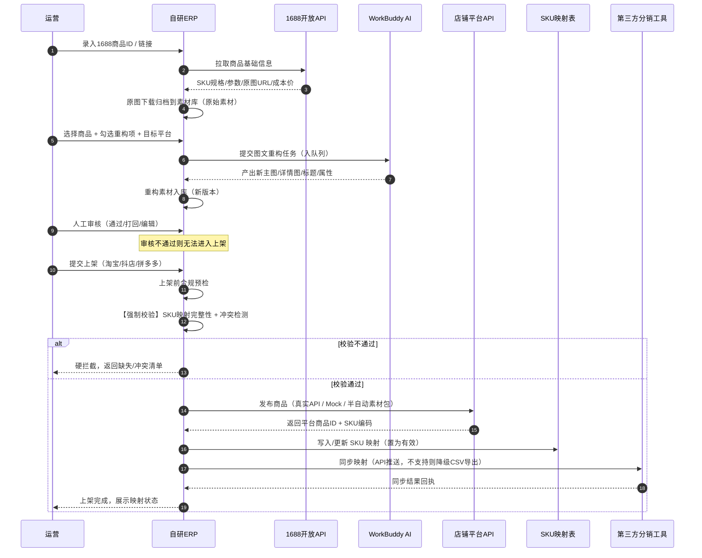
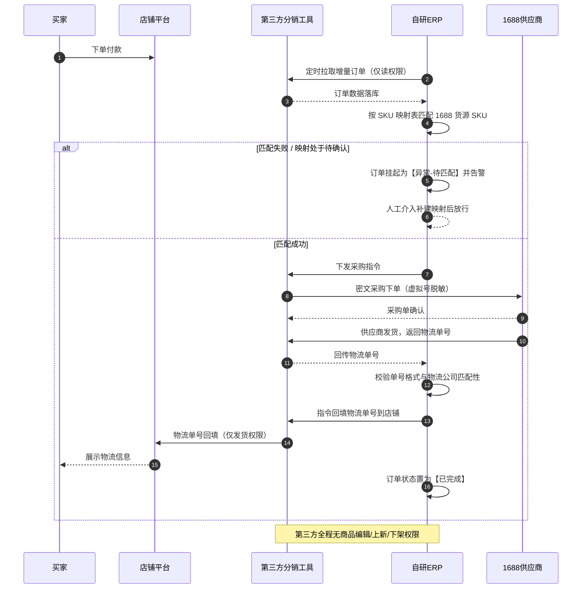
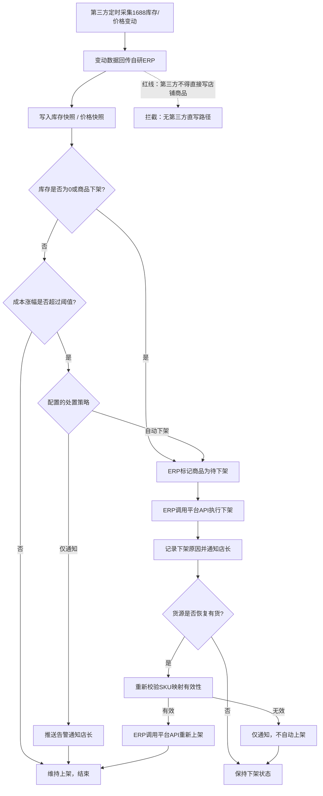
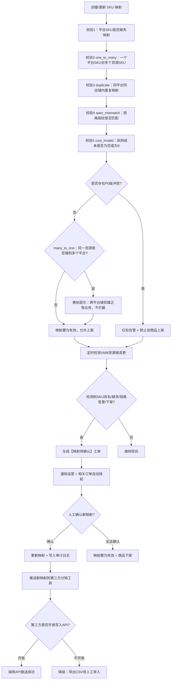
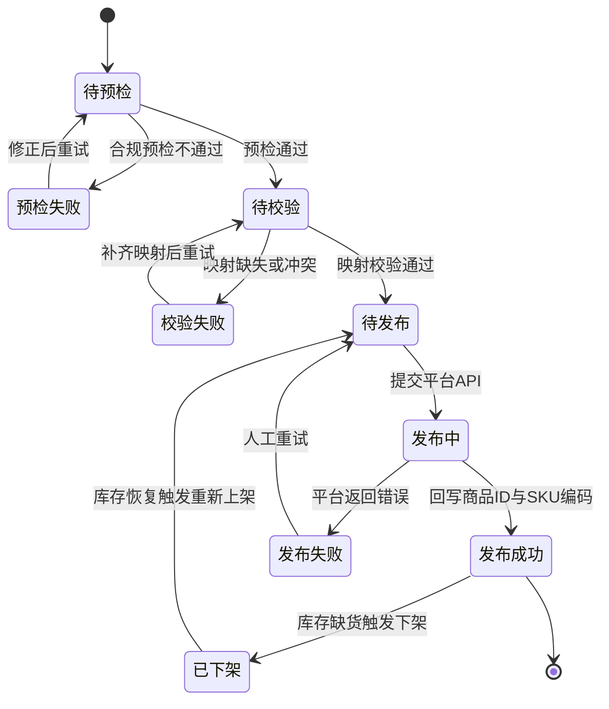
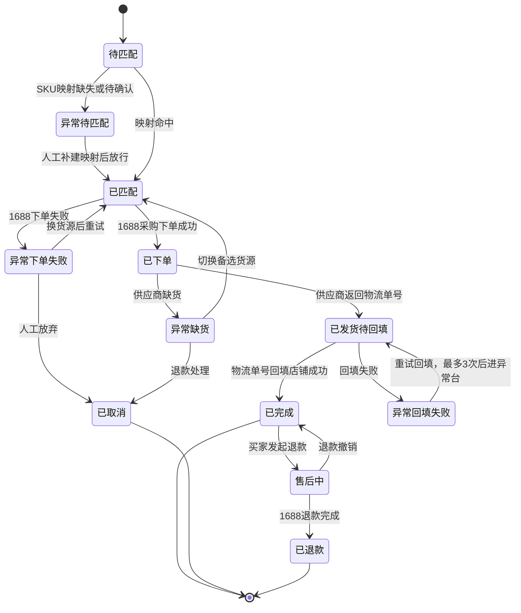

# 自用电商 ERP 系统 · 产品需求文档（PRD）

| 项目信息 | 内容 |
| --- | --- |
| 文档语言 | 简体中文 |
| 项目名称 | `selfuse_ecommerce_erp` |
| 后端技术栈 | Python（FastAPI + Celery + PostgreSQL + Redis + MinIO/对象存储） |
| 前端技术栈 | React + TypeScript + Vite |
| 文档版本 | v1.22（定稿；已对齐 `docs/ARCHITECTURE.md` v1.14，并回补实现侧新增能力） |
| 撰写人 | 许清楚（产品经理） |
| 目标用户 | 个人 / 小团队卖家（无货源 / 一件代发） |
| 经营平台 | 淘宝、抖店、拼多多 |
| 货源平台 | 1688 |

---

## 一、原始需求复述

用户是个人 / 小团队卖家，在**淘宝、抖店、拼多多**经营店铺，采用**无货源 / 一件代发**模式。核心诉求是**省钱 + 控风险**：

- **自研 ERP 负责"商品上新链路"**（免费）：1688 采集原始素材 → AI 图文重构 → 多平台上架 → 建立 SKU 映射表 → 映射同步给第三方分销工具。
- **第三方分销工具只订阅"订单履约"模块**（妙手 / 逸淘），**完全不启用其商品采集、铺货搬家功能**，从而砍掉约一半订阅费。
- **履约层必须做成可切换的抽象适配层**（妙手 / 逸淘 / CSV 本地兜底），后台可配置切换，不改核心代码。
- **绝不把商品编辑 / 上新权限交给第三方工具**，防止其篡改已 AI 重构的商品。

---

## 二、产品定义

### 2.1 一句话产品目标

> 用自研系统吃下"选品 → AI 重构 → 多平台上架 → SKU 映射"这条最贵的上新链路，把最标准化的订单履约外包给廉价第三方，在**不交出商品编辑权**的前提下，把单店 ERP 总成本压到第三方全量方案的一半以下。

### 2.2 三条量化目标

| 编号 | 目标 | 量化指标 | 度量方式 |
| --- | --- | --- | --- |
| G1 | **降本** | 单店 ERP 年成本较"第三方全量订阅方案"下降 ≥ 50%；自研侧仅承担服务器 + AI 调用成本 | 年度订阅账单对比 / 成本台账 |
| G2 | **提效** | 单个商品从"1688 采集"到"三平台上架完成"的人工耗时 ≤ 5 分钟（其中人工仅做重构审核与上架确认）；批量上新支持 ≥ 50 商品 / 批次 | 上架任务耗时埋点统计 |
| G3 | **控风险** | SKU 映射准确率 100%（映射缺失 / 冲突商品**零上架**）；因映射错误导致的发错货纠纷 ≤ 1 单 / 千单；超卖订单数 = 0 | 映射校验拦截计数 + 售后纠纷归因统计 |

### 2.3 用户故事

**角色：运营（负责选品、上架、日常铺货）**

| ID | 用户故事 |
| --- | --- |
| US-1 | 作为运营，我希望从 1688 一键拉取商品的基础信息（SKU 规格、参数、原图、成本价）到货源库，以便我只做挑选不用手工誊抄。 |
| US-2 | 作为运营，我希望把原始图文批量提交给 AI 做重构（重绘主图 / 详情图、重写标题卖点、补全属性），并在发布前逐条人工审核，以便既规避盗图风险又保证素材质量。 |
| US-3 | 作为运营，我希望一次配置后把重构后的商品同时发布到淘宝 / 抖店 / 拼多多，并自动回收平台商品 ID 与 SKU 编码，以便不用在三个后台重复填写。 |
| US-4 | 作为运营，我希望在没有平台 API 资质时也能用"素材包 + 表单预填"的半自动方式发布，以便上新不被资质卡死。 |
| US-5 | 作为运营，我希望看到每个商品的 SKU 映射关系与校验状态，未通过校验的商品无法上架，以便从源头杜绝发错货。 |

**角色：店长（负责订单、库存、资金与风险）**

| ID | 用户故事 |
| --- | --- |
| US-6 | 作为店长，我希望在后台一键切换履约渠道（妙手 / 逸淘 / 本地 CSV 兜底），切换后不改代码即可生效，以便哪家便宜用哪家、哪家出问题立刻换。 |
| US-7 | 作为店长，我希望实时看到每笔订单的履约状态（待匹配 / 已下单 / 已发货 / 已回填 / 异常），异常单自动高亮并给出处理建议，以便我不漏单。 |
| US-8 | 作为店长，我希望 1688 货源缺货或涨价时，系统自动把对应平台商品下架并通知我，而不是让第三方工具直接改我的店铺商品，以便超卖风险可控。 |
| US-9 | 作为店长，我希望给第三方工具只授予"订单读取 + 发货"权限，并在系统里固化这个限制，以便工具永远改不动我 AI 重构过的商品。 |
| US-10 | 作为店长，我希望买家退款时能自动联动向 1688 提交退款并同步退货地址，同时保留纠纷责任在我方店铺的清晰记录，以便售后不失控。 |

---

## 三、系统边界与职责划分

| 链路 | 归属 | 说明 |
| --- | --- | --- |
| 货源采集 | **自研** | 1688 开放 API，只取原始素材，不直接上架 |
| AI 图文重构 | **自研**（调用 WorkBuddy AI 能力） | 重绘主图/详情图、重写标题卖点、调整属性 |
| 多平台上架 | **自研** | 淘宝 / 抖店 / 拼多多开放 API；无资质时走 Mock 或半自动模式 |
| SKU 映射管理 | **自研（唯一权威源）** | 映射的创建、校验、变更、推送全部由自研侧掌控 |
| 订单履约 | **第三方（妙手 / 逸淘）** | 通过抽象适配层对接，仅启用订单读取 + 发货 |
| 库存/价格变动采集 | **第三方采集 → 自研决策 → 自研执行** | 第三方只推送数据，**不得**直接改店铺商品 |
| 自动下架 | **自研** | 由 ERP 调用平台 API 执行 |

> **红线原则**：第三方工具**任何情况下**都不得持有商品编辑 / 上新 / 下架 / 改价权限。

---

## 四、需求池

优先级：**P0 = 必须有（MVP 上线阻塞项）**，**P1 = 应该有**，**P2 = 可以有**。

> **【v1.7 补充】阅读本需求池的一条约定：每条需求的"验收标准"必须同时能回答"它没防住什么"。**
>
> 本项目在 PRD 与架构对齐过程中出现过**两次同类事故**，都不是写错了，而是**只写了结论、没写边界**，导致后来的人（包括作者本人）误以为已覆盖：
>
> | 事故 | 表面结论 | 实际盲区 |
> | --- | --- | --- |
> | `duplicate` 重复映射检测 | "已实现重复映射检测" | 唯一索引已从 DB 层阻断同键多行，**该检测永远返回空**，冲突面板干净是因为根本没跑 |
> | 倒挂检测的 `sale_price_cents > 0` 过滤 | "已过滤空售价，不会误报" | **被过滤的商品永久失去倒挂检测能力**，同样是"看起来没问题" |
>
> 提炼成一句话：**写了过滤条件不等于解决了空值，写了检测不等于检测生效。**
>
> 因此提出以下四类需求时，**必须一并写明边界**（与架构文档 §10.12 同一规范）：
>
> | 场景 | 必须一并写出 |
> | --- | --- |
> | 校验 / 检测规则 | 覆盖哪些、**漏掉哪些**，漏掉的部分靠什么兜底 |
> | 过滤条件 | 是"主手段"还是"兜底"，被过滤的数据**后果是什么** |
> | 降级方案 | 降级后**哪些能力消失**、如何被发现 |
> | 页面合并 | 合并后**哪些视图 / 入口消失**、是否影响既有操作路径 |
>
> 本需求池中 MAP-P0-03（6 类冲突 + 执行顺序）、LST-P0-02（Mock 模式）、LST-P0-07（售价必填）三条均按此约定写了边界，可作为**需求侧范例**（设计侧范例见架构文档 §10.12 的 E1–E5）。
>
> **【v1.9 补充】一条防止"把保护当成 bug 修掉"的红线**
>
> `POST /sku-mappings/validate` 返回 **422** 时，**第一反应必须是"校验生效了"，而不是"接口报错了"**。典型触发场景：回填把第二个店铺 SKU 绑到同一货源 SKU → 命中 P0 重复映射冲突 → 422。**这是 MAP-P0-02 硬拦截在起作用，是正确行为。**
>
> **严禁为了"让用例变绿 / 让流程跑通"而放宽校验、绕过校验或降低冲突级别。**本系统最高概率事故就是映射错误（映射错 → 买错规格 → 发错货 → 店铺纠纷），MAP-P0-02 是它的唯一防线，**这条防线不可协商**。
>
> 遇到 422 的正确处置：查看响应体中的冲突明细，修正数据（改映射 / 换货源 SKU），而不是改校验规则。
>
> ⚠️ **可执行的验收断言不在此处**：本约定说明的是"边界要写清"，**判定是否真的做到了的验收断言见 `docs/ARCHITECTURE.md` 附录 A**。写验收用例、做交付验收时请跳转查阅该附录——本文件不重复维护断言，**也不写断言条数**（条数会随需求增补而变，数字本身就是一个会漂移的副本）。

### 4.1 货源采集（SRC）

| 需求ID | 优先级 | 需求描述 | 验收标准 |
| --- | --- | --- | --- |
| SRC-P0-01 | P0 | 通过 1688 开放 API 按商品 ID / 链接拉取商品基础信息：标题、类目、参数、主图、详情图、成本价、SKU 规格 | 输入合法 1688 商品 ID 后 30s 内完成拉取；字段完整率 ≥ 95%；失败返回明确错误码 |
| SRC-P0-02 | P0 | SKU 规格树解析：支持多规格（如 颜色×尺码）组合展开为 SKU 列表，保留规格名 / 规格值 / SKU ID / 价格 / 库存 | 对 ≥ 3 个规格维度的商品能正确笛卡尔展开，无遗漏无重复 |
| SRC-P0-03 | P0 | 货源商品列表与详情：支持按标题 / ID / 供应商 / 采集时间筛选，展示成本价与库存快照 | 列表分页响应 ≤ 1s（1 万条数据量级） |
| **SRC-P0-04** | P0 | **货源录入双通道兜底**：除 1688 API 采集外，必须支持**手工录入**（单条，含 SKU 列表）与 **CSV 批量导入**，落库时标记 `source_platform='manual'` | 手工/CSV 录入的商品与 API 采集商品**在下游完全等价**：可进素材库、可送 AI 重构、可半自动上架、可建映射、可被订单匹配命中 |
| SRC-P1-01 | P1 | 选品池：按关键词、价格区间、销量、复购率筛选 1688 商品并批量加入货源库 | 单次批量导入 ≥ 50 条成功率 ≥ 98% |
| SRC-P1-02 | P1 | 供应商维度管理：记录起订量、发货时效、所在地、合作评分 | 可按供应商维度统计在售商品数与履约异常率 |
| SRC-P2-01 | P2 | 同款多货源：一个自研商品可关联多个备选 1688 货源，主货源缺货自动切换备选 | 主货源缺货时 5 分钟内完成备选切换并更新映射 |

> **【v1.9 补充】原兜底设计的一个盲区：只给"上架侧"做了兜底，漏了"采集侧"**
>
> PRD 原本为应对 Q1（平台 API 资质门槛）设计了**两个兜底**，但它们都在上架侧：
> - LST-P0-02 Mock 沙箱模式
> - LST-P0-04 半自动素材包 + 表单预填
>
> **盲区在于：如果 1688 侧的 API 也拿不到（未配置 AppKey/AccessToken、或开放接口契约尚未实测确认），链路在第一步"采集"就断了**——后面两个上架兜底再完善也无货可上。
>
> 因此新增 **SRC-P0-04 手工录入 + CSV 导入**，把兜底补到采集侧。完整链路的兜底矩阵现在是：
>
> | 环节 | 主路径 | 兜底路径 |
> | --- | --- | --- |
> | 采集 | 1688 开放 API（SRC-P0-01） | **手工录入 / CSV 导入（SRC-P0-04）** |
> | 重构 | WorkBuddy AI（AIR） | `MockAiClient` 占位产出 |
> | 上架 | 平台发布 API（LST-P0-01） | Mock 沙箱（LST-P0-02）/ 半自动素材包（LST-P0-04） |
> | 履约 | 妙手 / 逸淘（FUL-P0-02/03） | 本地 CSV 兜底适配器（FUL-P0-04） |
>
> **注意**：手工/CSV 录入的商品与 API 采集商品必须**下游完全等价**（`source_platform` 仅作来源标记，**不参与任何能力分支判断**）。否则"录入的商品不能上架"这类限制会让兜底形同虚设。
>
> **【v1.11 补充】等价性的实现手段与两条产品侧约束**
>
> **实现手段**：靠**字段补齐**而不是靠下游加 `if`——手工/CSV 商品的 `source_sku.sku_code_1688` 填 `'manual:' + spec_signature`（无规格时 `'manual:' + 序号`）；**商品级同样补齐**：有商品编码用 `'MANUAL-<编码>'`，无编码则自动生成并保证库内唯一。使素材库 / AI 重构 / 上架 / 映射 / 订单匹配五条下游链路**零 `if` 分支**即可复用。
>
> **【v1.13 修订】`product_1688_id` 的 `UNIQUE NOT NULL` 约束维持不放宽。** v1.11 曾记载"因手工商品无 1688 ID，需放宽为可空 + 部分唯一索引"——**该变更已由实现侧撤回**：正解是**没有 ID 就造一个，而不是把约束拆了**（这恰是 R4「靠字段补齐」的应有之义）。原放宽方案降级为防御性兜底，不执行。
>
> **【v1.13 修订】唯一约束的事实澄清**：`source_sku` 上的唯一约束是**复合**的 `(source_product_id, sku_code_1688)`，作用域在**商品内**（防同一商品下写重 SKU）。重复导入会创建新的 `source_product_id` → 复合键不同 → **撞不上**。因此"满足唯一约束"**不能**作为"可以放心不硬拦截"的理由；填充该字段的唯一目的是**保证非空**。
> **🚫 禁止项**：禁止给 `sku_code_1688` 加单列唯一索引、禁止把复合约束收窄为单列——否则"只提示"会静默变成"中途硬失败"。
>
> **约束 1：批量导入必须整体事务 + 整批预校验，禁止留孤儿数据。** CSV 导入是"商品头 + SKU 列表"的多行写入，若中途某行失败而前面已提交，会产生**没有 SKU 的孤儿商品头**（列表里有、点进去是空的、上架时报错）。
> 落地方式：`POST /source-products/import-csv?dry_run=true` 供前端做**提交前预览**（返回 `duplicates[]` + `errors[]`，不写库）；正式导入走**单事务**，任一行失败整批 rollback + 422。
> **【v1.13 补充】正式导入接口内部必须强制先执行一遍预校验**（失败则整批拒绝、不写库），**不能只在运营主动调用 `dry_run` 时才安全**。否则"跳过 dry_run 直接导入"仍是危险路径——安全不应依赖用户记得先点预览。
> **边界（架构侧声明，产品侧接受）**：整批事务意味着"500 行错 1 行 → 整批重来"，这是刻意选择，缓解手段是预校验让运营提交前改完，而非靠"部分成功"省事。单条手工录入不受此约束。
>
> **约束 2：重复导入的检测必须在预处理阶段整批完成。** 运营需要在**提交前**就知道"这批里有 3 条与库内重复"，而不是导入完成后才发现多出 3 个重复商品（后续会带来 AI 重构重复计费、素材重复、成本统计重复）。
>
> **【v1.13 裁定】重复提示按"有无商品编码"二分**（架构侧提出，产品侧确认）：
> | 情形 | 行为 | 提示文案要求 |
> | --- | --- | --- |
> | **有商品编码** | 幂等 upsert（更新而非新增） | 必须提示"**将更新既有商品**，并列出将要变化的关键字段"（如 成本价 10.00→12.00、SKU 数 3→4），不能只说"将更新" |
> | **无商品编码** | 自动生成编码，按标题 + 规格指纹判重 | 提示"**可能与库内第 X 条重复**"，不硬拦截 |
>
> **⚠️ 由此产生的两条硬约束（产品侧新增，优先级高于便利性）**：
> 1. **upsert 必须是"部分更新"语义：CSV 中未提供的字段一律不覆盖。** 若按全量覆盖实现，运营导一遍只有标题的 CSV → **成本被抹成 0 → 触发 `cost_invalid`（P0，禁止上架）；库存被抹成 0 → 触发缺货自动下架**。一次导入会把在售商品批量打残，且症状表现为"库存/成本异常"而非"导入出错"，极难归因。
> 2. **幂等 upsert 不得静默覆盖人工成本。** 若既有商品的 `cost_source='manual'`（人工议价修正过），导入更新成本时**必须沿用 MAP-P0-04 的"成本待确认"机制**提示确认，不得静默冲掉——这与 INV-P0-05 的口径一致。

### 4.2 素材库管理（AST）

| 需求ID | 优先级 | 需求描述 | 验收标准 |
| --- | --- | --- | --- |
| AST-P0-01 | P0 | 原始素材归档：采集时自动下载原图并落对象存储，按内容哈希去重，保留原始 URL 与本地地址 | 同一图片重复采集不产生第二份存储；原图可追溯原始 URL |
| AST-P0-02 | P0 | 素材与货源商品 / SKU 关联，区分"原始素材"与"AI 重构素材"两类 | 任一商品可一键查看其全部原始素材与全部重构素材 |
| AST-P0-03 | P0 | 重构素材版本管理：每次 AI 重构产出新版本，可回退到历史版本 | 版本可回滚；回滚后上架任务使用回退版本的素材 |
| AST-P1-01 | P1 | 素材标签 / 分组管理（按类目、平台、用途） | 支持多标签筛选与批量打标 |
| AST-P2-01 | P2 | 素材生命周期策略：超期未使用素材自动转低频存储 / 清理 | 清理前生成待确认清单，需人工确认后执行 |

### 4.3 AI 图文重构任务队列（AIR）

| 需求ID | 优先级 | 需求描述 | 验收标准 |
| --- | --- | --- | --- |
| AIR-P0-01 | P0 | 创建重构任务：选择货源商品 + 勾选重构项（主图 / 详情图 / 标题 / 属性），设置目标平台 | 支持单商品与批量（≥ 50 商品）创建；任务进入队列后状态可见为"排队中" |
| AIR-P0-02 | P0 | 任务队列与调度：基于 Celery 的异步队列，支持并发上限配置、失败自动重试（最多 3 次，指数退避）、任务取消 | 队列积压时按优先级调度；单点失败不影响其他任务；重试次数与失败原因可查 |
| AIR-P0-03 | P0 | 重构结果人工审核：预览 AI 产出的图文，支持"通过 / 打回重做 / 手工编辑"，审核通过才允许进入上架 | **未审核通过的素材无法被上架任务引用**（系统级硬约束） |
| AIR-P0-04 | P0 | 标题卖点重写：按目标平台风格生成标题与卖点，内置平台违禁词 / 极限词预检 | 命中违禁词的标题被标记且不通过审核，给出替换建议 |
| AIR-P1-01 | P1 | 主图 / 详情图 AI 重绘：按平台模板尺寸与张数要求产出（如淘宝主图 800×800） | 产出图片尺寸符合所选平台规范；重绘图与原图相似度检测通过（非简单搬运） |
| AIR-P1-02 | P1 | 商品属性智能填充：按目标平台类目模板映射属性键并填充值 | 目标平台必填属性填充率 ≥ 90%，未填项在审核页高亮 |
| AIR-P2-01 | P2 | Prompt / 重构模板版本管理：不同类目使用不同重构模板，支持 A/B 对比 | 可追溯某商品使用了哪个模板版本；支持按模板统计审核通过率 |

> **【v1.10 补充】AI 接入为双通道可切换（用户已决策，非待定项）**
>
> `AiClient` 抽象接口下有三个实现，由配置项 `ai.client` **后台实时切换**，默认 **`file_bridge`**：
>
> | 客户端 | 用途 | 说明 |
> | --- | --- | --- |
> | `file_bridge`（默认） | WorkBuddy 文件桥 | 写 `data/ai_queue/<task_id>/{task.json, prompt.md}`，轮询 `data/ai_output/<task_id>/result.json`。**模型名 / 图片接口 / 鉴权由 WorkBuddy 侧决定，本地无需预知** |
> | `http` | OpenAI 兼容 HTTP API | 需部署前配置 `base_url` / `model` / `api_key` |
> | `mock` | 占位产出 | 过渡期与首次体验；配置改为此值后**实际生效**（配置项是权威，不是摆设） |
>
> **产品侧要求（v1.11 明确口径）**：
> 1. **"在途"包含 `queued` 与 `running` 两种状态**——不只是正在跑的任务。排队中的任务若切换后改用新客户端，同样可能卡死（例如从 `file_bridge` 切到 `mock`，排队任务被执行时读到 `mock` 却已投递过文件桥任务）。
> 2. 实现手段：任务创建时**固化 `ai_task.ai_client`**，handler 读该列而不读当前配置（与 `Order.adapter_name` 同模式）。**配置项只影响切换之后新建的任务。**
> 3. 若运营希望"排队中的任务也立刻用新客户端"，正确操作是**取消后重建**，而不是让系统切换——切换语义必须简单可预期。
> 4. **任务长时间停留在 `running` 必须在 UI 上可诊断**（对应架构 E8 边界）：`file_bridge` / `http` 模式下若外部 AI 代理不投递结果，任务会停在 `running` 直到轮询超时。**UI 必须显示已等待时长、剩余超时时间与"可能原因：外部 AI 代理未返回结果"**，否则运营只会看到"一直在转圈"，无法区分"在正常生成"与"外部链路已断"。

### 4.4 SKU 映射管理（MAP）— **最高风险模块**

| 需求ID | 优先级 | 需求描述 | 验收标准 |
| --- | --- | --- | --- |
| MAP-P0-01 | P0 | 映射表 CRUD：字段含平台、店铺ID、店铺商品ID、店铺SKU编码、1688货源商品ID、1688货源SKU编码、采购成本、状态、生效时间 | 支持单条与批量操作；创建 / 修改 / 删除全部落审计日志 |
| MAP-P0-02 | P0 | **上架前强制校验**：商品所有平台 SKU 必须存在完整且有效的映射，否则**禁止提交上架** | 无映射 / 映射不完整的商品在上架页被硬拦截并给出缺失清单，无法通过任何绕过路径发布 |
| MAP-P0-03 | P0 | **冲突检测（6 类，分 P0/P1 两级）**： ① `one_to_many` 一个平台 SKU 映射多个货源 SKU → **P0** ② `duplicate` 同平台同店铺内重复映射（一个货源SKU被多个店铺SKU引用 / 同一 `shop_sku_code` 挂在不同 `shop_item_id` 下）→ **P0** ③ `spec_mismatch` 规格指纹不匹配（货源改名 / 改规格）→ **P0** ④ `cost_invalid` 采购成本为空或为 0（**判 `sku_mapping.purchase_cost_cents`**）→ **P0** ⑤ `many_to_one` 一个货源 SKU 映射到**不同平台**的多个平台 SKU（跨平台铺货）→ **P1，仅提示** ⑥ `cost_underwater` **成本倒挂**：映射成本 ≥ 平台售价 → **P1，黄标提示不拦截**（v1.4 新增） | ①②③④ 在映射管理页与商品详情页双端**红标并禁止上架**； ⑤⑥ 仅黄色提示，文案明确标注处置建议，**不拦截** |
| MAP-P0-04 | P0 | **货源端变更同步**：定时检测 1688 端 SKU 改名 / 缺货 / 规格变更 / 下架，自动生成"映射待确认"工单并通知；确认后同步更新映射并推送给分销工具 | 变更检测延迟 ≤ 30 分钟；存在未确认变更的商品在订单匹配时进入"挂起"状态而非盲发 |
| MAP-P0-05 | P0 | 映射导出 CSV：按第三方工具（妙手 / 逸淘）要求的字段格式导出，支持按店铺 / 时间范围筛选 | 导出的 CSV 可被妙手 / 逸淘导入界面直接识别（需实测确认字段模板，见 Q2） |
| MAP-P1-01 | P1 | 映射 API 推送：适配器声明支持写入时，调用第三方开放 API 自动推送映射；不支持时**自动降级为 CSV 导出**并提示 | 推送结果（成功 / 失败 / 降级）可查；失败自动重试 3 次 |
| MAP-P1-02 | P1 | 映射变更审计日志：记录谁、何时、改了哪个字段、从什么值到什么值、变更来源（人工 / 系统 / 第三方） | 支持按映射条目回溯完整变更历史 |
| MAP-P2-01 | P2 | 批量映射导入 / 修正：支持上传第三方导出的映射文件做对账修正 | 导入后自动生成差异报告（新增 / 修改 / 冲突 / 孤儿映射） |

> **【v1.1 修订】冲突分类的两处关键澄清**
> 1. **新增第 5 类 `spec_mismatch`（规格指纹不匹配，P0）**：这是 MAP-P0-04「货源端变更同步」的技术实现基础——不比对规格指纹就无法自动发现货源改名 / 改规格，MAP-P0-04 将退化为人工巡检。
> 2. **原「一个货源 SKU 映射多个平台 SKU」拆为两类**：
>    - **同平台同店铺内重复**（`duplicate`）→ **P0，禁止上架**（真的会发错货）；
>    - **跨平台铺货**（`many_to_one`，同一货源铺到淘宝 + 抖店 + 拼多多）→ **P1，仅提示不拦截**（这是本项目的正常主营业务）。
>
>    **验收口径以此为准**：运营在三个平台铺同一个货源商品时，**不得**出现"为什么我三平台铺货被拦了"的拦截。
>
> 3. **【v1.2 补充】`MappingValidator.validate()` 的执行顺序是硬约束**：必须**先跑 `many_to_one` 并把命中的映射剔除，再跑其余四类**。原因：跨平台铺货在形态上会被 `duplicate` 的第一种情形（一个货源 SKU 被多个店铺 SKU 引用）误判成 P0 拦截——**顺序错了就正好复现上面那条验收争议**。对应测试用例：三平台铺同一货源 → `passed == true`，必须存在。
> 4. **【v1.2 补充】`duplicate` 的准确定义**：由于部分唯一索引 `uq_sku_mapping_shop_sku (platform, shop_id, shop_sku_code) WHERE is_deleted=0` 已从 DB 层阻断"完全相同映射对存在多条"，`duplicate` 指**索引覆盖不到的两种真实重复**：① 同店铺内一个货源 SKU 被多个店铺 SKU 引用（索引只约束"一店铺 SKU → 一映射"，不约束反向）；② 同一 `shop_sku_code` 挂在不同 `shop_item_id` 下（索引不含 `shop_item_id`）。

> **【v1.4 补充】成本字段的三层语义（产品决策，非实现细节）**
>
> 成本是本系统**唯一一个同时需要"当前值"和"历史快照"的字段**，必须三层分离，缺一层必然出对账事故：
>
> | 层级 | 字段 | 语义 | 写入者 | 可变性 |
> | --- | --- | --- | --- | --- |
> | **真源** | `source_sku.cost_price_cents` | 1688 货源**当前**成本 | 采集 / 同步任务 | 随货源变动而变 |
> | **镜像** | `sku_mapping.purchase_cost_cents` | 当前成本的**派生镜像**，供利润核算、冲突检测、改价公式取基数用 | 自动同步自真源；人工可覆盖（覆盖后记 `cost_source='manual'`） | **随真源变动而变** |
> | **快照** | `order_item.purchase_cost_cents` | **下单时点固化**的成本 | 下单瞬间从镜像复制 | **永不可变** |
>
> **决策要点**：
> 1. **采用"镜像自动同步 + 快照固化"，不采用"映射成本冻结为建映射时的值"**。理由：若映射成本冻结，货源涨价后利润核算与"成本为空/0"检测全部失真，INV-P0-04 的价格涨幅告警与映射冲突检测会出现**两套成本口径**，这正是架构师担心的不一致。
> 2. **`cost_invalid` 冲突检测判的是 `sku_mapping.purchase_cost_cents`（镜像，即同步后的当前成本）**，与 INV-P0-04 涨幅阈值的取数口径**必须一致**。
> 3. **历史订单的利润核算一律读 `order_item.purchase_cost_cents`，禁止 join 回 `sku_mapping` 或 `source_sku` 取成本**——否则货源一涨价，历史订单金额会被回溯改写。这是硬性约束，须进自动化用例。
> 4. **人工覆盖的处理**：允许人工修正映射成本（1688 页面价与实际成交价常因议价 / 运费不一致），覆盖后标 `cost_source='manual'`；此后货源端再变动时**生成"成本待确认"提示（复用 MAP-P0-04 的待确认工单机制），不得静默覆盖人工值**。
> 5. **审计噪音控制**：自动同步产生的成本变动写入 `mapping_change_log` 且 `change_source='system'`；P18 审计日志页**默认过滤**此类系统自动同步记录，可勾选查看。人工修改照常全量记录。
>
> 6. **【v1.4 新增第 6 类冲突 `cost_underwater`（成本倒挂，P1）】**：映射成本 ≥ 平台售价时黄标提示。
>    **为什么必须加**：INV-P0-04 的价格告警判的是**涨幅**（相对变化），存在盲区——某商品成本涨 8%（未达 10% 阈值）但**早已倒挂**，此时涨幅告警不触发，运营会**卖一单亏一单**且毫无察觉。这直接命中用户"省钱"的核心诉求。
>    **为什么定 P1 不拦截**：① 需依赖 `listing_sku` 售价已同步，上架首日售价可能尚未回写；② 无货源业务存在"引流款故意亏损"的正常场景；③ MVP 阶段先建立可见性，INV-P0-04 涨幅阈值仍是主防线。**若后续要升级为 P0 拦截，走系统配置项，不改代码。**
>    **数据来源**：`sku_mapping.purchase_cost_cents`（镜像）对比 `listing_sku.sale_price_cents`，允许配置最低利润率缓冲（默认 0，即成本 ≥ 售价即提示）。
>
> 7. **【v1.5 补充】`cost_underwater` 的两条前置过滤**（架构师发现的边界，产品侧确认）：
>    - **`sale_price_cents > 0`**：半自动模式下若售价留空，会被判成"成本 ≥ 售价"而**大面积误报倒挂**；
>    - **`is_mock = false`**：Mock 上架商品的售价是模拟生成的，倒挂检测对它们无意义，且会污染冲突面板。
>
>    **但过滤不等于解决**——被过滤掉的商品**永久失去倒挂检测能力**，这正是我们最怕的"静默失效"。因此配套 **LST-P0-07：半自动回填时售价必填**，从源头消灭空值，而不是靠过滤掩盖。过滤条件只是防御性兜底，防止历史存量数据误报。

### 4.5 多平台上架（LST）

| 需求ID | 优先级 | 需求描述 | 验收标准 |
| --- | --- | --- | --- |
| LST-P0-01 | P0 | 统一上架抽象接口：定义 `publish / query_status / offline / update_stock_price` 四个能力，淘宝 / 抖店 / 拼多多各自实现适配器 | 新增一个平台适配器不改动核心上架流程代码 |
| LST-P0-02 | P0 | **Mock / 沙箱模式**：未取得平台发布 API 资质时，上架流程走 Mock 适配器，返回模拟商品 ID 与 SKU 编码，全流程可跑通 | 后台一键开关；Mock 模式下数据带明确 `is_mock` 标记，且 Mock 数据不参与真实履约 |
| LST-P0-03 | P0 | 上架任务与结果回写：任务状态机（待发布 / 发布中 / 成功 / 失败 / 已下架），成功后回写平台商品 ID 与 SKU 编码并自动建立映射 | 回写成功率 ≥ 99%；失败商品可单独重试；回写成功后映射自动置为"有效" |
| LST-P0-04 | P0 | **半自动兜底模式**：ERP 生成标准化上架素材包（图片压缩包 + 标题 / 卖点 / 属性 / 价格的预填表单数据），人工在平台后台粘贴发布后回填商品 ID | 素材包可一键下载；支持人工回填 ID 后补建映射；回填后校验 ID 唯一性 |
| **LST-P0-07** | P0 | **回填售价必填**：半自动模式回填平台商品 ID 时，**平台售价为必填项**（与商品 ID 同级），不得留空 | **服务端必须兜住**：`sale_price` 缺失或 ≤ 0 时返回 **422 拒绝提交**（前端校验可被脚本批量回填绕过，不能只依赖前端）；P10 平台商品管理页提供**售价为空在售商品的筛选与批量补填入口**，补填后**自动触发 `cost_underwater` 重算**，且**响应体直接返回新产生的冲突列表**（运营补完立刻看到"原来这几个商品是倒挂的"，无需再手动跑一次检测） |
| LST-P1-01 | P1 | 上架前合规预检：校验类目必填属性、图片数量 / 尺寸 / 大小、标题长度、价格合理性 | 预检不通过时列出具体失败项与修正建议；预检通过率可统计 |
| LST-P1-02 | P1 | 上架失败诊断：把平台返回的错误码翻译为可执行的中文处理建议 | 覆盖 TOP 20 高频错误码；错误知识库可人工补充 |
| LST-P2-01 | P2 | 定时 / 批量发布：支持设定发布时间窗口与发布速率，避免触发平台限流 | 按配置的速率平滑发布；触发限流时自动降速重试 |

### 4.6 履约适配层（FUL）— **架构核心**

| 需求ID | 优先级 | 需求描述 | 验收标准 |
| --- | --- | --- | --- |
| FUL-P0-01 | P0 | 履约适配器抽象接口：定义 `fetch_orders / match_sku / place_purchase_order / fetch_tracking_no / write_back_tracking / submit_refund / get_return_address / push_inventory_change` 八项能力，适配器通过能力声明告知支持范围 | 新增适配器只需实现接口并注册，核心订单流程零改动 |
| FUL-P0-02 | P0 | 妙手适配器：对接"妙手一键下单"，实现上述能力中其实际开放的部分，未开放能力标记为 `UNSUPPORTED` 并触发降级 | 可通过后台配置凭证并连通；连通性自检有明确结果反馈 |
| FUL-P0-03 | P0 | 逸淘适配器：同上，对接"逸淘一键下单" | 同上；与妙手适配器可并存配置 |
| FUL-P0-04 | P0 | 本地 / CSV 兜底适配器：不依赖第三方，ERP 自主完成 1688 下单与物流回填，映射以 CSV 导入导出 | 第三方不可用时可切换此模式维持业务不中断；映射可导出为 CSV |
| FUL-P0-05 | P0 | **后台可配置切换**：系统设置页选择当前生效的履约渠道（妙手 / 逸淘 / 本地），保存后立即生效，无需重启、不改代码 | 切换后新订单走新渠道；切换动作落审计日志；切换期间在途订单按原渠道跑完 |
| FUL-P0-06 | P0 | **权限最小化配置**：适配器的授权范围仅包含"订单读取"与"发货 / 物流回填"，系统设置页明示权限清单，并在授权引导中禁止勾选商品编辑 / 上新 | 设置页展示当前授权范围；**任何启用路径**都必须校验 scope，越权则拒绝启用（403）+ 落审计 + 置 `rejected` 并告警。见下方【v1.12 边界】 |
| FUL-P1-01 | P1 | 适配器连通性自检与健康度：定时心跳检测，连续失败 N 次自动告警并提供一键切换入口 | 检测周期可配置（默认 5 分钟）；失败告警可推送到配置的通知渠道 |
| FUL-P2-01 | P2 | 多适配器灰度 / 分流：按店铺或商品比例分流到不同履约渠道做对比 | 分流比例可配置；可按渠道对比履约成功率与时效 |

### 4.7 订单同步与履约状态追踪（ORD）

| 需求ID | 优先级 | 需求描述 | 验收标准 |
| --- | --- | --- | --- |
| ORD-P0-01 | P0 | 订单拉取与落库：定时从当前生效适配器拉取增量订单，落库并去重 | 拉取延迟 ≤ 5 分钟；重复拉取不产生重复订单 |
| ORD-P0-02 | P0 | 履约状态机与看板，12 态：`pending_match` 待匹配 / `exception_unmatched` 异常-待匹配 / `matched` 已匹配待下单 / `exception_purchase_failed` 异常-下单失败 / `purchased` 已下单待发货 / `exception_out_of_stock` 异常-缺货 / `shipped` 已发货待回填 / `exception_writeback_failed` 异常-回填失败 / `completed` 已完成 / `after_sale` 售后中 / `refunded` 已退款 / `cancelled` 已取消 | 看板可实时查看各状态订单数与明细；每次状态迁移写时间线事件；`is_mock=true` 订单不得进入 `matched` |
| ORD-P0-03 | P0 | **SKU 匹配失败挂起**：订单 SKU 在映射表中找不到或映射处于"待确认"状态时，订单进入"异常-待匹配"并告警，**绝不盲发** | 匹配失败订单 100% 进入挂起；处理人可手工指定货源 SKU 并补建映射 |
| ORD-P0-04 | P0 | 异常订单处理台：集中处理缺货、地址异常、密文解析失败、下单失败、回填失败等异常，提供重试 / 换货源 / 退款 / 忽略四种动作 | 每类异常有对应处置动作；处理后状态正确流转；处理记录留痕 |
| ORD-P1-01 | P1 | 物流单号回填校验：校验单号格式与物流公司匹配性，回填失败自动重试 | 回填成功率 ≥ 98%；失败单进入异常台 |
| ORD-P1-02 | P1 | 售后退款联动：平台退款申请 → 自动向 1688 提交退款 → 获取 1688 退货地址 → 回传给买家 | 全流程状态可追踪；失败进入异常台；退货地址回传成功率 ≥ 98% |
| ORD-P2-01 | P2 | 履约时效统计报表：平均下单时长、平均发货时长、异常率，按供应商 / 平台 / 渠道维度 | 报表可按日 / 周 / 月导出 |

### 4.8 库存 / 价格同步与自动下架（INV）

| 需求ID | 优先级 | 需求描述 | 验收标准 |
| --- | --- | --- | --- |
| INV-P0-01 | P0 | 变动采集：接收第三方推送的 1688 库存 / 价格变动，或由 ERP 定时轮询兜底 | 变动数据入库存 / 价格快照表；采集延迟 ≤ 30 分钟 |
| INV-P0-02 | P0 | **变动回流而非直接改店铺**：第三方仅回传数据，店铺侧商品的任何变更**只能**由 ERP 调平台 API 执行 | 系统中不存在"第三方直接写店铺商品"的代码路径，代码评审确认 |
| INV-P0-03 | P0 | 缺货自动下架：货源 SKU 库存为 0 或商品下架时，ERP 自动调用平台 API 下架对应店铺商品，并记录下架原因 | 从检测到下架完成 ≤ 30 分钟；下架动作与原因可查 |
| INV-P0-04 | P0 | 价格变动阈值告警：成本价上涨超过设定阈值（默认 10%）时触发告警，按配置选择"自动下架"或"仅通知" | 阈值可配置；告警含商品、涨幅、建议动作 |
| **INV-P0-05** | P0 | **成本自动同步（镜像层）**：货源成本变动时自动同步到 `sku_mapping.purchase_cost_cents`，同步后**立即重算** `cost_invalid` 与 `cost_underwater` 两类冲突 | 同步延迟 ≤ 30 分钟（与 INV-P0-01 同节拍）；`cost_source='auto'` 时自动覆盖；**`cost_source='manual'` 时不覆盖，改为生成"成本待确认"提示**；同步动作写 `mapping_change_log`（`change_source='system'`） |
| INV-P1-01 | P1 | 库存恢复自动上架：货源恢复有货且商品此前因缺货下架时，自动重新上架 | 恢复上架前重新校验映射有效性；映射无效则只通知不上架 |
| INV-P2-01 | P2 | 价格联动自动改价：成本变动按利润率公式自动调整店铺售价；**基数取 `sku_mapping.purchase_cost_cents`（镜像/当前成本）** | 改价前后留痕；低于最低利润率时改为下架而非降价 |

> **【v1.14 补充】手工 / CSV 录入商品的库存可信度边界**（顺着 SRC-P0-04 往下推的第三层）
>
> **推导链**：① 孤儿数据 → ② upsert 覆盖语义 → ③ **手工商品的库存 / 成本永不自动更新**（架构 E7 已声明该边界）。
>
> **由此产生的风险**：手工 / CSV 录��的商品，库存**长期停留在导入时的值**（无 1688 自动同步）。若导入时填 50，系统会一直认为有 50——**实际已售罄也不会被发现，直到订单履约阶段才爆出"异常-缺货"**。这直接命中用户强调的**超卖风险**，并且是静默的：库存监控页上一片正常。
>
> **由此产生的第二个风险（方向相反）**：若运营在 CSV 里把库存填成 0（填错、或模板列错位），自动下架会把**在售商品批量下架**。
>
> **产品侧裁定（核心原则：破坏性动作要求数据源可信）**
>
> | 项 | 裁定 |
> | --- | --- |
> | **自动下架（INV-P0-03）适用范围** | **仅限库存数据自身来源为"自动同步"的 SKU**。手工 / CSV 维护库存的 SKU 触发**告警 + 一键下架入口**，不自动执行 |
> | **【v1.17 关键界限】本门槛只管"缺货类"，不管"涨价类"** | **INV-P0-03（缺货自动下架）**受此门槛约束；**INV-P0-04（涨价处置）不受此门槛约束**，涨价按运营配置的处置策略照常执行自动下架 |
> | **【v1.15 明确】判定键是 `inventory_snapshot.source`，不是 `source_platform`** | 取**该 SKU 最近一次快照的来源**：`erp_poll` / `third_party_push` = 可自动下架；`manual_import` / `manual_edit` = 只告警；**无快照 = `unknown`，不自动下架（保守优先）** |
> | **理由** | 自动下架是**破坏性动作**。1688 同步的库存=0 可信度高，自动化合理；人工一次性录入且永不更新的库存可信度不足，**自动化会放大录入错误**。与前面"宁可导入少覆盖几个字段，也不能让一次导入打残在售商品"同一取舍 |
> | **代价（必须被看见）** | 手工商品因此**失去自动防超卖能力**，超卖风险改由订单履约阶段的"异常-缺货"兜底。**这是明确取舍，不是遗漏**：宁可承担可发现的缺货异常，也不承担不可发现的误下架 |
> | **库存监控页要求** | 必须显示**数据源**（自动同步 / 手工维护）与**最后更新时间**；手工维护且超过 N 天（默认 7 天，可配）未更新的，标记"库存可能已过期"。**⚠️ 该超期提示仅对自动同步来源的商品有效，对手工维护商品永不触发——见 §10.1 已知限制 L5** |
> | **导入写入要求** | 导入修改库存 / 成本时**必须写快照并触发重算**（与 INV-P0-05 同口径），不得让导入后的商品处于检测盲区 |
>
> **⚠️ 边界声明（防止默认理解错误）**：不得认为"所有商品都会自动下架"。**自动下架的适用范围是"库存数据的来源"，不是商品本身**——同一批商品里，库存来自自动同步的 SKU 自动下架，库存来自人工维护的只告警。
>
> **【v1.15 补充】为什么判定键不能用 `source_platform`（与铁律 R4 的相容性论证）**
>
> 表面上看这条与 R4「禁止 `source_platform` 出现在能力分支」冲突，**实际不冲突**，区别在分支影响的是什么：
>
> | | R4 禁止的分支 | 本条允许的分支 |
> | --- | --- | --- |
> | 分支键 | 商品来源 `source_platform` | **库存数据自身的来源** `inventory_snapshot.source` |
> | 影响的是 | **能力可用性**（能否上架 / 建映射 / 被订单匹配） | **破坏性动作的门槛**（是否自动下架） |
> | 依据 | 兜底通道必须等价，否则兜底形同虚设 | 可信度差异是**客观事实**：1688 同步的 0 可信，人工一次性录入且永不更新的 0 不可信 |
>
> **若图省事用 `source_platform` 实现，会产生三个具体错误**：① **语义不准**——1688 来源商品若被人工改过库存，可信度已变，但 `source_platform` 仍是 `1688`；② **无法表达状态变化**——同一商品会"自动同步 → 人工维护 → 自动同步"，商品来源不变而库存来源在变；③ **无法处理降级**——1688 不可用时转手工维护，商品来源表达不了"这次是降级导致的"。
>
> **状态迁移是预期行为，不是抖动**：自动同步中的 SKU 一旦被人工改库存就退出自动下架范围，直到下次成功同步拉回。**这个来回必须被允许，不得加"防抖动"逻辑去抑制它**——因为每次切换都对应真实的可信度变化。
>
> **【v1.17 补充】为什么涨价类不能套用同一道门槛**（主理人 D-43a 裁决，产品侧确认）
>
> 两类告警的**证据根本不是同一份数据**：
>
> | 告警 | 判据来源 | 是否受"数据源可信度"门槛约束 |
> | --- | --- | --- |
> | 缺货 `out_of_stock` | 读 **`InventorySnapshot`**（库存） | ✅ 受约束 |
> | 涨价 `price_increase` | 读 **`PriceSnapshot`** 的 `prev_price_cents → cost_price_cents` 环比 | ❌ **不受约束** |
>
> **两个理由**：
> 1. **不能用一个数据源去否决另一个数据源的结论。** 拿"库存快照的来源不可信"去否决"价格环比涨了 15%"这个结论，是把两份独立证据搅在一起——**库存不可信不代表价格不可信**。
> 2. **会被静默换掉用户的意图。** 运营把 `price_increase_action` 明确配成 `offline`，表达的是「**别让我亏本卖**」。若被这道门槛无声降级成"只告警"，等于**用"防误下架"悄悄换掉了"防亏本卖"**——这正是本项目反复提防的**静默失效**：配置页上写着"自动下架"，实际只告警，且没有任何提示。
>
> **⚠️ 实现警示**：本门槛曾被错误地同时套用到涨价类，导致涨价不下架；已由 QA 对照实验 [G] 抓出并修正。**门槛的作用范围必须显式声明为"仅缺货类"，否则后来的人很容易写成"所有自动下架"。**
>
> **【v1.17 补充】无快照时的展示**：`data_source` 显示 **`unknown`**，**不得回落到 `erp_poll`**。回落会把"没有数据"伪装成"有可信数据"，直接绕过这道门槛。
>
> **【v1.20 补充】同一条 fail-close 原则的另一半：查不到归属商品时，来源默认取 `manual`（不是 1688）**
>
> `sync()` 逐 SKU 标注来源时，若查不到该 SKU 的归属商品（数据异常），**默认值必须是 `SOURCE_PLATFORM_MANUAL`，不得默认 `SOURCE_PLATFORM_1688`**。
>
> | 默认值取 | 结果 | 性质 |
> | --- | --- | --- |
> | `manual` | 异常 SKU 被标为不可信 → 只告警、不自动下架 | **fail-close**（失败时收紧） |
> | `1688` | 异常 SKU 被标为"自动同步" → **通过下架门槛** | **fail-open**（失败时放行） |
>
> 判据与上一条同源：**"这个 SKU 是不是自动同步来的"这件事无法证明时，必须落到不可信一侧**，与「无快照 → `unknown` → 不自动下架」是同一条原则，只是发生在**写快照**这一步而非**读快照**这一步。两者合起来才闭合：写侧 fail-close（查不到就标手工）+ 读侧 fail-close（无快照就当 unknown），任一侧放开，门槛都会被绕过。
>
> ⚠️ **禁止"优化"回 `1688`**：该默认值看起来只是个兜底常量，但它是门槛的**最后一道防线**——数据异常时它决定系统是收紧还是放行。
>
> **【v1.16 补充】🚫 明确禁止用"历史形态"当判定键**（实现侧已出现该错误实现，故写死禁止）
>
> 有实现版本用「**该 SKU 是否曾有过 `stock_qty > 0` 的快照**」作判定键。**这是错的，两端都会误判**：
>
> | 方向 | 反例 | 后果 |
> | --- | --- | --- |
> | **误报**（该拦没拦住） | 导入填 50 → 后来填错成 0 → 历史里有过 >0 → **仍被自动下架** | 风险 B 完整复现：一次填错批量下架在售商品 |
> | **漏报**（该下的没下） | **1688 来源商品首次同步就报 0**（供应商本就缺货）→ 历史无 >0 → **逃脱自动下架** | 风险 A 复现：可信数据源上的缺货不被处理，导致超卖 |
>
> **注意第二行尤其危险**：历史形态键不仅在不可信数据源上出错，**在可信数据源（1688）上同样出错**——把"首次同步就缺货"判成"不可信"。判定键必须回答的是"**这次数据从哪来**"，不是"**这个 SKU 以前长什么样**"。
>
> **另一个相关的错误修法**：若发现 `sync()` 对所有 SKU 一律写 `source='erp_poll'`（导致该字段恒为同值、判定空转），**正解是让标签变诚实**（`sync()` 对手工/CSV 商品如实写 `manual_import`，1688 来源才写 `erp_poll`），**而不是换掉判定键**。字段撒谎时应该修数据源，不是废弃字段。
>
> **【v1.15 补充】⚠️ 新鲜度提示陷阱：两种"库存陈旧"必须分开提示**
>
> 库存监控页的超期标记有**两种完全不同的根因**，混用会造成系统自我退化：
>
> | 根因 | 正确提示 | 运营的正确动作 |
> | --- | --- | --- |
> | ① 手工维护且超期未更新 | "**库存可能已过期，请人工核对**" | 人工核对并更新 |
> | ② **自动同步中断**（1688 不可用 / 轮询失败） | "**自动同步已中断 X 小时，库存非实时**" | 排查同步链路，**不要去改库存** |
>
> **若把 ② 显示成 ① 会发生连锁反应**：运营以为该去手工改库存 → 一改，最近快照变成 `manual_edit` → **该 SKU 就退出自动下架范围**。即：**一句提示写错，会把可信数据源污染成不可信数据源，让系统自己退化**——而且这种退化是渐进的、无告警的。
>
> 因此：**新鲜度提示必须区分"从未/长期手工维护"与"自动同步中断"两类，文案不同、建议动作不同。**

### 4.9 系统设置与权限（SYS）

| 需求ID | 优先级 | 需求描述 | 验收标准 |
| --- | --- | --- | --- |
| SYS-P0-01 | P0 | 平台凭证管理：1688 / 淘宝 / 抖店 / 拼多多 / 妙手 / 逸淘 的 AppKey / Secret / Token 加密存储，支持更新与失效检测 | 明文永不落库、永不出现在日志与前端响应中；Token 过期有提示 |
| SYS-P0-02 | P0 | 授权范围配置与越权拦截：固化"订单读取 + 发货"权限白名单，检测到越权 scope 拒绝启用 | 越权尝试触发告警并落审计日志；**校验对象为库内已生效的 `declared_scopes`，不是请求体**（见下方【v1.12 边界】） |
| SYS-P0-03 | P0 | 适配器切换配置：当前生效上架适配器（平台真实 / Mock / 半自动）与履约适配器（妙手 / 逸淘 / 本地）分别可配 | 配置 30s 内生效；切换留痕 |
| SYS-P0-04 | P0 | 操作审计日志：记录关键操作（映射变更、上架、下架、适配器切换、凭证变更、权限变更） | 日志含操作人、时间、对象、前后值；保留 ≥ 180 天 |
| **SYS-P0-05** | P0 | **全局状态栏**：`MainLayout` 顶栏常驻，只轮询单一聚合接口 **`GET /system/status-bar`**，一次返回三项：① 未处理越权记录数（> 0 则红点亮）② 当前上架模式 + 履约渠道 + `is_mock_active` ③ 系统健康状态 | **无需进入设置页即可发现越权行为**；存在未处理越权记录时红点常亮，全部处理后熄灭；`is_mock_active=true` 时顶栏显示显著 Mock 警示条，**任何页面都在**。该接口**只读 `SystemSetting` 缓存与 `audit_log` 计数，不得触发任何外部 HTTP 调用**（顶栏为常驻组件，轮询不得打爆第三方 API） |
| **SYS-P0-06** | P0 | **越权记录处置**：管理员可对越权记录标记处置（调用 `POST /adapters/violations/{id}/handle`，附处置说明），处置后该记录不再计入顶栏红点计数 | 仅管理员可处置；**"越权被拒"与"越权被处置"两条审计记录成对存在**，P18 审计日志页可看到完整闭环；处置动作本身也落审计 |
| SYS-P1-01 | P1 | 用户 / 角色与权限：区分管理员与运营，运营不可修改凭证与适配器配置 | 越权访问返回 403 且记录 |
| SYS-P1-03 | P1 | 适配器启用状态与越权状态**解耦展示**：P16 设置页分别显示"启用状态"与"scope 校验状态"，两者可独立为 true/false | 运营能一眼看出"已启用但 scope 被拒"这种危险组合；该组合在页面上以红色高亮并给出处置入口 |
| SYS-P1-02 | P1 | 系统健康检查页：各平台 / 适配器连通状态、队列积压、任务失败率一览 | 页面 5s 内加载；异常项红标 |
| SYS-P2-01 | P2 | 通知渠道配置：邮件 / 钉钉 / 企业微信 Webhook 接入，按事件类型订阅 | 支持按事件（映射异常 / 订单异常 / 库存告警）分别配置接收 |

> **【v1.3 补充】越权告警不单独建表**：越权记录复用 `audit_log` 中 `action_type='permission_change'` 的条目，处置态由 `is_handled` / `handled_by` / `handled_at` / `handle_note` 四个字段承载（仅该类型使用）。
> **产品侧理由**：越权本身就是必须留痕的审计事件。单独建"越权告警表"会产生"审计里有、告警列表里没有"的**双份真相**，两套数据对账的成本高于收益，且会出现"P18 审计日志查得到、P17 权限页查不到"的割裂。**单一真相源优先于表结构整洁。**
> **闭环要求**：`POST /adapters/violations/{id}/handle` 的处置动作本身也要埋一条审计——即"越权被拒"与"越权被处置"两条记录成对存在，保证"谁处理的、为什么这么处理"永远查得到。

> **【v1.12 边界】红线 R1 的两条精确口径**（前端对照实验发现真实绕过通道后补充）
>
> 实验发现：`PUT /adapters/fulfillment/{name}/config` **只在请求体带 `declared_scopes` 时才走 scope 校验**；只传 `{"is_enabled": true}` 时 200 启用成功。于是只要库里存有越权 `declared_scopes`，就能用不带 scope 的请求**带着越权权限启用适配器**。
>
> **① 校验对象必须是库内已生效的 `declared_scopes`，不是请求体。**
> 无论请求是否携带 `declared_scopes`，**任何启用路径**都必须先读取库内生效值再做白名单校验；`scope_check_status = rejected` 时**直接拒绝启用**。**不得存在"请求体没带就不校验"的分支**——这是"看起来校验了，实际有条路能绕过去"的典型形态。
>
> **② 越权处置是"拒绝启用 + 403 + 审计 + 置 rejected"，不得自动停用适配器。**
> 明确这一条是因为它容易被"反向修坏"：若有人为了让红线更硬而改成"检测到越权即自动 `is_enabled=false`"，**在途订单会因渠道突然失效而中断**，直接违反 FUL-P0-05（在途订单按原渠道跑完）。**安全红线与业务连续性冲突时，本项目的口径是：阻止新的越权启用，但不破坏已建立的履约链路。**
>
> 由此产生一种必须被看见的危险组合：**`is_enabled=true` 且 `scope_check_status=rejected`**（适配器在跑，但它的权限声明是被拒的）。因此新增 **SYS-P1-03**：P16 设置页将"启用状态"与"scope 校验状态"**分列展示**，该组合红色高亮并给出处置入口。若两者合并成一个状态展示，这个组合会被隐藏。

---

## 五、核心业务流程

### 5.1 商品上新链路

### 5.2 订单履约链路（第三方执行，ERP 监督）

### 5.3 库存 / 价格同步与自动下架链路

### 5.4 SKU 映射校验与变更同步（风险控制核心）

### 5.5 上架任务状态机

### 5.6 订单履约状态机

> **【v1.1 修订】** 原图的"已发货 → 已完成"拆为 **`shipped` 已发货待回填** 与 **`completed` 已完成（回填成功）** 两态。原因：ORD-P1-01 要求"回填失败自动重试（最多 3 次）"，不拆分则回填失败的订单没有中间态可挂，会直接掉进异常台而丢失重试计数。状态枚举：
> `pending_match` / `exception_unmatched` / `matched` / `exception_purchase_failed` / `purchased` / `exception_out_of_stock` / `shipped` / `exception_writeback_failed` / `completed` / `after_sale` / `refunded` / `cancelled`
>
> **守卫规则**：① 进入 `matched` 必须持有 `sku_mapping_id` 且 `mapping.status == 'valid'`；② `is_mock=true` 的订单**不允许**进入 `matched`（Mock 数据不参与真实履约）；③ 每次迁移写时间线事件（from / to / operator / trace_id）。

---

## 六、关键 UI 页面清单

> **【v1.1 修订】MVP 页面裁剪决策**（架构师提出将 18 页压到 12 页以控制文件数，产品侧逐条评估如下）

| 原页面 | 决策 | 产品侧理由与附加条件 |
| --- | --- | --- |
| P3 素材库 | ✅ **合并**（但合并到「货源商品库」页的**独立 Tab**，而非 Drawer 内） | 低频、确属子视图，可合并。**但必须保留"跨商品浏览全部素材"的全局入口**——塞进 Drawer 会让运营无法一次查看某个类目下的所有重构素材，AST-P0-03 的版本回退也失去操作场所。Tab 与 Drawer 实现成本几乎相同。 |
| P5 AI 重构审核详情 | ✅ **合并**（并入 AI 任务列表 Drawer） | 同意合并。**附加条件：Drawer 必须支持宽屏 / 全屏模式**。审核是"原图 vs 重绘图"左右对比 + 标题逐句比对的重操作，窄 Drawer 会直接拉长单商品审核耗时，**与 G2（人工 ≤ 5 分钟）冲突**。 |
| P9 半自动上架素材包 | ⚠️ **有条件合并**（并入上架任务页 Tab） | 同意合并，Tab 常驻可见不可折叠。**附加条件：若 Q1 结论为"拿不到平台发布 API 资质"，P9 必须从 Tab 提升为独立页面**——那时它是上新主路径而非兜底路径，塞在 Tab 里不可接受。 |
| P13 售后管理 | ✅ **合并**（并入订单页 Tab） | 同意。但订单看板须保留「售后中」状态列的跳转入口，售后单不可只藏在 Tab 里。 |
| **P17 权限设置** | ❌ **保留独立页面**（不同意合并） | **这是本产品的核心卖点，不是配置子项**： ① 对应 US-9「只给第三方订单读取 + 发货权限」，是用户"控风险"诉求的**唯一可视化载体**； ② 对应 P0 级需求 FUL-P0-06 与 SYS-P0-02； ③ 该页同时承载**越权告警**——这是一个告警面，必须常驻可见，降级为 Tab 会削弱发现越权行为的能力； ④ 折中方案：若文件数仍是硬约束，可砍 P14 库存监控的独立图表区或把 P19 报表彻底延后，**不要动 P17**。 |

> **净结果**：18 页 → **14 页**（砍 P3 / P5 / P9 / P13，保留 P17）。相比架构师的 12 页方案多 2 个文件，建议用 C5（schemas 合并，-3）或 C7（docker-compose 延后，-2）的裁剪额度补回。

| # | 页面名称 | 路由 | 核心元素 |
| --- | --- | --- | --- |
| 1 | 工作台 Dashboard | `/` | 今日订单数 / 待处理异常数 / 映射告警数 / 队列积压数 四张指标卡；待办清单；系统健康状态灯 |
| — | **全局顶栏（跨页面常驻）** | `MainLayout` | 由单一聚合接口 `GET /system/status-bar` 驱动（**不得拆成 4 个接口轮询**，顶栏是常驻组件、页面切换不卸载）：① **越权告警红点** + 未处理计数，点击直达 P17 权限页 ② 当前上架模式 / 履约渠道标识 + **Mock 警示条**（`is_mock_active=true` 时显著常驻）③ 系统健康状态与异常项 |
| 2 | 货源商品库 | `/source-products` | 商品列表（缩略图、标题、成本价、供应商、库存状态）；采集输入框（1688 ID/链接）；批量导入；详情抽屉（SKU 规格树、原图集、参数表） |
| 3 | 素材库 **〔MVP 并入 P2 的 Tab〕** | `/source-products?tab=assets` | 网格视图；原始/重构素材切换 Tab；按商品/标签筛选；版本切换器与回退；批量下载 |
| 4 | AI 重构任务队列 | `/ai-tasks` | 任务列表（商品、目标平台、重构项、状态、耗时）；批量创建入口；并发配置；重试/取消按钮 |
| 5 | 重构审核详情 **〔MVP 并入 P4 的 Drawer，需支持宽屏/全屏〕** | `/ai-tasks?drawer=:id` | 左右对比（原图 vs 重绘图）；标题/卖点原文 vs 新文；违禁词高亮；属性填充表；【通过/打回/编辑】操作栏 |
| 6 | SKU 映射管理 | `/sku-mappings` | 映射表格（平台、店铺商品ID、店铺SKU编码、1688商品ID、1688SKU编码、成本、状态）；**冲突检测面板（5 类冲突按 P0/P1 分级列出，P1 跨平台铺货仅黄标不拦截）**；批量编辑；导入/导出 |
| 7 | 映射变更待确认 | `/sku-mappings/pending` | 变更工单列表（变更类型、变更前/后值、来源、发现时间）；【确认/驳回/手工指定】操作；关联商品与影响订单数 |
| 8 | 上架任务管理 | `/publish-tasks` | 任务列表（商品、目标平台、模式[真实/Mock/半自动]、状态、平台商品ID）；批量上架；失败重试；Mock 模式开关 |
| 9 | 半自动上架素材包 **〔MVP 并入 P8 的 Tab，常驻不可折叠〕** | `/publish-tasks?tab=manual` | 素材包下载按钮；预填表单数据（标题/卖点/属性/价格）一键复制；商品 ID 回填表单；回填校验 |
| 10 | 平台商品管理 | `/listing-products` | 已上架商品列表（平台、商品ID、状态、关联货源）；手动下架/上架；跳转平台后台链接 |
| 11 | 订单履约看板 | `/orders` | 状态多列看板（12 态，含「已发货待回填」与「售后中」独立列）；筛选（平台、店铺、时间、状态）；订单详情抽屉（商品、映射、采购单、物流、状态时间线） |
| 12 | 异常订单处理台 | `/orders/exceptions` | 异常分类 Tab；异常原因说明；处置动作（重试/换货源/退款/忽略）；处理记录时间线 |
| 13 | 售后管理 **〔MVP 并入 P11 的 Tab〕** | `/orders?tab=after-sale` | 退款单列表；1688 退款申请状态；退货地址展示与回传状态；责任归属标记 |
| 14 | 库存与价格监控 | `/inventory` | 库存快照表（货源SKU、当前库存、状态）；价格变动曲线与涨幅榜；阈值配置；自动下架记录 |
| 15 | 系统设置 - 平台凭证 | `/settings/credentials` | 各平台凭证表单（加密存储、仅显示掩码）；连通性测试按钮；Token 过期提示 |
| 16 | 系统设置 - 适配器 | `/settings/adapters` | 上架适配器选择（真实/Mock/半自动）；履约适配器选择（妙手/逸淘/本地）；适配器能力矩阵表；连通性自检结果；切换确认弹窗 |
| 17 | 系统设置 - 权限 **〔保留独立页，不合并〕** | `/settings/permissions` | 授权范围清单（订单读取✓、发货✓、商品编辑✗、上新✗、改价✗）；越权告警记录；授权引导说明 |
| 18 | 审计日志 | `/settings/audit-logs` | 日志列表（操作人、时间、对象类型、操作、前后值）；按类型筛选；导出 |
| 19 | 统计报表（P2） | `/reports` | 上新效率、履约时效、异常率、成本节约额；按时间/平台/供应商维度 |

---

## 七、数据实体概览

> 仅列实体与关键字段，完整 DDL 由架构师设计（见 `docs/ARCHITECTURE.md` 第 4 章）。

> **【v1.1 修订】实体数 22 → 24**，新增 2 张基础设施表（架构师提出，产品侧确认采纳）：
> - **`Credential` 统一密钥保险箱**：SYS-P0-01 要求"明文永不落库"。把 1688 / 淘宝 / 抖店 / 拼多多 / 妙手 / 逸淘 的 AppKey / Secret / Token 全部集中到这一张表加密存储，`PlatformAccount` 与 `FulfillmentAdapter` 只存 `credential_id` 引用。**产品侧收益**：密钥轮换、过期检测、"明文查看需二次验证 + 留痕"三件事只需一处实现，不会出现某个平台的密钥漏加密。
> - **`TaskRecord` 异步任务持久化**：8.4 要求"服务重启后未完成任务自动恢复"。技术栈改为 APScheduler（无 Celery + Redis）后必须自建任务表，记录 `pending / running / success / failed / cancelled` 与重试次数，重启时由恢复逻辑重新调度。

| 实体 | 说明 | 关键字段 |
| --- | --- | --- |
| `Supplier` | 1688 供应商 | id、1688供应商ID、名称、所在地、发货时效、合作评分、状态 |
| `SourceProduct` | 1688 货源商品 | id、1688商品ID、标题、类目、供应商ID、成本价、原始URL、采集时间、状态（在售/下架/缺货） |
| `SourceSku` | 1688 货源 SKU | id、货源商品ID、1688SKU编码、规格名值组合JSON、**成本价 `cost_price_cents`（真源层：1688 当前成本，由采集/同步任务写入）**、库存、状态、规格指纹（用于变更检测） |
| `Asset` | 素材 | id、关联商品ID、关联SKU ID、类型（主图/详情图）、来源（原始/AI重构）、存储地址、内容哈希、版本号、尺寸 |
| `AiTask` | AI 重构任务 | id、货源商品ID、目标平台、重构项（主图/详情/标题/属性）、模板版本、状态、重试次数、耗时、创建人 |
| `AiTaskResult` | 重构结果 | id、任务ID、产出素材ID、产出标题、产出卖点、产出属性JSON、违禁词命中、审核状态、审核人、审核时间 |
| `PlatformAccount` | 平台账号 | id、平台（淘宝/抖店/拼多多/1688）、店铺ID、**credential_id（密钥引用，不存明文）**、过期时间、授权scope、状态 |
| `ListingProduct` | 平台商品 | id、平台、店铺ID、平台商品ID、关联货源商品ID、标题、状态（在售/下架）、是否Mock、发布时间 |
| `ListingSku` | 平台 SKU | id、平台商品ID、平台SKU编码、规格名值组合、售价、状态 |
| `SkuMapping` | **SKU 映射（核心）** | id、平台、店铺ID、店铺商品ID、店铺SKU编码、1688货源商品ID、1688货源SKU编码、**采购成本 `purchase_cost_cents`（镜像层：自动同步自货源当前成本，供利润核算/冲突检测/改价取基数）+ `cost_source`（auto/manual）**、状态（有效/待确认/失效）、冲突标记、生效时间、更新时间 |
| `MappingConflict` | 映射冲突 | id、映射ID、**冲突类型（六类：`one_to_many` / `duplicate` / `many_to_one` / `cost_invalid` / `spec_mismatch` / `cost_underwater`）、严重级别（P0/P1）**、描述、明细JSON、是否已解决、解决人与解决动作 |
| `MappingChangeLog` | 映射变更日志 | id、映射ID、变更字段、原值、新值、变更来源（人工/系统/第三方）、操作人、时间 |
| `PublishTask` | 上架任务 | id、商品ID、目标平台、模式（真实/Mock/半自动）、状态、预检结果、平台返回错误码、平台商品ID、创建时间 |
| `FulfillmentAdapter` | 履约适配器配置 | id、名称（妙手/逸淘/本地）、**credential_id（密钥引用）**、能力声明 manifest JSON（含 `SUPPORTED`/`DEGRADED`/`UNSUPPORTED`/`UNVERIFIED`）、是否启用、优先级、健康状态、最后心跳时间 |
| `Order` | 店铺订单 | id、平台、店铺ID、平台订单号、买家信息密文、收货地址密文、金额、下单时间、履约状态、当前适配器ID |
| `OrderItem` | 订单明细 | id、订单ID、平台SKU编码、匹配到的货源SKU ID、数量、**采购成本 `purchase_cost_cents`（快照层：下单时点从映射镜像复制，永不可变，禁止 join 回 mapping/source 取成本）**、匹配状态 |
| `PurchaseOrder` | 1688 采购单 | id、订单ID、1688采购单号、供应商ID、金额、下单状态、物流公司、物流单号、发货时间 |
| `AfterSale` | 售后单 | id、订单ID、平台退款单号、退款原因、1688退款申请状态、退货地址、责任归属、处理状态 |
| `InventorySnapshot` | 库存快照 | id、货源SKU ID、库存数、采集时间、来源（第三方推送/ERP轮询） |
| `PriceSnapshot` | 价格快照 | id、货源SKU ID、成本价、采集时间、环比涨幅 |
| `AuditLog` | 审计日志 | id、操作人、操作类型（含 `permission_change`）、对象类型、对象ID、原值、新值、IP、时间；**越权处置态字段 `is_handled` / `handled_by` / `handled_at` / `handle_note`（仅 `permission_change` 类型使用，承载顶栏红点的熄灭逻辑）** |
| `SystemSetting` | 系统配置 | id、配置键（上架模式/当前履约适配器/库存阈值/涨幅阈值/通知渠道）、配置值、更新人、更新时间 |
| **`Credential`（v1.1 新增）** | **统一密钥保险箱** | id、归属类型（platform/adapter）、归属对象ID、密钥类型（app_key/app_secret/access_token/refresh_token）、**value_enc（AES-256 密文）**、掩码预览、过期时间、最后轮换时间、状态 |
| **`TaskRecord`（v1.1 新增）** | **异步任务持久化** | id、任务类型（ai_rework/publish/order_sync/inventory_sync/source_collect）、关联业务ID、payload JSON、状态（pending/running/success/failed/cancelled）、重试次数、最大重试数、下次调度时间、错误信息、trace_id |

---

## 八、非功能需求

### 8.1 性能

| 项 | 指标 |
| --- | --- |
| 页面首屏 | 列表页首屏加载 ≤ 2s（1 万条数据量级，分页 20 条/页） |
| 订单拉取 | 增量拉取延迟 ≤ 5 分钟；单次处理 1000 单 ≤ 60s |
| 库存变动处理 | 从接收到执行下架 ≤ 30 分钟（受平台 API 限流约束时顺延并告警） |
| AI 重构吞吐 | 支持并发任务数可配置（默认 5）；单商品重构 ≤ 3 分钟 |
| 批量上架 | 单批次 ≥ 50 商品；按平台限流自动降速 |

### 8.2 可观测性

| 项 | 要求 |
| --- | --- |
| 结构化日志 | 全链路 `trace_id` 贯穿：采集 → 重构 → 上架 → 映射 → 履约 |
| 关键埋点 | 上架成功率 / 失败原因分布、AI 重构审核通过率、SKU 匹配失败率、物流回填成功率、自动下架次数 |
| 告警 | 映射冲突、订单匹配失败、适配器连续心跳失败、队列积压 > 阈值、平台 Token 过期、库存/价格超阈值，均触发告警 |
| 健康检查页 | 各平台 / 适配器连通状态、队列积压、近 1h 任务失败率可视化 |
| 任务追踪 | 每个上架 / 重构 / 履约任务可查看完整执行时间线与错误栈 |

### 8.3 安全与密钥管理

| 项 | 要求 |
| --- | --- |
| 密钥存储 | 所有 AppKey / Secret / Token 使用对称加密（AES-256）落库，密钥由环境变量注入，不入库不入代码库 |
| 密钥展示 | 前端仅展示掩码，明文需二次验证后才可临时查看并留审计日志 |
| 日志脱敏 | 买家手机号、收货地址、密文信息在任何日志 / 报错中脱敏 |
| 权限最小化 | 第三方授权 scope 白名单仅含"订单读取 + 发货"；系统检测到越权 scope 拒绝启用并告警 |
| 访问控制 | 后台登录鉴权；管理员 / 运营角色分离；凭证与适配器配置仅管理员可改 |
| 传输安全 | 全链路 HTTPS；Webhook 回调校验签名 |
| 依赖安全 | 第三方 SDK 定期版本检查与漏洞扫描 |

### 8.4 备份与可靠性

| 项 | 要求 |
| --- | --- |
| 数据库备份 | 每日全量备份 + binlog 增量，保留 ≥ 30 天；每月做一次恢复演练 |
| 素材备份 | 对象存储开启跨区域复制或多版本；重构素材删除前需二次确认 |
| 映射数据保护 | **SKU 映射表为最高等级资产**：任何删除 / 批量修改需二次确认，且**软删除保留 ≥ 180 天**可回滚 |
| 任务可靠性 | 所有异步任务持久化，服务重启后未完成任务自动恢复 |
| 降级策略 | 第三方适配器不可用时可一键切本地兜底适配器；平台 API 不可用时可切 Mock / 半自动模式 |
| 幂等性 | 订单拉取、上架发布、物流回填、映射推送均需幂等，重复触发不产生副作用 |

### 8.5 可维护性

| 项 | 要求 |
| --- | --- |
| 适配器扩展 | 新增平台 / 新增履约渠道只需实现接口并注册，核心流程代码零改动 |
| 配置驱动 | 上架模式、履约渠道、阈值、并发数、重试策略全部后台可配，禁止硬编码 |
| 错误知识库 | 平台错误码 → 中文处理建议映射可在后台维护，无需发版 |

---

## 九、待确认问题

> **【v1.10 状态更新】当前无阻塞项。**
> - **Q13（AI 接入方式）已由用户决策关闭**：文件桥接 + HTTP API 双通道可切换，默认 `file_bridge`，实现侧已落地。**不再是阻塞项**，剩余工作仅为部署期配置（改用 `http_client` 时填 `base_url` / `model` / `api_key`）。
>
> **【v1.21 状态更新】Q1 / Q2 / Q3 / Q14 已由外部事实核实关闭，不再是"待实测"项。**
> - **使用主体已确认为个体户 / 个人身份证店。** 上述四项此前标为"部署期拿到真实账号后实测"，现已由使用者**实测核清**（非推测），结论见下表对应行的「已核实结论」栏。
> - 四项结论的共同指向：**自研侧不做"拿不到就赌一把"的设计**。上架走半自动为主路径、映射走 CSV 导入、密文履约只由已获 1688 定向邀约资质的第三方提供。
>
> **【v1.22 状态更新】Q7 已由使用者决策关闭。**
> - Q1 核实后**半自动由"兜底"升为"主路径"**，Q7 的性质随之从"兜底接受度"变为"**主路径接受度**"。使用者**已在明确知晓该因果链的前提下确认**（确认主体时即带着这条因果链；并明确指示"半自动作为主路径，不要把业务押在 API 能过审上"），**人工成本已接受，不再是未决项**。
> - **唯一退路已固化**：若日后人工成本确不可承受，**只能收缩到抖店单平台做 API 全自动**（淘宝收紧、拼多多核验真实性，这两家没有退路）。**多平台铺开 ⇄ API 全自动，二选一，不能既要又要。**
> - **剩余未决项**：Q4、Q5、Q6、Q8、Q9、Q10、Q11、Q12、Q15、Q16（均为业务规模 / 成本 / 部署形态类问题，不阻塞交付）。
> - 上述各项**均已有兜底设计**（半自动上架 / CSV 导出 / 手工录入与 CSV 导入），拿不到也不影响交付。

| # | 待确认问题 | 影响范围 | 建议动作 / 预案 |
| --- | --- | --- | --- |
| **Q1** ✅**已核实** | **各平台商品发布类 API 的资质门槛**：淘宝 TOP、抖店、拼多多、1688 开放平台的"商品发布/上新"API 大多要求企业营业执照主体 + 应用审核。当前店铺是个人 / 个体工商户还是企业主体？能否拿到发布权限？审核周期多久？ | 决定 LST-P0-01 走真实 API 还是只能走 Mock / 半自动 | **【已核实结论（v1.21，使用者实测）】使用主体＝个体户 / 个人身份证店。** **① 抖店**：个体户**可申请** `/product/addV2`；应用描述写「自用，仅管理本人名下店铺，不对外提供 SaaS」通过率高，但 **QPS 低于企业主体**。 **② 淘宝 TOP**：个体户能申请 `taobao.item.add`，但**近年审核收紧，大批量上新场景易被驳回**；个人开发者几乎拿不到。 **③ 拼多多**：可创建商家自研应用，但**审核严格，会核验业务真实性**。 **结论：不是稳过，存在不确定性** → **半自动上架为主路径，API 全自动为可选备选，不把业务押在"API 能否过审"上**。 **预案**：淘宝开放平台商品 API 被驳回时维持半自动——ERP 生成图文 → 调用平台图片上传 → 半自动提交商品表单，可用 **Playwright / WorkBuddy** 完成网页填表上架。 （兜底不变：**PRD 已强制要求内置 Mock 沙箱模式与半自动兜底模式 LST-P0-02 / LST-P0-04**，无资质时全流程仍可跑通） |
| **Q2** ✅**已核实** | **妙手 / 逸淘是否对外开放"写入 SKU 映射"的 API**？很多分销工具只提供读取，不提供写入。 | 决定 MAP-P1-01 能否自动化，还是只能 CSV 导入 | **【已核实结论（v1.21，使用者实测）】** **① 妙手一键下单（履约模块）≠ 妙手 ERP。** 妙手 **ERP** 有完整开放 API 支持写入 SKU 货源映射；但**一键下单模块官方无 REST API 用于新增/修改 SKU 映射**，只提供 **CSV 批量导入 + 手动后台录入**。客服口径：「开放 API 只在妙手 ERP 版本」。 **② 逸淘**：国内一件代发一键下单**完全没有开放 API**，同样仅 CSV 导入 + 后台手动绑定（逸淘开放 API 只有跨境版本）。 **结论：CSV 导入是唯一可行路径** —— 自研 ERP 自动生成 CSV，人工上传到妙手一键下单后台。 **预案**：SKU 量大、CSV 手动上传麻烦时，写轻量脚本自动登录妙手后台自动上传 CSV（网页自动化）；备选工具兜底优先妙手，**妙手政策变动时逸淘可无缝替换**（同样 CSV 导入 + 密文履约）。 （兜底不变：**适配层强制保留 CSV 导出通道 MAP-P0-05 / FUL-P0-04**）   **⚠️ 本行标 ✅已核实 ≠ CSV 通道已经打通——N5 仍未取回，是当前唯一卡点。** **N5（未关闭）**：妙手 / 逸淘**映射 CSV 的字段模板**（列名、列顺序、是否需 UTF-8 BOM）尚未取回。**Q2 关闭的是"能否走通这条路"，N5 决定"导出的文件能否被工具读出来"，是两件事。** **不取回 N5 的后果**：MAP-P0-05 导出的 CSV **无法被妙手直接识别**，运营需手工改列名 / 调顺序 / 加 BOM——**每改一次都是一次 SKU 映射错配的机会**，直接命中本项目头号风险（SKU 映射错 → 错发错规格）。 **取回方式**：导入前向妙手客服索取字段模板，或导出一份妙手后台的现有映射 CSV 反推模板。**这是部署期的第一优先动作**，优先级高于任何新增功能。 **⛔ 不要因为本行是绿标就认为该通道可用。** |
| **Q3** ✅**已核实** | **1688 密文下单 / 虚拟号脱敏能力是否只能由第三方提供**？自研直连 1688 下单是否可行、是否涉及额外资质或费用？ | 决定 FUL-P0-04 本地兜底适配器的可行性边界 | **【已核实结论（v1.21，使用者实测）——自研拿不到密文下单能力】** **①** 买家收货地址解密是**店铺维度敏感权限**，需审批且有**每日解密额度**；自研调用会持续消耗额度；ISV 走密文履约链路**不解密、不消耗额度**。 **②** `alibaba.trade.fenxiaoOrder.create`（**密文回流下单核心接口**）是**定向邀约、仅对大型服务商 ISV 开放**，要求月回流万单级别 → **个体户 / 普通商家自研拿不到**。 **③** 普通商家能申请的是 `alibaba.trade.createCrossOrder`，**只能明文下单**，必须传买家真实姓名 + 手机号 + 地址。 **④ 明文下单的两个缺点（必须记住）**： 　　**· 消耗店铺解密额度**（额度有限，自研直连会持续消耗）； 　　**· 供应商拿到买家真实信息**，存在**溯源找到店铺发起盗图投诉**的风险。 **结论：密文回流履约能力只能由妙手 / 逸淘这类已获 1688 定向邀约 ISV 资质的第三方提供；自研不碰订单解密和 1688 分销交易接口**——这正是本项目"**只买履约模块而不自研**"的理由。 **对 FUL-P0-04 的界定**：本地兜底适配器**不得**实现 1688 下单明文链路（上述 ④ 两条缺点），其定位维持"导出采购清单 → 人工在 1688 下单"的半自动降级，作为第三方渠道不可用时的**应急通道**而非常规路径 |
| Q4 | **1688 开放 API 的调用配额与免费额度**？日调用上限、是否有付费阶梯？ | 决定采集频率与批量规模设计 | 查阅 1688 开放平台配额说明；设计采集任务限流与缓存策略 |
| Q5 | **AI 重构的单位成本与并发上限**？单个商品图文重构的 token / 图片生成成本、日均上新量预期？ | 决定 G1 降本目标是否成立、AIR 队列并发配置 | 先做 20 个商品的样本实测核算单商品成本，再反推月度 AI 预算 |
| Q6 | **业务规模量级**：店铺数量、在售 SKU 总量、日均订单量、预期峰值（大促）？ | 决定架构选型、并发设计、是否需要多店铺隔离 | 请用户提供当前与 6 个月后的预估数字 |
| **Q7** ✅**已决策关闭** | **半自动兜底模式是否可接受**？即：ERP 产出素材包 + 预填表单，人工在平台后台粘贴发布并回填 ID。人工成本是否可接受？ | 决定无资质场景下的方案可行性与 G2 提效目标口径。**Q1 核实后本问题性质升级**：半自动由"兜底"升为"**主路径**"，本项从"兜底接受度"变为"**主路径接受度**" | **【已决策关闭（v1.21）——使用者已签字，不是未决】** **① 依据一**：使用者确认店铺主体时，是在「**个体户 → 大概率拿不到发布 API → 半自动升为主路径**」这条**完整因果链**下选的个体户 / 个人身份证店，不是孤立回答主体问题——即他确认主体时**已知晓半自动是主路径**。 **② 依据二（使用者原话）**：「**半自动上架作为主路径，API 全自动作为可选备选，不要把业务押在 API 能过审这件事上**」——这是明确指示，非推测。 **③ 结论**：使用者已在明确知晓前提下确认该模式，**人工成本已接受**。 **⚠️ 唯一退路（比 Q7 本身更重要，务必记住）**：若实际运营后人工成本确不可承受，**唯一可行的收缩方向是集中到抖店单平台做 API 全自动**。理由：使用者核实的三条事实里，**抖店是个体户唯一"可申请且通过率高"的平台**（`/product/addV2`，应用描述写「自用，仅管理本人名下店铺，不对外提供 SaaS」）；**淘宝近年审核收紧、拼多多核验业务真实性——这两个平台的 API 全自动没有退路**。 **即：多平台铺开的代价就是必须接受半自动；要 API 全自动就得收缩平台。这是一个二选一，不能既要又要。** **产品侧要求**：本结论固化后，**不得再以"半自动人工成本高"为由追加多平台 API 全自动需求**——那等于推翻已定的二选一。若要改，先走「收缩到抖店单平台」这条路 |
| Q8 | **妙手 / 逸淘"仅订单履约模块"的订阅价格与模块边界**？是否存在无法只订阅履约模块、必须捆绑采集功能的情况？ | 直接影响 G1 降本 50% 的目标是否可达 | 售前确认模块拆分与报价；若无法拆分，重新测算降本比例 |
| Q9 | **库存同步的频率与超卖容忍度**？允许的最大同步延迟是多少？大促期间是否需提高频率？ | 决定 INV-P0-01 轮询周期与平台 API 调用预算 | 建议默认 30 分钟，大促期间提升至 5 分钟并评估 API 配额 |
| Q10 | **部署形态与合规**：部署在国内云主机还是本地机器？是否涉及买家个人信息（密文地址）的存储合规要求？ | 决定 SYS / 备份方案与数据合规设计 | 建议国内云主机 + 加密存储；明确数据保留期限与删除策略 |
| Q11 | **是否需要多店铺 / 多账号数据隔离**？同一套系统是否会接入多个主体的店铺？ | 决定权限模型与数据隔离设计复杂度 | MVP 可先按单租户设计，但数据模型预留店铺维度 |
| Q12 | **售后纠纷的责任与赔付流程**是否需要系统留痕支持（如举证材料归档）？ | 影响 ORD-P1-02 售后模块的功能边界 | MVP 先做状态追踪与退货地址回传，举证归档放 P2 |
| **Q13** ✅**已决** | **WorkBuddy AI 的接入方式**（原标为阻塞，v1.10 关闭）。**用户决策：两者都要、可切换**——WorkBuddy 文件桥接 + HTTP API 双通道，**默认 `file_bridge`** | 无阻塞。实现侧三个客户端已就位：① `mock_client` 占位产出（过渡与首次体验）② `file_bridge` 文件桥（写 `data/ai_queue/<id>/{task.json, prompt.md}`，轮询 `data/ai_output/<id>/result.json`）③ `http_client` OpenAI 兼容接口；配置项 `ai.client` 后台可**实时切换**（QA 实测：改为 `mock` 后实际创建 `MockAiClient`，配置是权威不是摆设） | **降为部署配置事项**：默认 `file_bridge` 模式下，模型名 / 图片生成接口 / 鉴权 / 异步回调**由 WorkBuddy 侧决定**，本地只负责投递 prompt 与取回结果，**无需预先知道模型名**；仅当改用 `http_client` 时，部署前需填入 `base_url` / `model` / `api_key`。AIR 任务表仍预留 `model_name` / `prompt_snapshot` 字段用于成本归因（配合 Q5） |
| **Q14** ✅**已核实** | **平台是否开放收货地址 / 买家信息解密 API**？ERP 拿到订单密文后能否自行解密用于 1688 下单？ | 决定 FUL-P0-04 本地兜底适配器的真实可行性。若不开放，本地兜底只能降级为"导出订单 CSV → 人工在 1688 下单"，半自动色彩很重，**影响 G2** | **【已核实结论（v1.21，使用者实测）——与 Q3 同一套结论】** **①** 买家收货地址解密是**店铺维度敏感权限**，需审批且有**每日解密额度**；自研调用会持续消耗额度；ISV 走密文履约链路**不解密、不消耗额度**。 **②** `alibaba.trade.fenxiaoOrder.create`（**密文回流下单核心接口**）是**定向邀约、仅对大型服务商 ISV 开放**，要求月回流万单级别 → **个体户 / 普通商家自研拿不到**。 **③** 普通商家能申请的是 `alibaba.trade.createCrossOrder`，**只能明文下单**，必须传买家真实姓名 + 手机号 + 地址。 **④ 明文下单的两个缺点（必须记住）**： 　　**· 消耗店铺解密额度**； 　　**· 供应商拿到买家真实信息**，存在**溯源找到店铺发起盗图投诉**的风险。 **结论：密文回流履约能力只能由妙手 / 逸淘这类已获 1688 定向邀约 ISV 资质的第三方提供；自研不碰订单解密和 1688 分销交易接口**。 **对"去第三方化"程度的影响（原 Q14 关注点）**：自研解密用于 1688 下单这条路**关闭**。第三方依赖**不是可优化项而是既定约束**，G1 降本测算须以此为前提——降本来自"不用第三方采集/铺货模块"，而非"去掉履约渠道" |
| **Q15** | **是否需要 Webhook 接收第三方库存 / 订单推送**？PRD INV-P0-01 写了"接收第三方推送"，但未提供能力保证 | 若第三方只推不拉，轮询方案拿不到数据；若需 Webhook 则增加路由 + 签名校验工作量 | **MVP 建议先只做 ERP 定时轮询（默认 30 分钟，可配）**，Webhook 放 P1。**前提**：需确认妙手 / 逸淘是否至少提供"订单拉取"的主动查询接口（架构关键假设 A4），若连订单都要靠推送才能拿到，则 Webhook 必须提到 P0 |
| **Q16** | **MVP 是否需要完整登录鉴权**？PRD 8.3 要求"后台登录鉴权 + 管理员 / 运营角色分离"，但自用单机单人场景可能过度设计 | 决定 SYS-P1-01 的实现深度与前端登录页工作量 | 建议 **MVP 做轻量版**：`.env` 配置管理员 Token 与运营 Token，请求头识别角色用于审计留痕；完整 RBAC（登录页、会话管理、密码策略）放 P1。**产品侧要求不变**：无论简繁，"凭证与适配器配置仅管理员可改"这条必须生效 |

> **v1.1 新增说明**：Q13 / Q14 / Q15 由架构设计阶段新发现（对应架构文档 N2 / N6 / N7），Q16 对应架构 N1。此外架构侧 N5（**妙手/逸淘映射 CSV 的字段模板**：列名、顺序、是否需 UTF-8 BOM）是 **Q2 的落地依赖**，请在实测 Q2 时一并取回模板，否则 MAP-P0-05 导出的 CSV 无法被工具直接识别。

---

## 十、交付范围说明

| 模块 | MVP 交付内容 |
| --- | --- |
| 后台框架 | Python FastAPI 项目骨架、统一响应与异常处理、权限中间件、审计日志切面 |
| 异步任务 | **APScheduler + `TaskRecord` 表持久化**（原表述"Celery + Redis"作废，主理人已定不引入 Celery/Redis 中间件）。覆盖 AI 重构、上架、订单同步、库存同步、货源采集五类任务；支持失败重试（≤ max_retry，指数退避）与**服务重启后 pending/running 任务自动恢复** |
| 适配器层 | 上架适配器（淘宝/抖店/拼多多 **Mock 实现优先**，真实实现按资质进度补充）+ 履约适配器（妙手/逸淘/本地，**接口与 Mock 实现完整**，真实 API 对接按开放能力补充） |
| 核心业务 | 货源采集、素材库、AI 重构队列与审核、SKU 映射（含校验与冲突检测）、上架任务、订单履约追踪、库存监控与自动下架 |
| 前端 | React 后台 **14 个页面**（原 19 页中 P3 素材库 / P5 审核详情 / P9 半自动素材包 / P13 售后 以 Tab 或 Drawer 形式并入主页面；**P17 权限页保留独立路由**；P19 报表页延后）。实现约束见架构文档 §8.2 的 F1–F4 |
| 交付标准 | **Mock 模式下全链路可跑通演示**；真实 API 对接以适配器为单位增量交付 |
| 默认配置 | **首次启动默认履约适配器 = `local_csv`**（零依赖、无需任何第三方凭证即可跑通全链路），默认上架模式 = `mock`。取得资质 / 签约后再后台一键切换 |

### 10.1 本轮已知限制（刻意保留，不是缺陷）

> 说明：以下限制是**权衡后主动保留**的，不是遗漏。每条都写清了保留理由与解除条件，避免后来的人误当成 bug 去"修"。

| # | 限制 | 影响 | 保留理由 | 解除条件 |
| --- | --- | --- | --- | --- |
| L1 | 手工录入 / CSV 导入的商品由 `sync()` 生成来源为 `manual_import` 的库存快照 | 这类商品**会产生库存告警**，但**不会被自动下架**——只告警，由人工确认后一键下架 | 保守优先：手工库存不可信，"没填"会被读成 0。误下架代价（在售商品被下架）> 漏下架代价（人工看告警再处理） | 若将来为手工商品接入可信上游库存，把快照来源改为 `erp_poll` 即可打开自动下架 |
| **L5** | 库存超期提示（"超过 N 天未更新 → 库存可能已过期"）**仅对自动同步来源（`erp_poll`）的商品有效** | 手工维护库存的商品因 `collected_at` 每轮被 `sync()` 刷新，该提示**永不触发**。**手工商品的库存新鲜度目前无任何系统提示，需人工核对** | 修它要引入"人工核对时间"这个**新语义**（新字段，或复用 `manual_edit` 标记），属数据模型变更，本轮无回归窗口。**降级依据是成本结构（改动面），不是严重度**——缺口本身是真实的 | 引入"人工核对时间"字段，或复用 `manual_edit` 标记作为判据。**在此之前，本条不得被表述为"所有商品都有超期提示"** |
| L2 | 1688 开放接口契约仍标 `TODO: 需实测确认` | 1688 侧采集需真实凭证后实测 | 属部署期事项（Q1 / Q2 / 1688 契约），不阻塞交付 | 用户拿到真实凭证后实测并回填 |
| L3 | 各平台商品发布 API 资质**存在不确定性**（**Q1 已核实**，v1.21） | 上架主路径为**半自动模式**；API 全自动为**可选备选** | 已核实**不是稳过**：分平台差异明显——**抖店**个体户可申请 `/product/addV2`（描述写"自用、不对外提供 SaaS"通过率高，但 **QPS 低于企业主体**）；**淘宝 TOP** 个体户能申请 `taobao.item.add` 但**近年审核收紧、大批量上新易被驳回**，个人开发者几乎拿不到；**拼多多**可创建商家自研应用但**审核严格、会核验业务真实性**。故按"可能拿不到资质"设计，**半自动是主路径而非兜底，不把业务押在 API 能否过审上** | 取得资质后切 `real` 模式；**未取得则维持半自动主路径**，可用 **Playwright / WorkBuddy** 完成网页填表上架（ERP 生成图文 → 调用平台图片上传 → 半自动提交商品表单） |
| L4 | AI 默认走 `file_bridge` 文件桥 | 需 WorkBuddy 侧代理投递结果才有真实产出 | 用户已决策（双通道可切换，默认 `file_bridge`），属部署配置事项 | 部署后配置；或改用 `http` 并填 `base_url`/`model`/`api_key` |

> **【v1.18 更正说明】L1 曾有一版错误描述，已修正。**
>
> 旧版写的是「手工 / CSV 商品**不生成** `inventory_snapshot` → 不参与库存告警与自动下架（检测盲区）」。这句话**方向是反的**：
>
> | | 旧版（错） | 事实 |
> | --- | --- | --- |
> | 手工商品有没有库存数据 | 没有 | **有**——`inventory_service.sync()` 遍历**全部**未删除 `SourceSku`（`:83` 不区分来源），逐 SKU 写快照，仅按来源如实标注 `manual_import` / `erp_poll`（`:102-119`） |
> | 会不会告警 | 不会（功能缺失） | **会**——`_detect_alerts()` 对全部 `stock_qty <= 0` 的快照告警，**不按来源过滤** |
> | 会不会自动下架 | 不会 | 不会——由 `_apply_actions()` 的门槛拦下（这正是**防护在起作用**） |
>
> 两版描述的**系统行为方向相反**：旧版读者会以为库存告警对手工商品**整体失效**（功能缺失，需要立项重做），事实是**告警正常、只是被门槛降级为不自动下架**（防护生效）。按旧版写会导致低估现有防护、或去重做一个已存在的功能。

> **【v1.18 补充 → v1.19 已裁定】顺着 L1 更正往下推发现的两处盲区**
>
> `sync()` 每轮对**每个** SKU 都写一条新快照且 `collected_at = utc_now()`。由此产生两个后果：
>
> | # | 现象 | 为什么是问题 | v1.19 处置 |
> | --- | --- | --- | --- |
> | **N1** | **`_detect_alerts()` 对缺货快照取 `.limit(200)`（全局上限，非按 SKU 去重后取）** | 若同时缺货的 SKU 超过 200 个，**超出的部分本轮不产生告警、也不参与自动下架，且无任何提示**。这正是本项目反复提防的"写了检测不等于检测生效"——**检测有静默天花板**。手工商品现在已经会真实产生告警，会占用这些名额，因此天花板在 L1 更正后**比原来更容易被撞到** | ✅ **判 P0，本轮修复**。修法：先按 `source_sku_id` 取各自最新快照再判断是否为 0；**触及上限时必须打 warning 日志 + 把截断信息放进返回值，绝不能静默截断**。**验收断言：造 250 个缺货 SKU，必须产生 250 条告警**（仅出 200 条且无提示 = 未修复） |
> | **N2** | **手工商品的"最后更新时间"永远是最新的** | 快照时间戳是"`sync()` 最后一次写入的时间"，不是"**人最后一次核对库存的时间**"。`sync()` 每轮都重写，两者对 1688 商品重合、对**手工商品永久分离**。结果是 §4.8 要求的"超过 N 天未更新 → 标记库存可能已过期"**对手工商品永不触发**——而手工商品恰恰是唯一需要这条提示的人群。缺口方向：提示在最需要它的人群上失效 | ⏸ **判 P1，本轮不修，降级为已知限制 L5**（已写入上表）。不修理由是**成本结构不是严重度**：需引入"人工核对时间"新语义（新字段或复用 `manual_edit`），属数据模型变更，本轮无回归窗口。**§4.8 ③ 已加交叉引用指向 L5，防止该提示被误读为对所有商品成立** |

---

## 十一、变更记录

| 版本 | 变更点 | 来源 |
| --- | --- | --- |
| v1.0 | 初版 PRD：9 大需求模块 52 条需求、6 张流程图、19 个 UI 页面、22 个数据实体、12 条待确认问题 | 产品侧 |
| **v1.1** | 与 `docs/ARCHITECTURE.md` v1.0 对齐，共 6 处修订： ① 数据实体 22 → **24**（新增 `Credential`、`TaskRecord`），`PlatformAccount` / `FulfillmentAdapter` 改为密钥引用 ② 第十节异步任务表述 **Celery + Redis → APScheduler + 自建任务表**；补充默认适配器 `local_csv` / 默认上架模式 `mock` ③ **MAP-P0-03 冲突检测 4 类 → 5 类并分 P0/P1 两级**：新增 `spec_mismatch`；原「一个货源 SKU 映射多个平台 SKU」拆为 `duplicate`（P0 拦截）与 `many_to_one` 跨平台铺货（P1 仅提示，不拦截） ④ 图 5.4 同步更新为 5 类校验；图 5.6 订单状态机 **拆分 `shipped` 已发货待回填 与 `completed` 已完成**，补充 12 态枚举与 3 条守卫规则；ORD-P0-02 同步更新 ⑤ 第六节新增 **MVP 页面裁剪决策表**：同意合并 P3/P5/P9/P13（各带附加条件），**否决合并 P17 权限页**，净结果 18 → 14 页 ⑥ 第九节新增待确认问题 **Q13（AI 调用方式，阻塞）/ Q14（地址解密）/ Q15（Webhook vs 轮询）/ Q16（MVP 鉴权深度）**，并补充 Q2 的落地依赖 N5（CSV 字段模板） | 架构师反馈 + 产品侧评估 |
| **v1.2** | 与 `ARCHITECTURE.md` v1.1 对齐，共 4 处修订： ① 第七节 `MappingConflict` 冲突类型枚举补齐为 **五类**（新增 `many_to_one`），与 §4 变更记录 ③ 保持一致 ② 第十节前端交付范围 **19 页 → 14 页**（与第六节裁剪结论一致），并注明 P17 保留独立路由、实现约束见架构 §8.2 F1–F4 ③ §4.4 补充 **`MappingValidator` 执行顺序硬约束**（先剔除 `many_to_one` 再跑其余四类）与 **`duplicate` 的准确定义**（唯一索引覆盖不到的两种真实重复），防止跨平台铺货被误判为 P0 ④ 新增 **SYS-P0-05 全局越权告警入口**（`MainLayout` 顶栏红点）与 UI 清单「全局顶栏」行，构成"顶栏红点发现 + P17 处置"两层告警 | 架构师反馈（含其自查发现的 `duplicate` 定义缺陷） |
| **v1.3** | 与 `ARCHITECTURE.md` v1.2 对齐，共 3 处修订： ① **SYS-P0-05 与全局顶栏的数据源改为单一聚合接口 `GET /system/status-bar`**（原写"轮询 `GET /adapters/violations`"会导致顶栏每 60s 打 4 个接口，其中两个返回体较重且顶栏是常驻不卸载组件）；补充实现约束：**该接口只读 `SystemSetting` 缓存与 `audit_log` 计数，不得触发任何外部 HTTP 调用** ② 新增 **SYS-P0-06 越权记录处置**（`POST /adapters/violations/{id}/handle`，仅管理员），补齐"红点熄灭"所必需的处置态 ③ §4.9 补充 **"越权告警不单独建表"的决策与理由**（复用 `audit_log` 的 `permission_change` 条目 + `is_handled`/`handled_by`/`handled_at`/`handle_note` 四字段），并要求"越权被拒"与"越权被处置"两条审计成对存在；第七节 `AuditLog` 实体同步补充处置态字段 | 架构师反馈（接口合并 + 处置态设计） |
| **v1.4** | **成本字段三层语义的产品决策**（架构师提问，产品侧裁定），共 4 处修订： ① §4.4 新增**成本三层语义表**（真源 `source_sku.cost_price_cents` / 镜像 `sku_mapping.purchase_cost_cents` / 快照 `order_item.purchase_cost_cents`），明确采用"**镜像自动同步 + 快照固化**"而非"映射成本冻结"，并给出 5 条决策要点（含判据口径一致、禁止 join 回取、人工覆盖不静默、审计噪音控制） ② 新增 **INV-P0-05 成本自动同步**（P0），同步后重算冲突；INV-P2-01 明确改价公式基数取镜像层 ③ **冲突检测 5 类 → 6 类**：新增 `cost_underwater`（成本倒挂，P1 黄标不拦截），补上 INV-P0-04 涨幅阈值的盲区（涨 8% 未达阈值但已倒挂 → 卖一单亏一单） ④ 第七节 `SourceSku` / `SkuMapping` / `OrderItem` 三个实体的成本字段标注层级与可变性约束 | 架构师提问 → 产品侧裁定 |
| **v1.5** | 与 `ARCHITECTURE.md` v1.4 对齐，共 2 处修订： ① 新增 **LST-P0-07 半自动回填售价必填**（P0）。架构师发现半自动模式下 `listing_sku.sale_price_cents` 可能为空会导致 `cost_underwater` 大面积误报；其 SQL 侧加 `sale_price_cents > 0` 过滤只能防误报，**被过滤的商品会永久失去倒挂检测能力（静默失效）**，因此从源头把售价定为必填，过滤仅作存量兜底 ② §4.4 补充 `cost_underwater` 的**两条前置过滤**（`sale_price_cents > 0`、`is_mock = false`）及产品侧说明；P10 平台商品管理页需提供售价补填入口并触发倒挂重算 | 架构师发现的边界 → 产品侧裁定 |
| **v1.6** | 与 `ARCHITECTURE.md` v1.5 对齐，**定稿版**。1 处修订：LST-P0-07 验收标准补充两项产品可见行为——① **服务端 422 兜底**（前端校验可被脚本批量回填绕过，不能只依赖前端）② **补填响应体直接返回新产生的冲突列表**（运营补完立刻看到"原来这几个商品是倒挂的"，无需再手动跑检测）。至此 PRD 与架构文档零分歧 | 架构师落地增强 → 产品侧确认 |
| **v1.7** | 与 `ARCHITECTURE.md` v1.6 对齐。1 处修订：§4 需求池开头新增**「验收标准必须能回答『它没防住什么』」的约定**，把本项目两次真实事故（`duplicate` 检测静默失效、空售价过滤导致检测能力丧失）做成对照表，并列出四类需求（校验/过滤/降级/页面合并）必须一并写明的边界。**与架构文档 §10.12 为同一规范**，使 PRD 与架构在"给结论也给边界"上写法一致 | 架构师将默契升格为团队规范 → 产品侧镜像 |
| **v1.8** | 与 `ARCHITECTURE.md` v1.7 对齐。1 处修订：§4 约定末尾补**反向指引**——明确"可执行的验收断言在架构文档附录 A（21 条红线自检清单），本文件不重复维护"，闭合 PRD ↔ 架构的查阅回路，避免两处口径漂移 | 架构师请求闭合回路 |
| **v1.9** | 回补**实现侧已存在但 PRD 未记载**的能力与红线，共 2 处修订： ① 新增 **SRC-P0-04 货源录入双通道兜底**（手工录入 + CSV 导入）。PRD 原兜底设计**只覆盖了"上架侧"（Mock / 半自动），漏了"采集侧"**——若 1688 API 不可用，链路在第一步就断，后两个兜底无货可上；同时要求手工/CSV 录入商品与 API 采集商品**下游完全等价**，否则兜底形同虚设 ② §4 约定新增**"严禁把校验触发的 422 当 bug 修掉"红线**：`validate` 返回 422 是 MAP-P0-02 硬拦截生效的正确行为，严禁为让用例变绿而放宽/绕过校验 | 实现侧反馈（backend 已知坑）→ 产品侧提炼 |
| **v1.10** | **Q13 从「⚠️ 阻塞」降级为「✅ 已决 + 部署配置事项」**，共 3 处修订： ① 第九节 Q13 改写：用户已决策「文件桥接 + HTTP API **两者都要、可切换**」，默认 `file_bridge`；实现侧三个客户端已就位（`mock` / `file_bridge` / `http`），配置项 `ai.client` 后台可实时切换。**模型名/鉴权在 file_bridge 模式下由 WorkBuddy 侧决定，不构成阻塞**；仅改用 `http` 时需部署前填 `base_url` / `model` / `api_key` ② 第九节开头新增**状态块**：明确**当前无阻塞项**，并将 Q1 / Q2+N5 / 1688 接口契约三项归为**部署期实测事项**（需真实账号凭证），且均有兜底 ③ §4.3 新增 **AI 双通道说明表**及产品侧要求（切换 `ai.client` 时在途任务按原客户端跑完） **结论：交付说明中不再写"Q13 阻塞"** | 主理人反馈（用户决策已下达） |
| **v1.11** | 与 `ARCHITECTURE.md` v1.10 对齐，共 3 处修订： ① §4 断言指引**删除"21 条"这个数字**，改为"见附录 A"——条数会随需求增补而变，**数字本身就是一个会漂移的副本**（与"不重复维护断言"同一原则） ② §4.3 明确 **AI 客户端切换口径**："在途"**包含 `queued` 与 `running`**（排队任务若改用新客户端同样会卡死）；实现为任务创建时固化 `ai_task.ai_client`，配置只影响之后新建的任务；运营想让排队任务用新客户端应**取消后重建**而非让系统切换 ③ §4.1 补充 **SRC-P0-04 的实现手段与两条约束**：接受 `product_1688_id` 放宽为可空 + 部分唯一索引；**约束 1：批量导入必须整体事务 + 导入前整批预校验，禁止留孤儿商品头**；**约束 2：重复导入的"提示"必须在预处理阶段整批给出**，并警示"日后若给 `sku_code_1688` 补唯一索引，'只提示'会静默变成'中途硬失败'" | 架构师反馈 → 产品侧裁定 |
| **v1.12** | 补**红线 R1 的精确口径**（前端对照实验发现真实绕过通道后），共 3 处修订： ① §4.6 FUL-P0-06 / §4.9 SYS-P0-02 验收标准明确：**校验对象是库内已生效的 `declared_scopes`，不是请求体**——原写法"检测到适配器申请了越权 scope"可被理解为只校验请求体，而真实绕过通道正是"请求体不带 scope 就跳过校验" ② §4.9 新增边界块：**越权处置为"拒绝启用 + 403 + 审计 + rejected"，不得自动停用适配器**（否则在途订单中断，违反 FUL-P0-05）；并明确"安全红线与业务连续性冲突时，本项目口径是阻止新的越权启用，但不破坏已建立的履约链路" ③ 新增 **SYS-P1-03**：P16 设置页将"启用状态"与"scope 校验状态"**分列展示**，`is_enabled=true` + `rejected` 的危险组合红色高亮——若合并成一个状态展示，该组合会被隐藏 | 主理人同步（前端实测发现的 R1 绕过通道）→ 产品侧提炼 |
| **v1.13** | 与 `ARCHITECTURE.md` v1.11 对齐，共 4 处修订： ① §4.1 **撤回 v1.11 的 DDL 放宽**：`product_1688_id` 维持 `UNIQUE NOT NULL`。实现侧反哺设计——商品级 ID 同样可补齐（`'MANUAL-<编码>'`，无编码自动生成），**正解是"没有就造一个"而不是"把约束拆了"**，这与 R4 一致 ② §4.1 **唯一约束事实澄清**：`source_sku` 上的是**复合**约束 `(source_product_id, sku_code_1688)`，作用域在商品内，重复导入因 `source_product_id` 不同而**撞不上**；故"满足唯一约束"不能作为"不硬拦截"的理由，填充该字段的唯一目的是**保证非空**。新增禁止项：禁止加单列唯一索引 / 禁止收窄复合约束 ③ §4.1 约束 1 补充：**正式导入接口内部必须强制先跑预校验**，安全不得依赖运营主动调 `dry_run` ④ §4.1 **裁定重复提示按"有无商品编码"二分**，并新增两条硬约束：**upsert 必须是部分更新语义**（CSV 未提供字段不覆盖，否则成本抹 0 → `cost_invalid` 禁上架、库存抹 0 → 误判缺货下架）；**幂等更新不得静默覆盖人工成本**（`cost_source='manual'` 时沿用"成本待确认"机制） | 架构师反馈（含事实更正与实现反哺）→ 产品侧裁定 |
| **v1.14** | §4.8 新增**手工 / CSV 商品库存可信度边界**（顺着 SRC-P0-04 往下推的第三层：孤儿数据 → upsert 覆盖语义 → **手工库存永不自动更新**）： ① **自动下架（INV-P0-03）仅限库存来源为"自动同步"的商品**；手工维护库存的商品只告警 + 一键下架入口，**不自动执行**——核心原则：**破坏性动作要求数据源可信** ② 明确代价：手工商品失去自动防超卖能力，改由履约阶段"异常-缺货"兜底，这是**明确取舍不是遗漏** ③ 库存监控页必须显示**数据源 + 最后更新时间**，超过 N 天（默认 7 天）未更新标记"库存可能已过期" ④ 导入修改库存 / 成本**必须写快照并触发重算**，不得让导入后的商品处于检测盲区 ⑤ 边界声明：**自动下架的适用范围是库存来源，不是商品本身**——同一批商品里不同来源走不同策略 | 架构师邀请"继续往下推一层" → 产品侧推导并裁定 |
| **v1.15** | 与 `ARCHITECTURE.md` v1.14 对齐，共 3 处修订： ① §4.8 **明确判定键是 `inventory_snapshot.source`，不是 `source_platform`**，并补**与铁律 R4 的相容性论证**（R4 禁的是"能力可用性"分支，本条是"破坏性动作门槛"分支）。列出用 `source_platform` 实现的三个具体错误（语义不准 / 无法表达状态变化 / 无法处理降级），并明确"人工改库存→退出自动下架范围→下次同步拉回"是**预期行为不是抖动** ② §4.8 补充 **`unknown`（无快照）不自动下架，保守优先** ③ §4.8 新增**新鲜度提示陷阱**：库存陈旧有"手工维护超期"与"自动同步中断"两种根因，**提示与建议动作必须分开**。若把后者显示成前者，运营会去手工改库存 → 最近快照变 `manual_edit` → 该 SKU 退出自动下架范围，**一句提示写错会让系统渐进地自我退化** | 架构师反馈（换判定键 + 提示陷阱）→ 产品侧确认 |
| **v1.16** | §4.8 新增**禁止用"历史形态"当判定键**（实现侧已出现该错误实现，故写死禁止）： ① **误报反例**：导入填 50 → 填错成 0 → 历史有过 >0 → 仍被自动下架（风险 B 完整复现） ② **漏报反例（更危险）**：**1688 来源商品首次同步就报 0** → 历史无 >0 → 逃脱自动下架（风险 A 复现）——即该键**在可信数据源上同样出错** ③ 判据：判定键必须回答"**这次数据从哪来**"，不是"**这个 SKU 以前长什么样**" ④ 明确**错误修法**：发现 `sync()` 一律写 `erp_poll` 导致字段空转时，正解是**让标签变诚实**（修数据源），**不是换掉判定键**（废弃字段） | 实现侧并发冲突暴露的错误判定键 → 产品侧裁定 |
| **v1.17** | 按主理人 **D-43a 裁决**修订，共 3 处： ① §4.8 明确**本门槛只管"缺货类"（INV-P0-03），不管"涨价类"（INV-P0-04）**，并给出两条理由（不能用一个数据源否决另一个数据源的结论；会被静默换掉用户"别让我亏本卖"的意图 = 静默失效）。附实现警示：该门槛曾被错误套用到涨价类，由 QA 对照实验 [G] 抓出 ② §4.8 补充：**无快照时 `data_source` 显示 `unknown`，不得回落到 `erp_poll`**（回落会把"没有数据"伪装成"有可信数据"，直接绕过门槛） ③ 新增 **§10.1 本轮已知限制（刻意保留）表**，含 L1「手工/CSV 商品不生成 `inventory_snapshot` → 不参与库存告警与自动下架」并写明保留理由（保守优先）与解除条件（补写快照即可，**可逆**），另含 L2–L4（1688 契约待实测 / 上架资质未定 / AI 走文件桥） **注：v1.17 的 L1 描述有误，已在 v1.18 更正** | 主理人 D-43a 裁决 |
| **v1.18** | **更正 §10.1 的 L1（主理人复核代码后发现上一版措辞方向写反）**，共 2 处： ① **L1 整条替换**：事实是 `inventory_service.sync()` 遍历**全部**未删除 `SourceSku`（`:83` 不区分来源）逐个写快照、仅按来源如实标注 `manual_import` / `erp_poll`（`:102-119`），`_detect_alerts()` 对全部 `stock_qty<=0` 快照告警**不按来源过滤**。故手工/CSV 商品**会生成快照、会产生告警，只是不会被自动下架**（被门槛拦下）。旧版写成"不生成快照 → 不参与告警"，描述的是**方向相反的系统行为**：旧版＝功能缺失（需立项重做），事实＝防护生效（告警正常、自动下架被降级）。旧版会导致低估现有防护或去重做已存在的功能 ② §10.1 新增 **【v1.18 补充】由 L1 更正推出的两处新盲区（仅记录，未立项，待主理人裁定）**：**N1** `_detect_alerts()` 的 `.limit(200)` 是**全局上限而非按 SKU 去重后取**，同时缺货 SKU > 200 时超出部分本轮不告警、不参与自动下架且无任何提示＝**检测有静默天花板**（L1 更正后手工商品会真实占用名额，**比原来更容易撞到**）；**N2** 快照 `collected_at` 是"`sync()` 最后一次写入时间"而非"人最后一次核对库存的时间"，`sync()` 每轮重写使两者对 1688 商品重合、对**手工商品永久分离**，导致 §4.8 要求的"超 N 天未更新 → 库存可能已过期"**对手工商品永不触发**，即提示在最需要它的人群上失效。产品侧倾向 N1=P0 / N2=P1，**是否本轮立项请主理人裁定** | 主理人复核更正（L1 措辞方向错误）→ 产品侧更正并顺推 |
| **v1.19** | 主理人对 **N1 / N2 的裁定落地**，共 3 处： ① §10.1 已知限制表**新增 L5**（接在 L1 后）：库存超期提示（"超 N 天未更新 → 库存可能已过期"）**仅对自动同步来源（`erp_poll`）商品有效**；手工维护商品因 `collected_at` 每轮被 `sync()` 刷新而**永不触发**，其库存新鲜度**目前无任何系统提示，需人工核对**。保留理由写明**降级依据是成本结构（改动面）不是严重度**——需引入"人工核对时间"新语义（新字段或复用 `manual_edit`），属数据模型变更，本轮无回归窗口；解除条件同上；并加硬约束：**在此之前本条不得被表述为"所有商品都有超期提示"** ② §4.8「库存监控页要求」（v1.14 ③）**加交叉引用指向 L5**，防止读者以为该超期提示对所有商品成立 ③ §10.1 的 N1/N2 记录块改为 **【v1.18 补充 → v1.19 已裁定】**，增加"v1.19 处置"列：**N1 判 P0 本轮修复**（先按 `source_sku_id` 取各自最新快照再判 0；触上限必须打 warning 日志 + 截断信息进返回值，绝不静默截断；**验收断言：造 250 个缺货 SKU 必须产生 250 条告警**）；**N2 判 P1 本轮不修，降级为 L5** **说明：N1 / N2 是本轮 PM 侧最后两个条目，不再新增** | 主理人裁定（N1=P0 本轮修 / N2=P1 降级为已知限制） |
| **v1.20** | **记录一处已实现的 fail-close 决策**（主理人同步，非新立条目、不改任何需求优先级）：§4.8 新增「查不到归属商品时来源默认取 `manual` 而非 `1688`」—— ① 给出 fail-close / fail-open 对照表：默认 `manual` = 异常 SKU 标为不可信 → 只告警不下架（**失败时收紧**）；默认 `1688` = 异常 SKU 被标成"自动同步" → **通过下架门槛**（**失败时放行**） ② 点明它与「无快照 → `unknown` → 不自动下架」是**同一条原则的两半**：写快照侧 fail-close + 读快照侧 fail-close，**任一侧放开门槛都会被绕过**，两者合起来才闭合 ③ 加禁止项：**不得"优化"回 `1688`**——它看起来只是个兜底常量，实为门槛的最后一道防线 | 主理人同步实现侧新增的 fail-close 默认值 → 产品侧记录并提炼边界 |
| **v1.21** | **外部事实核实落地（使用者实测，主体＝个体户 / 个人身份证店）**：**Q1 / Q2 / Q3 / Q14 由"待实测"转为「✅ 已核实」**，共 5 处修订： ① §九 状态段重写：四项关闭并给出共同指向（**自研侧不做"拿不到就赌一把"的设计**——上架走半自动、映射走 CSV、密文履约只由已获 1688 定向邀约资质的第三方提供）；**剩余未决项收敛为 Q4 / Q5 / Q6 / Q8–Q12 / Q15 / Q16** ② **Q1**：抖店个体户可申请 `/product/addV2`（"自用、不对外提供 SaaS"通过率高但 **QPS 低于企业主体**）；淘宝 TOP 可申请 `taobao.item.add` 但**近年审核收紧、大批量上新易被驳回**、个人开发者几乎拿不到；拼多多可创建商家自研应用但**审核严格、核验业务真实性**。结论：**不是稳过 → 半自动上架为主路径、API 全自动降为可选备选**；预案为 Playwright / WorkBuddy 网页填表 ③ **Q2**：**妙手一键下单（履约模块）≠ 妙手 ERP** —— ERP 版有开放 API 可写入映射，一键下单模块**官方无 REST API**，仅 CSV 导入 + 后台手动；逸淘国内一件代发**完全没有开放 API**（开放 API 仅跨境版）。结论：**CSV 导入是唯一可行路径**；预案为脚本自动上传 CSV，逸淘作为妙手政策变动时的无缝替换 ④ **Q3 / Q14 写同一套结论**：地址解密是**店铺维度敏感权限**（需审批 + 每日额度，自研持续消耗，ISV 密文链路不解密不消耗）；`alibaba.trade.fenxiaoOrder.create` 为**定向邀约、仅对大型服务商 ISV 开放**（月回流万单级），个体户自研**拿不到**；普通商家仅有 `alibaba.trade.createCrossOrder`（**只能明文下单**）。**明文下单两缺点**：消耗店铺解密额度 + 供应商拿到真实信息存在**溯源盗图投诉**风险。结论：**密文回流履约只能由妙手 / 逸淘这类已获邀约 ISV 提供，自研不碰订单解密与 1688 分销交易接口**——这是"只买履约模块不自研"的理由；并据此界定 **FUL-P0-04 本地兜底不得实现明文下单链路**，仅作应急通道 ⑤ §10.1 **L3** 改为「资质**存在不确定性**（Q1 已核实）」，写明分平台差异与"半自动是主路径而非兜底"，应对栏补 Playwright / WorkBuddy 网页填表 **保留约束**：四项均保留原问题表述与行号，仅改状态与结论栏，便于追溯 | 使用者外部事实实测 → 产品侧固化 |
| **v1.22** | **Q7 由使用者决策关闭（无需再问）**，共 3 处修订： ① **Q7 改为 ✅已决策关闭**（保留原问题表述）：两条依据——使用者确认店铺主体时是带着「个体户 → 大概率拿不到发布 API → **半自动升为主路径**」这条**完整因果链**选的，非孤立回答；且其原话明确指示「**半自动上架作为主路径，API 全自动作为可选备选，不要把业务押在 API 能过审这件事上**」。结论：人工成本已接受 ② **写入"唯一退路"（本条比 Q7 本身更重要）**：若日后人工成本确不可承受，**唯一可行的收缩方向是集中到抖店单平台做 API 全自动**——抖店是个体户唯一"可申请且通过率高"的平台（`/product/addV2`），淘宝近年收紧、拼多多核验业务真实性，**这两家没有退路**。固化取舍：**多平台铺开 ⇄ API 全自动，二选一，不能既要又要**；并加产品侧硬约束——**不得再以"半自动人工成本高"为由追加多平台 API 全自动需求**（等于推翻已定的二选一），要改先走"收缩到抖店单平台" ③ §九 状态段新增 **【v1.22 状态更新】**：说明 Q7 性质升级（兜底接受度 → **主路径接受度**）与关闭依据，并将"唯一退路"写入状态段；剩余未决项不变（Q4/Q5/Q6/Q8–Q12/Q15/Q16） **同时提升 N5 可见度**：Q2 结论栏末尾改为独立警示段——**本行标 ✅已核实 ≠ CSV 通道已打通**，N5（妙手/逸淘映射 CSV 字段模板：列名 / 列顺序 / 是否需 UTF-8 BOM）**仍未取回，是当前唯一卡点**；写明不取回的后果（导出 CSV 无法被妙手识别 → 运营手工改列名/调顺序/加 BOM → **每次手改都是一次 SKU 映射错配机会**，命中头号风险）、取回方式（客服索取或导出后台现有映射反推）、优先级（**部署期第一优先动作，高于任何新增功能**），并加 ⛔ 提示"**不要因为本行是绿标就认为该通道可用**" | 主理人裁定（Q7 已由使用者决策关闭 + N5 保持可见度） |

---

## 十二、附录：名词表

| 名词 | 说明 |
| --- | --- |
| 无货源 / 一件代发 | 店铺不出货不出仓，订单产生后向 1688 供应商下单，由供应商直接发给买家 |
| SKU 映射 | 店铺平台 SKU 与 1688 货源 SKU 的对应关系，是履约正确性的唯一依据 |
| 密文下单 | 1688 侧使用虚拟号对买家真实手机号脱敏后再下单，保护买家隐私 |
| 铺货 / 商品搬家 | 第三方工具提供的"采集他人商品并批量上架到自己店铺"功能，本项目**明确不启用** |
| 半自动兜底模式 | 无平台发布 API 资质时，ERP 产出素材包与预填表单数据，人工在平台后台发布并回填 ID |
| Mock / 沙箱模式 | 平台 API 不可用时，用模拟适配器返回模拟数据，保证业务流程可端到端跑通 |
